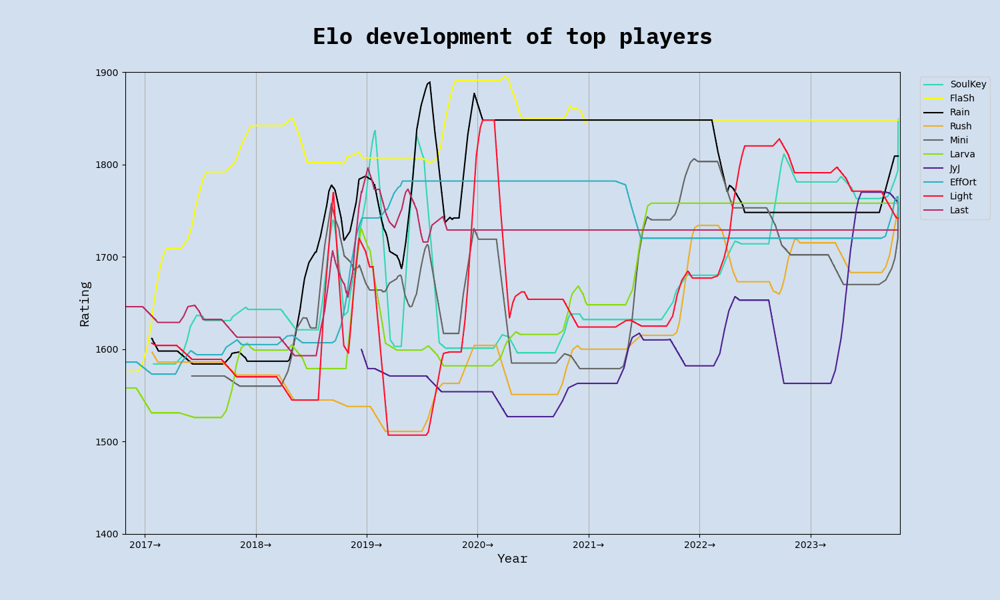
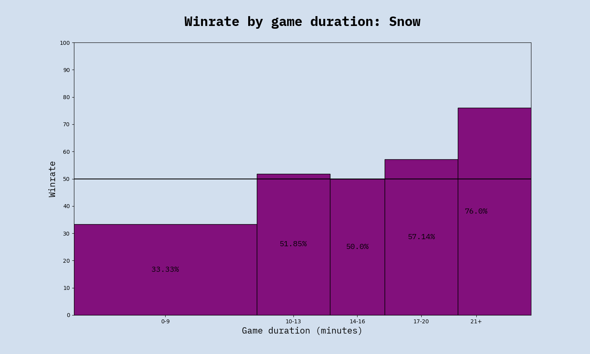
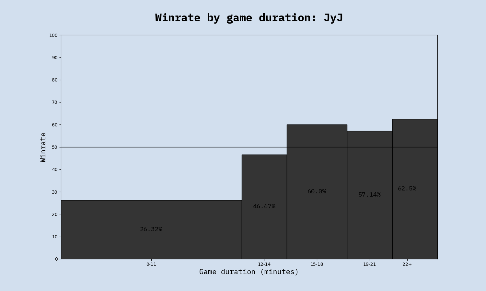
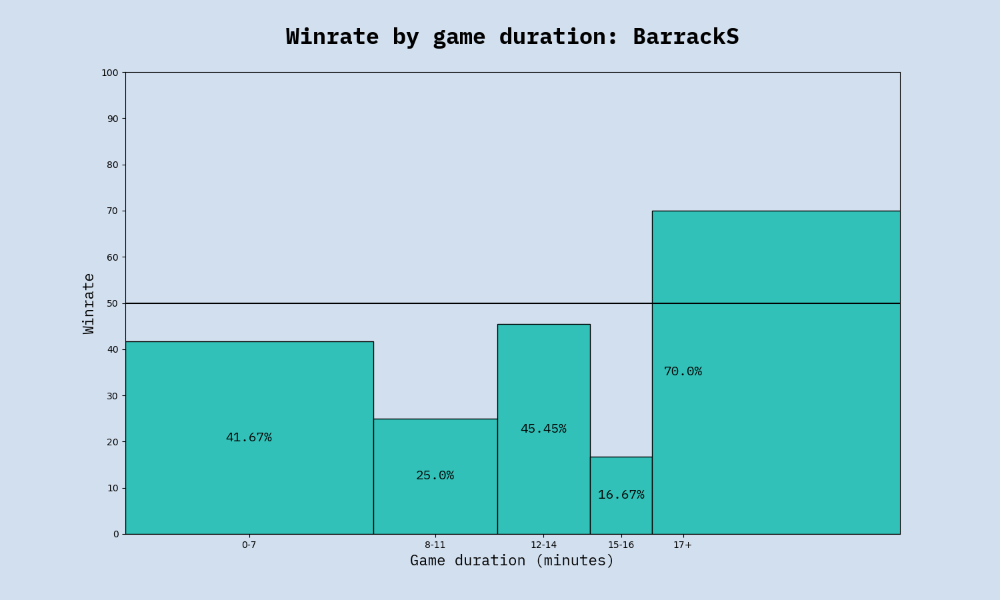
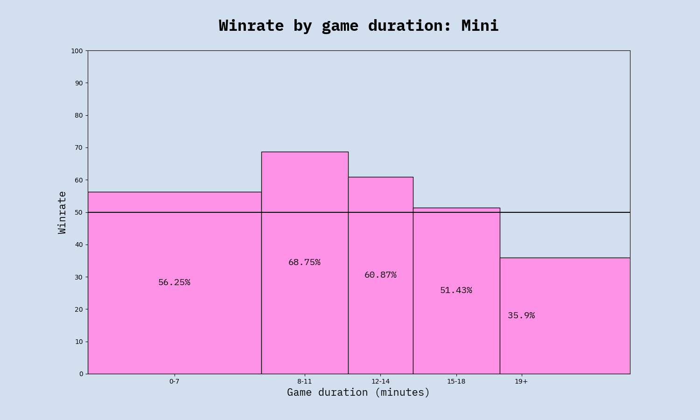
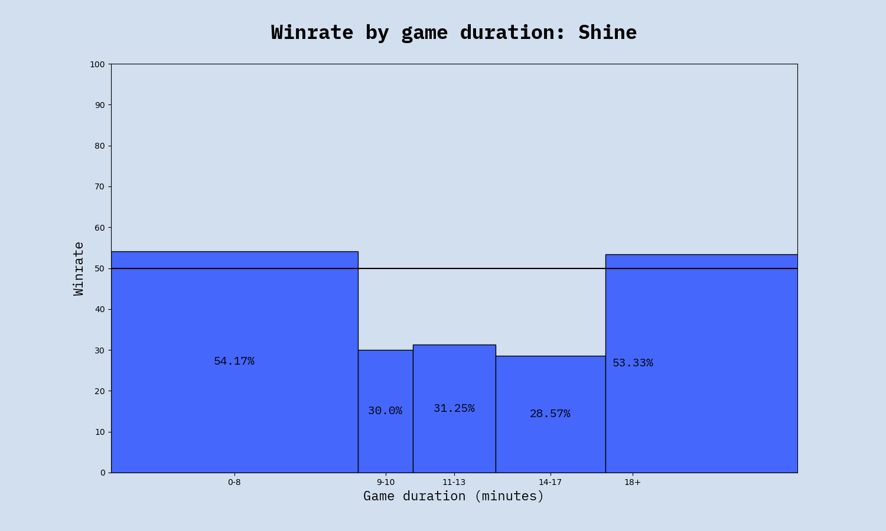
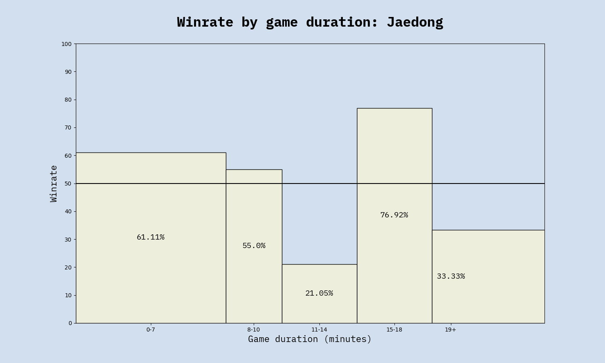

  

# Stats from the ASL/KSL era
#### by Jacob Stubbe Østergaard / JackyVSO  

## Introduction
The following is a set of insights gleaned from data on offline Starcraft 1 tournament games at the pro level between 2016 and 2024. It includes combined insights related to:

- Game duration
- Matchup dynamics
- Player winrates and ratings
- Map balance
- Spawn locations
- Player and matchup development over time

...and much more.

The dataset comprises all 18 seasons of ASL/SSL and all 4 seasons of KSL for a total of <b><u>2,107 games</u></b>. This is enough to make lots of statistically significant inferences but also few enough that more fine-grained insights that build on a small subset of the games come with a lot of uncertainty.

Data for each game includes players, outcome, date, duration, spawn locations, map details, map selection and tournament context. I have personally compiled the data in a SQL database which I have then queried for the insights. Most of the data has been collected from <a href="https://liquipedia.net/starcraft/Main_Page">Liquipedia</a>, while game duration and spawn location has been collected from the AfreecaTV VODs.

It should be noted that since the dataset consists exclusively of top level games, the insights in this article apply only to Starcraft played at the very highest skill level. Different dynamics may be at play at other levels. For analysis of ladder game data instead of ASL/KSL, check out <a href="https://tl.net/forum/brood-war/617209-data-analysis-on-8-million-games">Kraekkling's recent work</a>.

Making these stats available is my attempt to give something back to the community. I hope you find them interesting. Let me know if you have further questions that may be answered from this dataset, and I'll get back to you.

## Table of contents
The article is divided into four main parts: Matchups, Maps, Players and Tournament Stats. For the casuals, I recommend using this menu to find the stats you're interested in. For the nerds, I recommend diving right in and reading the article from end to end.

### 1. [Matchups](#Matchups)
- [Frequency of each matchup](#A5)
- [Overall winrate for each race](#A2)
- [Overall winrates for each non-mirror matchup](#A11)
- [Matchup winrates by year](#6)
- [Average duration of each matchup](#A9)
- [Longest games by matchup](#10)
- [Matchup winrates by game duration](#11)
- [Effect of cross spawns on game duration for each matchup](#14)
- [Effect of cross spawns on winrate for each matchup](#A10)

### 2. [Maps](#Maps)
- [Matchup winrates by number of spawn locations](#7)
- [Balance ranking of popular maps](#8)

### 3. [Players](#Players)
- [Games played by each player](#1)
- [Player winrates](#3)
- [Elo ranking list](#4)
- [Elo graphs of top players](#5)
- [Player winrates by game duration](#13)
- [Average game duration by player](#12)

### 4. [Tournament Stats](#TournamentStats)
- [Longest and shortest games in ASL/KSL history](#9)
- [Bo5/Bo7 win probabilities by game outcomes](#A3)
- [Map selection advantage](#A4)
- [Relative advantage of being a seeded player](#A7)
- [Group decider matches: winners' loser vs. losers' winner](#A8)
  

<h1 class="h1" id="Matchups"> 1. Matchups</h1>
The distribution of matchups of games in the database is as follows:
<h4 id="A5"></h4>

We can see that mirror matchups are quite rare, which is only logical. The comparative scarcity of TvPs can be explained by a slight overrepresentation of Zergs in ASL and KSL in general (see the figures for total games played by each race in the table below) but that leaves no obvious explanation for why there have then been more TvTs than ZvZs. Maybe Zergs try to avoid each other in group selections. Maybe ZvZ series are generally more one-sided and therefore shorter than TvTs series. I don't know. Now let's move on to matchup winrates. The numbers still nominally indicate that Protoss is the best performing race.

This table shows the overall winrate for each race across both its non-mirror matchups:

<table border="1" class="dataframe table table-striped table-bordered">
  <thead>
    <tr style="text-align: right;"><table border="1" class="dataframe table table-striped table-bordered">
    <thead>
    <tr>
    <th colspan="3" style="font-size: 24px; text-align: center;">Overall race winrates</th>
</tr><tr style="text-align: right;"><th>Race</th><th>Total games</th><th>Overall winrate</th>    </tr>
    </thead>
    <tbody>
    <tr>
    <td style="background-color: #d2dfee;">Terran</td><td style="background-color: #d2dfee;">1242</td><td style="background-color: #d2dfee;">49.76</td>
    </tr><tr>
    <td style="background-color: #e2effe;">Protoss</td><td style="background-color: #e2effe;">1166</td><td style="background-color: #e2effe;">50.6</td>
    </tr><tr>
    <td style="background-color: #d2dfee;">Zerg</td><td style="background-color: #d2dfee;">1260</td><td style="background-color: #d2dfee;">49.68</td>
    </tr>  </tbody>
</table>

 Protoss is the best performing race by a margin of 0.8 percentage points over Terran. It also seems that Terran is the 2nd best performing race. But since Artosis often points out that Terran only appears to be doing well because Flash is so good, I decided to check what the winrates would be without Flash. To make a fair comparison, I also removed the statistically best performing player for each of the other races (Rain for Protoss and Soulkey for Zerg), and this is what the updated figures look like:

<table border="1" class="dataframe table table-striped table-bordered">
  <thead>
    <tr style="text-align: right;"><table border="1" class="dataframe table table-striped table-bordered">
    <thead>
    <tr>
    <th colspan="3" style="font-size: 24px; text-align: center;">Overall race winrates</th>
</tr><tr style="text-align: right;"><th>Race</th><th>Total games</th><th>Overall winrate</th>    </tr>
    </thead>
    <tbody>
    <tr>
    <td style="background-color: #d2dfee;">Terran</td><td style="background-color: #d2dfee;">1126</td><td style="background-color: #d2dfee;">47.66</td>
    </tr><tr>
    <td style="background-color: #e2effe;">Protoss</td><td style="background-color: #e2effe;">984</td><td style="background-color: #e2effe;">49.83</td>
    </tr><tr>
    <td style="background-color: #d2dfee;">Zerg</td><td style="background-color: #d2dfee;">1016</td><td style="background-color: #d2dfee;">46.7</td>
    </tr>  </tbody>
</table>

So Terran does do noticeably worse without Flash, but still better than Zerg without Soulkey. So while there's still a tiny bit of fuel for the "Protoss is OP" argument, there isn't much left for the "Terran has it hardest" argument - at least not in this dataset.

(While this was all a fun exercise, I should really emphasize that it means very little. The Protoss winrate advantage of 50.6 vs 49.76 over Terran amounts to an advantage of no more than six games, which makes it statistically insignificant by any reasonable standards. There is really only one thing that these numbers show very clearly, and that is that **Starcraft is an eerily well balanced game** - at least when played on carefully designed maps)  

Now let's look at the winrates for the individual non-mirror matchups. The numbers confirm the well-known pattern of T > Z > P > T but suggest that Zerg's advantage over Protoss is slightly smaller than Terran's advantage over Zerg and Protoss' advantage over Terran:  

<h4 id="A11"></h4>

While these figures are very unsurprising, the story becomes a lot more interesting when we go into some more detail. For starters, let's take a look at the development of the matchup winrates year on year:

<h4 id="6"></h4>

These graphs tell quite a different story than the overall winrates. The power distributions have actually fluctuated greatly as the races have struggled for the upper hand in the metagame. The picture becomes still more nuanced when we take game duration and spawn locations into consideration.  
First, let's look at how game duration correlates to matchup winrates. 

*Note:because of the limited data available (only 500 tournament games played in each non-mirror matchup since 2016), I have created these graphs using 10 automatically clustered intervals, which means the intervals are of different length but each represent roughly the same amount of games (20-50 games per interval). Using any more intervals than this, let alone setting a point for every single minute, would leave some intervals with way too few data points, which would make the graphs noisy/random. The presented graphs represent a compromise between that and a very coarse version with only a few intervals but more certainty. Their minor details do not represent reality but their major trends are accurate.*

Looking at winrates across game duration intervals, the trend is that

<h3 id="11"><i>Zerg rules the early game but struggles in the midgame. The late game is balanced.</i></h3>

We can see that if the game ends quickly, that bodes well for Zerg. In TvZ, there is a clear trend of early victories being Zerg, midgame victories being Terran, and the late game being very even. Long games are quite evenly split in all three matchups. PvZ has a similar trend but with semi-long games being once again Zerg-favored.

Moving on to spawn locations, we come to one of the most unambiguous findings of this study:

<h3 id="A10"><i>Cross spawns is VERY BAD for Terran</i></h3>
... and amazing for Protoss.

<table border="1" class="dataframe table table-striped table-bordered">
    <thead>
    <tr>
    <th colspan="8" style="font-size: 24px; text-align: center;">Effect of cross spawns in each matchup</th>
</tr><tr style="text-align: right;"><th>Matchup</th><th>Adjacent spawns winrate</th><th>Cross spawns winrate</th><th>Net effect</th>    </tr>
    </thead>
    <tbody>
    <tr>
    <td style="background-color: #e2effe;">TvP</td><td style="background-color: #e2effe;">Terran +14</td><td style="background-color: #e2effe;">Protoss +7</td><td style="background-color: #e2effe;"><b>Protoss +21</b></td>
    </tr><tr>
    <td style="background-color: #e2effe;">TvZ</td><td style="background-color: #e2effe;">Terran +14</td><td style="background-color: #e2effe;">Terran +2</td><td style="background-color: #e2effe;"><b>Zerg +12</b></td>
    </tr><tr>
    <td style="background-color: #e2effe;">PvZ</td><td style="background-color: #e2effe;">Zerg +13</td><td style="background-color: #e2effe;">Protoss +4</td><td style="background-color: #e2effe;"><b>Protoss +17</b></td>
    </tr>  </tbody>
</table>

Such strong discrepancies across 200+ games in each matchup on 4-player maps is unlikely to have happened randomly. This table begins to reveal how the overall winrate of each matchup is really just an average of a range of varied winrates under specific conditions. TvP in general might be slightly Protoss-favored but TvP on a 4 player map with adjacent spawns is strongly Terran-favored.

If that table began to reveal how circumstance-dependent the power dynamics between the races are, these charts should drive the point home. They show how matchup winrates are affected by whether it's a 2-player, 3-player or 4-player map:

<h4 id="7"></h4>

The most notable thing here is just how lopsided TvP on 2-player maps is. Out of 133 games in the database, Terran has won 46 and Protoss has won 87. If TvP was never played on 2-player maps, it would be a Terran-favored matchup. Terran also fares better with more spawning locations against Zerg, although this is far less pronounced. This is consistent with another finding in the data, which was that *the bigger the map (by size in tiles), the better for Terran*. I have not included that figure here because it shows the same as the above but less markedly.
PvZ seems hardly to be affected by the number of spawning locations on the map. There's a slight advantage for Protoss on 3-player maps and for Zerg on 2- and 4-player maps but it's small enough to be random. I'll leave it to more accomplished players to explain why this matchup is the least affected.  
  
<h1 class="h1" id="Maps"> 2. Maps</h1>

Now let's keep our focus on the maps for a bit before we move on to stats about players. No less than 78 different maps have been used in ASL and KSL: 22 2-player maps (603 games), 15 3-player maps (425 games), and 41 4-player maps (1079 games).

Since most of these maps have been in use for only one or two seasons, it isn't really possible to glean any statistical insights from them. However, for the most popular maps which have been played across many seasons, it should be possible to make meaningful comparisons. I thought it might be interesting to devise a metric to score these maps according to how balanced they are. The following balance ranking of the 13 most played maps was calculated using RMSE (root mean squared error) across the three matchups, with 50.0% as the target value.

*Note: Using RMSE instead of MAE (mean absolute error) means that a strong bias in one matchup is punished more than a moderate bias across all matchups. Whether to use one or the other is a question of what one's idea of balance really is. I'm using RMSE because I personally think a map that is perfectly balanced in two matchups but has a 75% bias in the third one is less balanced than one that has scores of, say, 57/40/58.*

<h4 id="8"></h4>
<table border="1" class="dataframe table table-striped table-bordered">
    <thead>
    <tr>
    <th colspan="7" style="font-size: 24px; text-align: center;">Most to least balanced maps</th>
</tr><tr style="text-align: right;"><th>Rank</th><th>Map</th><th>Total games</th><th>TvP</th><th>TvZ</th><th>PvZ</th><th>Balance score</th>    </tr>
    </thead>
    <tbody>
    <tr>
    <td style="background-color: #d2dfee;">1</td><td style="background-color: #d2dfee;">Sylphid</td><td style="background-color: #d2dfee;">141</td><td style="background-color: #eee1df;">47.1</td><td style="background-color: #eeccc5;">47.1</td><td style="background-color: #eea79a;">58.8</td><td style="background-color: #2261ff;">94.4</td>
    </tr><tr>
    <td style="background-color: #e2effe;">2</td><td style="background-color: #e2effe;">Retro</td><td style="background-color: #e2effe;">44</td><td style="background-color: #eeddda;">53.8</td><td style="background-color: #eeb8ad;">44.4</td><td style="background-color: #eeb2a7;">42.9</td><td style="background-color: #2361fe;">94.3</td>
    </tr><tr>
    <td style="background-color: #d2dfee;">3</td><td style="background-color: #d2dfee;">Eddy</td><td style="background-color: #d2dfee;">55</td><td style="background-color: #eed9d6;">54.5</td><td style="background-color: #eea091;">58.8</td><td style="background-color: #eecbc5;">46.7</td><td style="background-color: #2761fb;">94.0</td>
    </tr><tr>
    <td style="background-color: #e2effe;">4</td><td style="background-color: #e2effe;">Butter</td><td style="background-color: #e2effe;">41</td><td style="background-color: #eed4d0;">44.4</td><td style="background-color: #ee8570;">37.5</td><td style="background-color: #eee1df;">50.0</td><td style="background-color: #3c5fe6;">92.1</td>
    </tr><tr>
    <td style="background-color: #d2dfee;">5</td><td style="background-color: #d2dfee;">Polypoid</td><td style="background-color: #d2dfee;">77</td><td style="background-color: #eedfdd;">53.3</td><td style="background-color: #ee745d;">64.7</td><td style="background-color: #eec3bc;">54.5</td><td style="background-color: #4a5ed8;">90.9</td>
    </tr><tr>
    <td style="background-color: #e2effe;">6</td><td style="background-color: #e2effe;">Eclipse</td><td style="background-color: #e2effe;">94</td><td style="background-color: #eeaca0;">36.0</td><td style="background-color: #eecfca;">52.4</td><td style="background-color: #eeb5aa;">43.3</td><td style="background-color: #4a5ed8;">90.9</td>
    </tr><tr>
    <td style="background-color: #d2dfee;">7</td><td style="background-color: #d2dfee;">Vermeer</td><td style="background-color: #d2dfee;">46</td><td style="background-color: #eeb3a8;">62.5</td><td style="background-color: #ee7760;">64.3</td><td style="background-color: #eee1df;">50.0</td><td style="background-color: #605cc3;">89.0</td>
    </tr><tr>
    <td style="background-color: #e2effe;">8</td><td style="background-color: #e2effe;">Circuit Breaker</td><td style="background-color: #e2effe;">149</td><td style="background-color: #eea99c;">64.7</td><td style="background-color: #eea495;">58.3</td><td style="background-color: #ee8f7c;">62.5</td><td style="background-color: #6d5bb7;">87.9</td>
    </tr><tr>
    <td style="background-color: #d2dfee;">9</td><td style="background-color: #d2dfee;">Fighting Spirit</td><td style="background-color: #d2dfee;">105</td><td style="background-color: #eebfb7;">40.0</td><td style="background-color: #ee907e;">60.9</td><td style="background-color: #ee7c66;">34.6</td><td style="background-color: #6f5ab5;">87.7</td>
    </tr><tr>
    <td style="background-color: #e2effe;">10</td><td style="background-color: #e2effe;">Benzene</td><td style="background-color: #e2effe;">48</td><td style="background-color: #eecdc7;">42.9</td><td style="background-color: #ee5335;">30.8</td><td style="background-color: #eeab9e;">58.3</td><td style="background-color: #755aaf;">87.2</td>
    </tr><tr>
    <td style="background-color: #d2dfee;">11</td><td style="background-color: #d2dfee;">Heartbreak Ridge</td><td style="background-color: #d2dfee;">48</td><td style="background-color: #ee907e;">30.0</td><td style="background-color: #eea799;">57.9</td><td style="background-color: #eebcb3;">55.6</td><td style="background-color: #755aaf;">87.2</td>
    </tr><tr>
    <td style="background-color: #e2effe;">12</td><td style="background-color: #e2effe;">Transistor</td><td style="background-color: #e2effe;">41</td><td style="background-color: #eea090;">66.7</td><td style="background-color: #ee8570;">37.5</td><td style="background-color: #ee735b;">33.3</td><td style="background-color: #935793;">84.6</td>
    </tr><tr>
    <td style="background-color: #d2dfee;">13</td><td style="background-color: #d2dfee;">Overwatch 2</td><td style="background-color: #d2dfee;">54</td><td style="background-color: #eeb3a8;">37.5</td><td style="background-color: #ee5335;">69.2</td><td style="background-color: #ee5a3d;">70.6</td><td style="background-color: #ae5578;">82.2</td>
    </tr><tr>
    <td style="background-color: #e2effe;">14</td><td style="background-color: #e2effe;">Gladiator</td><td style="background-color: #e2effe;">47</td><td style="background-color: #ee3d1a;">12.5</td><td style="background-color: #eee1df;">50.0</td><td style="background-color: #ee6348;">69.2</td><td style="background-color: #f94e31;">75.7</td>
    </tr><tr>
    <td style="background-color: #d2dfee;">15</td><td style="background-color: #d2dfee;">Dark Origin</td><td style="background-color: #d2dfee;">48</td><td style="background-color: #ee6f56;">23.1</td><td style="background-color: #ee3d1a;">27.8</td><td style="background-color: #ee3d1a;">25.0</td><td style="background-color: #ff4e2b;">75.2</td>
    </tr>  </tbody>
</table>

*The winrates displayed are for the first race mentioned in the matchup (e.g. Sylphid has a 47.1% winrate for T in TvP, 47.1% for T in TvZ and 58.8% for P in PvZ)*
  

So Sylphid appears to be the most balanced map yet made, closely followed by Retro, whereas Dark Origin is the least balanced - being very Zerg favored (and Protoss favored in TvP). Looking at the scores for Vermeer, Polypoid and Circuit Breaker, we can see that what is sometimes termed "standard maps" are actually clearly Terran-favored, whereas more unusual maps might be less comfortable for Terran.

  
<h1 id="Players">3. Players</h1>
In this section, we'll abandon the bird's eye view and instead zoom in on how the individual Starcraft 1 pros have been faring against each other. A total of 80 players have qualified for ASL and/or KSL at least once (29 Terran, 27 Zerg, 24 Protoss). Here they are, listed according to how many tournament games they've played:

<h4 id="1"></h4>
<table border="1" class="dataframe table table-striped table-bordered">
    <thead>
    <tr>
    <th colspan="3" style="font-size: 24px; text-align: center;">Total games played (ASL+KSL)</th>
</tr><tr style="text-align: right;"><th>Rank</th><th>Player</th><th>Games</th>    </tr>
    </thead>
    <tbody>
    <tr>
    <td style="background-color: #d2dfee;">1</td><td style="background-color: #d2dfee;">SoulKey</td><td style="background-color: #d2dfee;">244</td>
    </tr><tr>
    <td style="background-color: #e2effe;">2</td><td style="background-color: #e2effe;">Mini</td><td style="background-color: #e2effe;">216</td>
    </tr><tr>
    <td style="background-color: #d2dfee;">3</td><td style="background-color: #d2dfee;">Sharp</td><td style="background-color: #d2dfee;">191</td>
    </tr><tr>
    <td style="background-color: #e2effe;">4</td><td style="background-color: #e2effe;">Light</td><td style="background-color: #e2effe;">191</td>
    </tr><tr>
    <td style="background-color: #d2dfee;">5</td><td style="background-color: #d2dfee;">Snow</td><td style="background-color: #d2dfee;">187</td>
    </tr><tr>
    <td style="background-color: #e2effe;">6</td><td style="background-color: #e2effe;">hero</td><td style="background-color: #e2effe;">186</td>
    </tr><tr>
    <td style="background-color: #d2dfee;">7</td><td style="background-color: #d2dfee;">Rain</td><td style="background-color: #d2dfee;">182</td>
    </tr><tr>
    <td style="background-color: #e2effe;">8</td><td style="background-color: #e2effe;">Best</td><td style="background-color: #e2effe;">175</td>
    </tr><tr>
    <td style="background-color: #d2dfee;">9</td><td style="background-color: #d2dfee;">Rush</td><td style="background-color: #d2dfee;">157</td>
    </tr><tr>
    <td style="background-color: #e2effe;">10</td><td style="background-color: #e2effe;">Queen</td><td style="background-color: #e2effe;">143</td>
    </tr><tr>
    <td style="background-color: #d2dfee;">11</td><td style="background-color: #d2dfee;">Bisu</td><td style="background-color: #d2dfee;">129</td>
    </tr><tr>
    <td style="background-color: #e2effe;">12</td><td style="background-color: #e2effe;">Action</td><td style="background-color: #e2effe;">124</td>
    </tr><tr>
    <td style="background-color: #d2dfee;">13</td><td style="background-color: #d2dfee;">FlaSh</td><td style="background-color: #d2dfee;">118</td>
    </tr><tr>
    <td style="background-color: #e2effe;">14</td><td style="background-color: #e2effe;">Mind</td><td style="background-color: #e2effe;">118</td>
    </tr><tr>
    <td style="background-color: #d2dfee;">15</td><td style="background-color: #d2dfee;">Last</td><td style="background-color: #d2dfee;">117</td>
    </tr><tr>
    <td style="background-color: #e2effe;">16</td><td style="background-color: #e2effe;">Larva</td><td style="background-color: #e2effe;">113</td>
    </tr><tr>
    <td style="background-color: #d2dfee;">17</td><td style="background-color: #d2dfee;">Soma</td><td style="background-color: #d2dfee;">101</td>
    </tr><tr>
    <td style="background-color: #e2effe;">18</td><td style="background-color: #e2effe;">Shuttle</td><td style="background-color: #e2effe;">100</td>
    </tr><tr>
    <td style="background-color: #d2dfee;">19</td><td style="background-color: #d2dfee;">JyJ</td><td style="background-color: #d2dfee;">100</td>
    </tr><tr>
    <td style="background-color: #e2effe;">20</td><td style="background-color: #e2effe;">Stork</td><td style="background-color: #e2effe;">99</td>
    </tr><tr>
    <td style="background-color: #d2dfee;">21</td><td style="background-color: #d2dfee;">Jaedong</td><td style="background-color: #d2dfee;">97</td>
    </tr><tr>
    <td style="background-color: #e2effe;">22</td><td style="background-color: #e2effe;">RoyaL</td><td style="background-color: #e2effe;">86</td>
    </tr><tr>
    <td style="background-color: #d2dfee;">23</td><td style="background-color: #d2dfee;">Shine</td><td style="background-color: #d2dfee;">79</td>
    </tr><tr>
    <td style="background-color: #e2effe;">24</td><td style="background-color: #e2effe;">EffOrt</td><td style="background-color: #e2effe;">74</td>
    </tr><tr>
    <td style="background-color: #d2dfee;">25</td><td style="background-color: #d2dfee;">Mong</td><td style="background-color: #d2dfee;">65</td>
    </tr><tr>
    <td style="background-color: #e2effe;">26</td><td style="background-color: #e2effe;">Sea</td><td style="background-color: #e2effe;">61</td>
    </tr><tr>
    <td style="background-color: #d2dfee;">27</td><td style="background-color: #d2dfee;">BarrackS</td><td style="background-color: #d2dfee;">51</td>
    </tr><tr>
    <td style="background-color: #e2effe;">28</td><td style="background-color: #e2effe;">sSak</td><td style="background-color: #e2effe;">48</td>
    </tr><tr>
    <td style="background-color: #d2dfee;">29</td><td style="background-color: #d2dfee;">MIsO</td><td style="background-color: #d2dfee;">47</td>
    </tr><tr>
    <td style="background-color: #e2effe;">30</td><td style="background-color: #e2effe;">Sacsri</td><td style="background-color: #e2effe;">43</td>
    </tr><tr>
    <td style="background-color: #d2dfee;">31</td><td style="background-color: #d2dfee;">Horang2</td><td style="background-color: #d2dfee;">42</td>
    </tr><tr>
    <td style="background-color: #e2effe;">32</td><td style="background-color: #e2effe;">Modesty</td><td style="background-color: #e2effe;">40</td>
    </tr><tr>
    <td style="background-color: #d2dfee;">33</td><td style="background-color: #d2dfee;">Movie</td><td style="background-color: #d2dfee;">38</td>
    </tr><tr>
    <td style="background-color: #e2effe;">34</td><td style="background-color: #e2effe;">Ample</td><td style="background-color: #e2effe;">34</td>
    </tr><tr>
    <td style="background-color: #d2dfee;">35</td><td style="background-color: #d2dfee;">Jaehoon</td><td style="background-color: #d2dfee;">32</td>
    </tr><tr>
    <td style="background-color: #e2effe;">36</td><td style="background-color: #e2effe;">free</td><td style="background-color: #e2effe;">31</td>
    </tr><tr>
    <td style="background-color: #d2dfee;">37</td><td style="background-color: #d2dfee;">GuemChi</td><td style="background-color: #d2dfee;">31</td>
    </tr><tr>
    <td style="background-color: #e2effe;">38</td><td style="background-color: #e2effe;">Killer</td><td style="background-color: #e2effe;">31</td>
    </tr><tr>
    <td style="background-color: #d2dfee;">39</td><td style="background-color: #d2dfee;">Leta</td><td style="background-color: #d2dfee;">25</td>
    </tr><tr>
    <td style="background-color: #e2effe;">40</td><td style="background-color: #e2effe;">Calm</td><td style="background-color: #e2effe;">24</td>
    </tr><tr>
    <td style="background-color: #d2dfee;">41</td><td style="background-color: #d2dfee;">Piano</td><td style="background-color: #d2dfee;">19</td>
    </tr><tr>
    <td style="background-color: #e2effe;">42</td><td style="background-color: #e2effe;">ggaemo</td><td style="background-color: #e2effe;">17</td>
    </tr><tr>
    <td style="background-color: #d2dfee;">43</td><td style="background-color: #d2dfee;">ForGG</td><td style="background-color: #d2dfee;">17</td>
    </tr><tr>
    <td style="background-color: #e2effe;">44</td><td style="background-color: #e2effe;">beast</td><td style="background-color: #e2effe;">17</td>
    </tr><tr>
    <td style="background-color: #d2dfee;">45</td><td style="background-color: #d2dfee;">Hyuk</td><td style="background-color: #d2dfee;">15</td>
    </tr><tr>
    <td style="background-color: #e2effe;">46</td><td style="background-color: #e2effe;">HyuN</td><td style="background-color: #e2effe;">12</td>
    </tr><tr>
    <td style="background-color: #d2dfee;">47</td><td style="background-color: #d2dfee;">Speed</td><td style="background-color: #d2dfee;">12</td>
    </tr><tr>
    <td style="background-color: #e2effe;">48</td><td style="background-color: #e2effe;">nOOb</td><td style="background-color: #e2effe;">11</td>
    </tr><tr>
    <td style="background-color: #d2dfee;">49</td><td style="background-color: #d2dfee;">ZeLoT</td><td style="background-color: #d2dfee;">9</td>
    </tr><tr>
    <td style="background-color: #e2effe;">50</td><td style="background-color: #e2effe;">815</td><td style="background-color: #e2effe;">9</td>
    </tr><tr>
    <td style="background-color: #d2dfee;">51</td><td style="background-color: #d2dfee;">Brain</td><td style="background-color: #d2dfee;">8</td>
    </tr><tr>
    <td style="background-color: #e2effe;">52</td><td style="background-color: #e2effe;">Ss1nz</td><td style="background-color: #e2effe;">8</td>
    </tr><tr>
    <td style="background-color: #d2dfee;">53</td><td style="background-color: #d2dfee;">YSC</td><td style="background-color: #d2dfee;">7</td>
    </tr><tr>
    <td style="background-color: #e2effe;">54</td><td style="background-color: #e2effe;">Ruin</td><td style="background-color: #e2effe;">7</td>
    </tr><tr>
    <td style="background-color: #d2dfee;">55</td><td style="background-color: #d2dfee;">HiyA</td><td style="background-color: #d2dfee;">6</td>
    </tr><tr>
    <td style="background-color: #e2effe;">56</td><td style="background-color: #e2effe;">Pusan</td><td style="background-color: #e2effe;">5</td>
    </tr><tr>
    <td style="background-color: #d2dfee;">57</td><td style="background-color: #d2dfee;">Sky</td><td style="background-color: #d2dfee;">5</td>
    </tr><tr>
    <td style="background-color: #e2effe;">58</td><td style="background-color: #e2effe;">Tyson</td><td style="background-color: #e2effe;">5</td>
    </tr><tr>
    <td style="background-color: #d2dfee;">59</td><td style="background-color: #d2dfee;">BishOp</td><td style="background-color: #d2dfee;">5</td>
    </tr><tr>
    <td style="background-color: #e2effe;">60</td><td style="background-color: #e2effe;">Lazy</td><td style="background-color: #e2effe;">4</td>
    </tr><tr>
    <td style="background-color: #d2dfee;">61</td><td style="background-color: #d2dfee;">firebathero</td><td style="background-color: #d2dfee;">4</td>
    </tr><tr>
    <td style="background-color: #e2effe;">62</td><td style="background-color: #e2effe;">ByuL</td><td style="background-color: #e2effe;">4</td>
    </tr><tr>
    <td style="background-color: #d2dfee;">63</td><td style="background-color: #d2dfee;">Scan</td><td style="background-color: #d2dfee;">4</td>
    </tr><tr>
    <td style="background-color: #e2effe;">64</td><td style="background-color: #e2effe;">Iris</td><td style="background-color: #e2effe;">3</td>
    </tr><tr>
    <td style="background-color: #d2dfee;">65</td><td style="background-color: #d2dfee;">NaDa</td><td style="background-color: #d2dfee;">3</td>
    </tr><tr>
    <td style="background-color: #e2effe;">66</td><td style="background-color: #e2effe;">Yoon</td><td style="background-color: #e2effe;">3</td>
    </tr><tr>
    <td style="background-color: #d2dfee;">67</td><td style="background-color: #d2dfee;">TY</td><td style="background-color: #d2dfee;">3</td>
    </tr><tr>
    <td style="background-color: #e2effe;">68</td><td style="background-color: #e2effe;">Hint</td><td style="background-color: #e2effe;">2</td>
    </tr><tr>
    <td style="background-color: #d2dfee;">69</td><td style="background-color: #d2dfee;">Maru</td><td style="background-color: #d2dfee;">2</td>
    </tr><tr>
    <td style="background-color: #e2effe;">70</td><td style="background-color: #e2effe;">Force(Name)</td><td style="background-color: #e2effe;">2</td>
    </tr><tr>
    <td style="background-color: #d2dfee;">71</td><td style="background-color: #d2dfee;">Terror</td><td style="background-color: #d2dfee;">2</td>
    </tr><tr>
    <td style="background-color: #e2effe;">72</td><td style="background-color: #e2effe;">PURPOSE</td><td style="background-color: #e2effe;">2</td>
    </tr><tr>
    <td style="background-color: #d2dfee;">73</td><td style="background-color: #d2dfee;">Tinkle</td><td style="background-color: #d2dfee;">2</td>
    </tr><tr>
    <td style="background-color: #e2effe;">74</td><td style="background-color: #e2effe;">soso</td><td style="background-color: #e2effe;">2</td>
    </tr><tr>
    <td style="background-color: #d2dfee;">75</td><td style="background-color: #d2dfee;">JJabNewDa</td><td style="background-color: #d2dfee;">2</td>
    </tr><tr>
    <td style="background-color: #e2effe;">76</td><td style="background-color: #e2effe;">ivOry</td><td style="background-color: #e2effe;">2</td>
    </tr><tr>
    <td style="background-color: #d2dfee;">77</td><td style="background-color: #d2dfee;">TaeNgGu</td><td style="background-color: #d2dfee;">2</td>
    </tr><tr>
    <td style="background-color: #e2effe;">78</td><td style="background-color: #e2effe;">1127</td><td style="background-color: #e2effe;">2</td>
    </tr><tr>
    <td style="background-color: #d2dfee;">79</td><td style="background-color: #d2dfee;">Motive</td><td style="background-color: #d2dfee;">2</td>
    </tr><tr>
    <td style="background-color: #e2effe;">80</td><td style="background-color: #e2effe;">Yerim2</td><td style="background-color: #e2effe;">0</td>
    </tr>  </tbody>
</table>

In terms of winrates, these are the overall standings:

<table border="1" class="dataframe table table-striped table-bordered">
      <thead>
      <tr>
        <th colspan="4" style="font-size: 24px; text-align: center;">Total</th>
    </tr><tr style="text-align: right;"><th>Rank</th><th>Name</th><th>Games</th><th>Winrate</th></tr>
      </thead>
      <tbody>
      <tr>
        <td style="background-color: #d2dfee;">1</td><td style="background-color: #d2dfee;">FlaSh</td><td style="background-color: #d2dfee;">118</td><td style="background-color: #4382ee;">74.58</td>
        </tr><tr>
        <td style="background-color: #e2effe;">2</td><td style="background-color: #e2effe;">Rain</td><td style="background-color: #e2effe;">182</td><td style="background-color: #647ecf;">63.74</td>
        </tr><tr>
        <td style="background-color: #d2dfee;">3</td><td style="background-color: #d2dfee;">SoulKey</td><td style="background-color: #d2dfee;">244</td><td style="background-color: #6a7ec9;">61.48</td>
        </tr><tr>
        <td style="background-color: #e2effe;">4</td><td style="background-color: #e2effe;">Last</td><td style="background-color: #e2effe;">117</td><td style="background-color: #6f7dc4;">59.83</td>
        </tr><tr>
        <td style="background-color: #d2dfee;">5</td><td style="background-color: #d2dfee;">EffOrt</td><td style="background-color: #d2dfee;">74</td><td style="background-color: #707dc3;">59.46</td>
        </tr><tr>
        <td style="background-color: #e2effe;">6</td><td style="background-color: #e2effe;">Mini</td><td style="background-color: #e2effe;">216</td><td style="background-color: #7c7cb8;">55.56</td>
        </tr><tr>
        <td style="background-color: #d2dfee;">7</td><td style="background-color: #d2dfee;">Light</td><td style="background-color: #d2dfee;">191</td><td style="background-color: #7c7cb8;">55.5</td>
        </tr><tr>
        <td style="background-color: #e2effe;">8</td><td style="background-color: #e2effe;">Soma</td><td style="background-color: #e2effe;">101</td><td style="background-color: #7c7cb8;">55.45</td>
        </tr><tr>
        <td style="background-color: #d2dfee;">9</td><td style="background-color: #d2dfee;">hero</td><td style="background-color: #d2dfee;">186</td><td style="background-color: #7d7cb7;">55.38</td>
        </tr><tr>
        <td style="background-color: #e2effe;">10</td><td style="background-color: #e2effe;">Bisu</td><td style="background-color: #e2effe;">129</td><td style="background-color: #807bb4;">54.26</td>
        </tr><tr>
        <td style="background-color: #d2dfee;">11</td><td style="background-color: #d2dfee;">Snow</td><td style="background-color: #d2dfee;">187</td><td style="background-color: #827bb2;">53.48</td>
        </tr><tr>
        <td style="background-color: #e2effe;">12</td><td style="background-color: #e2effe;">Queen</td><td style="background-color: #e2effe;">143</td><td style="background-color: #837bb1;">53.15</td>
        </tr><tr>
        <td style="background-color: #d2dfee;">13</td><td style="background-color: #d2dfee;">Best</td><td style="background-color: #d2dfee;">175</td><td style="background-color: #877aae;">52.0</td>
        </tr><tr>
        <td style="background-color: #e2effe;">14</td><td style="background-color: #e2effe;">Larva</td><td style="background-color: #e2effe;">113</td><td style="background-color: #897aac;">51.33</td>
        </tr><tr>
        <td style="background-color: #d2dfee;">15</td><td style="background-color: #d2dfee;">Sharp</td><td style="background-color: #d2dfee;">190</td><td style="background-color: #8d7aa8;">50.0</td>
        </tr><tr>
        <td style="background-color: #e2effe;">16</td><td style="background-color: #e2effe;">Mind</td><td style="background-color: #e2effe;">118</td><td style="background-color: #8d7aa8;">50.0</td>
        </tr><tr>
        <td style="background-color: #d2dfee;">17</td><td style="background-color: #d2dfee;">JyJ</td><td style="background-color: #d2dfee;">100</td><td style="background-color: #8d7aa8;">50.0</td>
        </tr><tr>
        <td style="background-color: #e2effe;">18</td><td style="background-color: #e2effe;">Rush</td><td style="background-color: #e2effe;">157</td><td style="background-color: #8e7aa7;">49.68</td>
        </tr><tr>
        <td style="background-color: #d2dfee;">19</td><td style="background-color: #d2dfee;">RoyaL</td><td style="background-color: #d2dfee;">86</td><td style="background-color: #9079a5;">48.84</td>
        </tr><tr>
        <td style="background-color: #e2effe;">20</td><td style="background-color: #e2effe;">Leta</td><td style="background-color: #e2effe;">25</td><td style="background-color: #9379a2;">48.0</td>
        </tr><tr>
        <td style="background-color: #d2dfee;">21</td><td style="background-color: #d2dfee;">Action</td><td style="background-color: #d2dfee;">123</td><td style="background-color: #9379a2;">47.97</td>
        </tr><tr>
        <td style="background-color: #e2effe;">22</td><td style="background-color: #e2effe;">Shuttle</td><td style="background-color: #e2effe;">100</td><td style="background-color: #9679a0;">47.0</td>
        </tr><tr>
        <td style="background-color: #d2dfee;">23</td><td style="background-color: #d2dfee;">Jaedong</td><td style="background-color: #d2dfee;">97</td><td style="background-color: #98799e;">46.39</td>
        </tr><tr>
        <td style="background-color: #e2effe;">24</td><td style="background-color: #e2effe;">Sea</td><td style="background-color: #e2effe;">61</td><td style="background-color: #99789c;">45.9</td>
        </tr><tr>
        <td style="background-color: #d2dfee;">25</td><td style="background-color: #d2dfee;">Stork</td><td style="background-color: #d2dfee;">99</td><td style="background-color: #9e7898;">44.44</td>
        </tr><tr>
        <td style="background-color: #e2effe;">26</td><td style="background-color: #e2effe;">Jaehoon</td><td style="background-color: #e2effe;">32</td><td style="background-color: #a07896;">43.75</td>
        </tr><tr>
        <td style="background-color: #d2dfee;">27</td><td style="background-color: #d2dfee;">Shine</td><td style="background-color: #d2dfee;">79</td><td style="background-color: #a67791;">41.77</td>
        </tr><tr>
        <td style="background-color: #e2effe;">28</td><td style="background-color: #e2effe;">Calm</td><td style="background-color: #e2effe;">24</td><td style="background-color: #a67790;">41.67</td>
        </tr><tr>
        <td style="background-color: #d2dfee;">29</td><td style="background-color: #d2dfee;">Ample</td><td style="background-color: #d2dfee;">34</td><td style="background-color: #a7778f;">41.18</td>
        </tr><tr>
        <td style="background-color: #e2effe;">30</td><td style="background-color: #e2effe;">BarrackS</td><td style="background-color: #e2effe;">51</td><td style="background-color: #a7778f;">41.18</td>
        </tr><tr>
        <td style="background-color: #d2dfee;">31</td><td style="background-color: #d2dfee;">Horang2</td><td style="background-color: #d2dfee;">42</td><td style="background-color: #a9778d;">40.48</td>
        </tr><tr>
        <td style="background-color: #e2effe;">32</td><td style="background-color: #e2effe;">sSak</td><td style="background-color: #e2effe;">48</td><td style="background-color: #ac768a;">39.58</td>
        </tr><tr>
        <td style="background-color: #d2dfee;">33</td><td style="background-color: #d2dfee;">GuemChi</td><td style="background-color: #d2dfee;">31</td><td style="background-color: #af7688;">38.71</td>
        </tr><tr>
        <td style="background-color: #e2effe;">34</td><td style="background-color: #e2effe;">Sacsri</td><td style="background-color: #e2effe;">43</td><td style="background-color: #b37684;">37.21</td>
        </tr><tr>
        <td style="background-color: #d2dfee;">35</td><td style="background-color: #d2dfee;">Mong</td><td style="background-color: #d2dfee;">65</td><td style="background-color: #b47583;">36.92</td>
        </tr><tr>
        <td style="background-color: #e2effe;">36</td><td style="background-color: #e2effe;">free</td><td style="background-color: #e2effe;">31</td><td style="background-color: #b8757f;">35.48</td>
        </tr><tr>
        <td style="background-color: #d2dfee;">37</td><td style="background-color: #d2dfee;">Movie</td><td style="background-color: #d2dfee;">38</td><td style="background-color: #bc757b;">34.21</td>
        </tr><tr>
        <td style="background-color: #e2effe;">38</td><td style="background-color: #e2effe;">Hyuk</td><td style="background-color: #e2effe;">15</td><td style="background-color: #bf7479;">33.33</td>
        </tr><tr>
        <td style="background-color: #d2dfee;">39</td><td style="background-color: #d2dfee;">Modesty</td><td style="background-color: #d2dfee;">40</td><td style="background-color: #c17476;">32.5</td>
        </tr><tr>
        <td style="background-color: #e2effe;">40</td><td style="background-color: #e2effe;">Killer</td><td style="background-color: #e2effe;">31</td><td style="background-color: #c27476;">32.26</td>
        </tr><tr>
        <td style="background-color: #d2dfee;">41</td><td style="background-color: #d2dfee;">MIsO</td><td style="background-color: #d2dfee;">47</td><td style="background-color: #c37475;">31.91</td>
        </tr><tr>
        <td style="background-color: #e2effe;">42</td><td style="background-color: #e2effe;">Piano</td><td style="background-color: #e2effe;">19</td><td style="background-color: #c47474;">31.58</td>
        </tr><tr>
        <td style="background-color: #d2dfee;">43</td><td style="background-color: #d2dfee;">ggaemo</td><td style="background-color: #d2dfee;">17</td><td style="background-color: #cb736d;">29.41</td>
        </tr><tr>
        <td style="background-color: #e2effe;">44</td><td style="background-color: #e2effe;">beast</td><td style="background-color: #e2effe;">17</td><td style="background-color: #cb736d;">29.41</td>
        </tr><tr>
        <td style="background-color: #d2dfee;">45</td><td style="background-color: #d2dfee;">ForGG</td><td style="background-color: #d2dfee;">17</td><td style="background-color: #ee6f4c;">17.65</td>
        </tr>  </tbody>
    </table>

Even with Soulkey's dominance as of late, FlaSh still shows a winrate that suggests he's on his own level as the best player in this era of Starcraft. However, FlaSh hasn't played since 2020, and when, in a moment, we'll check a ranking that privileges more recent performance, it's a different story.

Now let's take a look at the top players in each matchup:

<h4 id="3"></h4>

<table border="1" class="dataframe table table-striped table-bordered">
      <thead>
      <tr>
        <th colspan="4" style="font-size: 24px; text-align: center;">TvT</th>
    </tr><tr style="text-align: right;"><th>Rank</th><th>Name</th><th>Games</th><th>Winrate</th></tr>
      </thead>
      <tbody>
      <tr>
        <td style="background-color: #d2dfee;">1</td><td style="background-color: #d2dfee;">FlaSh</td><td style="background-color: #d2dfee;">27</td><td style="background-color: #4382ee;">77.78</td>
        </tr><tr>
        <td style="background-color: #e2effe;">2</td><td style="background-color: #e2effe;">Last</td><td style="background-color: #e2effe;">25</td><td style="background-color: #5780db;">72.0</td>
        </tr><tr>
        <td style="background-color: #d2dfee;">3</td><td style="background-color: #d2dfee;">Sharp</td><td style="background-color: #d2dfee;">57</td><td style="background-color: #877aad;">57.89</td>
        </tr><tr>
        <td style="background-color: #e2effe;">4</td><td style="background-color: #e2effe;">Light</td><td style="background-color: #e2effe;">38</td><td style="background-color: #877aad;">57.89</td>
        </tr><tr>
        <td style="background-color: #d2dfee;">5</td><td style="background-color: #d2dfee;">sSak</td><td style="background-color: #d2dfee;">16</td><td style="background-color: #8d7aa8;">56.25</td>
        </tr><tr>
        <td style="background-color: #e2effe;">6</td><td style="background-color: #e2effe;">Rush</td><td style="background-color: #e2effe;">49</td><td style="background-color: #9179a4;">55.1</td>
        </tr><tr>
        <td style="background-color: #d2dfee;">7</td><td style="background-color: #d2dfee;">RoyaL</td><td style="background-color: #d2dfee;">22</td><td style="background-color: #a27794;">50.0</td>
        </tr><tr>
        <td style="background-color: #e2effe;">8</td><td style="background-color: #e2effe;">JyJ</td><td style="background-color: #e2effe;">36</td><td style="background-color: #ac768b;">47.22</td>
        </tr><tr>
        <td style="background-color: #d2dfee;">9</td><td style="background-color: #d2dfee;">BarrackS</td><td style="background-color: #d2dfee;">14</td><td style="background-color: #d47265;">35.71</td>
        </tr><tr>
        <td style="background-color: #e2effe;">10</td><td style="background-color: #e2effe;">Mong</td><td style="background-color: #e2effe;">19</td><td style="background-color: #e27058;">31.58</td>
        </tr><tr>
        <td style="background-color: #d2dfee;">11</td><td style="background-color: #d2dfee;">Mind</td><td style="background-color: #d2dfee;">35</td><td style="background-color: #ec6f4e;">28.57</td>
        </tr><tr>
        <td style="background-color: #e2effe;">12</td><td style="background-color: #e2effe;">Sea</td><td style="background-color: #e2effe;">25</td><td style="background-color: #ee6f4c;">28.0</td>
        </tr>  </tbody>
    </table>

<table border="1" class="dataframe table table-striped table-bordered">
      <thead>
      <tr>
        <th colspan="4" style="font-size: 24px; text-align: center;">TvP</th>
    </tr><tr style="text-align: right;"><th>Rank</th><th>Name</th><th>Games</th><th>Winrate</th></tr>
      </thead>
      <tbody>
      <tr>
        <td style="background-color: #d2dfee;">1</td><td style="background-color: #d2dfee;">FlaSh</td><td style="background-color: #d2dfee;">28</td><td style="background-color: #4382ee;">82.14</td>
        </tr><tr>
        <td style="background-color: #e2effe;">2</td><td style="background-color: #e2effe;">Mong</td><td style="background-color: #e2effe;">20</td><td style="background-color: #737dc0;">65.0</td>
        </tr><tr>
        <td style="background-color: #d2dfee;">3</td><td style="background-color: #d2dfee;">Sea</td><td style="background-color: #d2dfee;">17</td><td style="background-color: #857bb0;">58.82</td>
        </tr><tr>
        <td style="background-color: #e2effe;">4</td><td style="background-color: #e2effe;">Light</td><td style="background-color: #e2effe;">69</td><td style="background-color: #877aae;">57.97</td>
        </tr><tr>
        <td style="background-color: #d2dfee;">5</td><td style="background-color: #d2dfee;">Rush</td><td style="background-color: #d2dfee;">39</td><td style="background-color: #a17895;">48.72</td>
        </tr><tr>
        <td style="background-color: #e2effe;">6</td><td style="background-color: #e2effe;">Mind</td><td style="background-color: #e2effe;">37</td><td style="background-color: #a17895;">48.65</td>
        </tr><tr>
        <td style="background-color: #d2dfee;">7</td><td style="background-color: #d2dfee;">Sharp</td><td style="background-color: #d2dfee;">69</td><td style="background-color: #a47792;">47.83</td>
        </tr><tr>
        <td style="background-color: #e2effe;">8</td><td style="background-color: #e2effe;">BarrackS</td><td style="background-color: #e2effe;">19</td><td style="background-color: #a57791;">47.37</td>
        </tr><tr>
        <td style="background-color: #d2dfee;">9</td><td style="background-color: #d2dfee;">Last</td><td style="background-color: #d2dfee;">51</td><td style="background-color: #a67790;">47.06</td>
        </tr><tr>
        <td style="background-color: #e2effe;">10</td><td style="background-color: #e2effe;">JyJ</td><td style="background-color: #e2effe;">23</td><td style="background-color: #bc757b;">39.13</td>
        </tr><tr>
        <td style="background-color: #d2dfee;">11</td><td style="background-color: #d2dfee;">sSak</td><td style="background-color: #d2dfee;">20</td><td style="background-color: #c87370;">35.0</td>
        </tr><tr>
        <td style="background-color: #e2effe;">12</td><td style="background-color: #e2effe;">RoyaL</td><td style="background-color: #e2effe;">27</td><td style="background-color: #cc736c;">33.33</td>
        </tr><tr>
        <td style="background-color: #d2dfee;">13</td><td style="background-color: #d2dfee;">Ample</td><td style="background-color: #d2dfee;">14</td><td style="background-color: #ee6f4c;">21.43</td>
        </tr>  </tbody>
    </table>

<table border="1" class="dataframe table table-striped table-bordered">
      <thead>
      <tr>
        <th colspan="4" style="font-size: 24px; text-align: center;">TvZ</th>
    </tr><tr style="text-align: right;"><th>Rank</th><th>Name</th><th>Games</th><th>Winrate</th></tr>
      </thead>
      <tbody>
      <tr>
        <td style="background-color: #d2dfee;">1</td><td style="background-color: #d2dfee;">FlaSh</td><td style="background-color: #d2dfee;">54</td><td style="background-color: #4382ee;">70.37</td>
        </tr><tr>
        <td style="background-color: #e2effe;">2</td><td style="background-color: #e2effe;">Last</td><td style="background-color: #e2effe;">41</td><td style="background-color: #4a81e7;">68.29</td>
        </tr><tr>
        <td style="background-color: #d2dfee;">3</td><td style="background-color: #d2dfee;">Mind</td><td style="background-color: #d2dfee;">46</td><td style="background-color: #4d81e5;">67.39</td>
        </tr><tr>
        <td style="background-color: #e2effe;">4</td><td style="background-color: #e2effe;">RoyaL</td><td style="background-color: #e2effe;">37</td><td style="background-color: #677ecb;">59.46</td>
        </tr><tr>
        <td style="background-color: #d2dfee;">5</td><td style="background-color: #d2dfee;">Ample</td><td style="background-color: #d2dfee;">17</td><td style="background-color: #6a7ec9;">58.82</td>
        </tr><tr>
        <td style="background-color: #e2effe;">6</td><td style="background-color: #e2effe;">JyJ</td><td style="background-color: #e2effe;">41</td><td style="background-color: #6b7ec9;">58.54</td>
        </tr><tr>
        <td style="background-color: #d2dfee;">7</td><td style="background-color: #d2dfee;">Sea</td><td style="background-color: #d2dfee;">19</td><td style="background-color: #6d7dc6;">57.89</td>
        </tr><tr>
        <td style="background-color: #e2effe;">8</td><td style="background-color: #e2effe;">Leta</td><td style="background-color: #e2effe;">11</td><td style="background-color: #787cbc;">54.55</td>
        </tr><tr>
        <td style="background-color: #d2dfee;">9</td><td style="background-color: #d2dfee;">Light</td><td style="background-color: #d2dfee;">84</td><td style="background-color: #7f7bb5;">52.38</td>
        </tr><tr>
        <td style="background-color: #e2effe;">10</td><td style="background-color: #e2effe;">Rush</td><td style="background-color: #e2effe;">69</td><td style="background-color: #9379a2;">46.38</td>
        </tr><tr>
        <td style="background-color: #d2dfee;">11</td><td style="background-color: #d2dfee;">Sharp</td><td style="background-color: #d2dfee;">64</td><td style="background-color: #97799f;">45.31</td>
        </tr><tr>
        <td style="background-color: #e2effe;">12</td><td style="background-color: #e2effe;">BarrackS</td><td style="background-color: #e2effe;">18</td><td style="background-color: #ac768a;">38.89</td>
        </tr><tr>
        <td style="background-color: #d2dfee;">13</td><td style="background-color: #d2dfee;">sSak</td><td style="background-color: #d2dfee;">12</td><td style="background-color: #db715e;">25.0</td>
        </tr><tr>
        <td style="background-color: #e2effe;">14</td><td style="background-color: #e2effe;">Mong</td><td style="background-color: #e2effe;">26</td><td style="background-color: #ee6f4c;">19.23</td>
        </tr>  </tbody>
    </table>

<table border="1" class="dataframe table table-striped table-bordered">
      <thead>
      <tr>
        <th colspan="4" style="font-size: 24px; text-align: center;">PvT</th>
    </tr><tr style="text-align: right;"><th>Rank</th><th>Name</th><th>Games</th><th>Winrate</th></tr>
      </thead>
      <tbody>
      <tr>
        <td style="background-color: #d2dfee;">1</td><td style="background-color: #d2dfee;">Snow</td><td style="background-color: #d2dfee;">48</td><td style="background-color: #4382ee;">66.67</td>
        </tr><tr>
        <td style="background-color: #e2effe;">2</td><td style="background-color: #e2effe;">Mini</td><td style="background-color: #e2effe;">71</td><td style="background-color: #5e7fd5;">60.56</td>
        </tr><tr>
        <td style="background-color: #d2dfee;">3</td><td style="background-color: #d2dfee;">Jaehoon</td><td style="background-color: #d2dfee;">12</td><td style="background-color: #677ecc;">58.33</td>
        </tr><tr>
        <td style="background-color: #e2effe;">4</td><td style="background-color: #e2effe;">Horang2</td><td style="background-color: #e2effe;">19</td><td style="background-color: #697eca;">57.89</td>
        </tr><tr>
        <td style="background-color: #d2dfee;">5</td><td style="background-color: #d2dfee;">Best</td><td style="background-color: #d2dfee;">67</td><td style="background-color: #6e7dc5;">56.72</td>
        </tr><tr>
        <td style="background-color: #e2effe;">6</td><td style="background-color: #e2effe;">Bisu</td><td style="background-color: #e2effe;">53</td><td style="background-color: #6f7dc5;">56.6</td>
        </tr><tr>
        <td style="background-color: #d2dfee;">7</td><td style="background-color: #d2dfee;">Rain</td><td style="background-color: #d2dfee;">69</td><td style="background-color: #827bb2;">52.17</td>
        </tr><tr>
        <td style="background-color: #e2effe;">8</td><td style="background-color: #e2effe;">Shuttle</td><td style="background-color: #e2effe;">44</td><td style="background-color: #9579a0;">47.73</td>
        </tr><tr>
        <td style="background-color: #d2dfee;">9</td><td style="background-color: #d2dfee;">Stork</td><td style="background-color: #d2dfee;">32</td><td style="background-color: #99789d;">46.88</td>
        </tr><tr>
        <td style="background-color: #e2effe;">10</td><td style="background-color: #e2effe;">GuemChi</td><td style="background-color: #e2effe;">14</td><td style="background-color: #aa778c;">42.86</td>
        </tr><tr>
        <td style="background-color: #d2dfee;">11</td><td style="background-color: #d2dfee;">Movie</td><td style="background-color: #d2dfee;">16</td><td style="background-color: #dd715c;">31.25</td>
        </tr><tr>
        <td style="background-color: #e2effe;">12</td><td style="background-color: #e2effe;">free</td><td style="background-color: #e2effe;">11</td><td style="background-color: #ee6f4c;">27.27</td>
        </tr>  </tbody>
    </table>

<table border="1" class="dataframe table table-striped table-bordered">
      <thead>
      <tr>
        <th colspan="4" style="font-size: 24px; text-align: center;">PvP</th>
    </tr><tr style="text-align: right;"><th>Rank</th><th>Name</th><th>Games</th><th>Winrate</th></tr>
      </thead>
      <tbody>
      <tr>
        <td style="background-color: #d2dfee;">1</td><td style="background-color: #d2dfee;">Rain</td><td style="background-color: #d2dfee;">51</td><td style="background-color: #4382ee;">84.31</td>
        </tr><tr>
        <td style="background-color: #e2effe;">2</td><td style="background-color: #e2effe;">Snow</td><td style="background-color: #e2effe;">48</td><td style="background-color: #8f7aa6;">60.42</td>
        </tr><tr>
        <td style="background-color: #d2dfee;">3</td><td style="background-color: #d2dfee;">Bisu</td><td style="background-color: #d2dfee;">18</td><td style="background-color: #b17686;">50.0</td>
        </tr><tr>
        <td style="background-color: #e2effe;">4</td><td style="background-color: #e2effe;">Mini</td><td style="background-color: #e2effe;">34</td><td style="background-color: #ba757d;">47.06</td>
        </tr><tr>
        <td style="background-color: #d2dfee;">5</td><td style="background-color: #d2dfee;">Shuttle</td><td style="background-color: #d2dfee;">19</td><td style="background-color: #ca736e;">42.11</td>
        </tr><tr>
        <td style="background-color: #e2effe;">6</td><td style="background-color: #e2effe;">Horang2</td><td style="background-color: #e2effe;">12</td><td style="background-color: #cb736d;">41.67</td>
        </tr><tr>
        <td style="background-color: #d2dfee;">7</td><td style="background-color: #d2dfee;">Stork</td><td style="background-color: #d2dfee;">48</td><td style="background-color: #d27267;">39.58</td>
        </tr><tr>
        <td style="background-color: #e2effe;">8</td><td style="background-color: #e2effe;">Best</td><td style="background-color: #e2effe;">44</td><td style="background-color: #dc715d;">36.36</td>
        </tr><tr>
        <td style="background-color: #d2dfee;">9</td><td style="background-color: #d2dfee;">Jaehoon</td><td style="background-color: #d2dfee;">13</td><td style="background-color: #ee6f4c;">30.77</td>
        </tr><tr>
        <td style="background-color: #e2effe;">10</td><td style="background-color: #e2effe;">Movie</td><td style="background-color: #e2effe;">13</td><td style="background-color: #ee6f4c;">30.77</td>
        </tr>  </tbody>
    </table>

<table border="1" class="dataframe table table-striped table-bordered">
      <thead>
      <tr>
        <th colspan="4" style="font-size: 24px; text-align: center;">PvZ</th>
    </tr><tr style="text-align: right;"><th>Rank</th><th>Name</th><th>Games</th><th>Winrate</th></tr>
      </thead>
      <tbody>
      <tr>
        <td style="background-color: #d2dfee;">1</td><td style="background-color: #d2dfee;">Rain</td><td style="background-color: #d2dfee;">62</td><td style="background-color: #4382ee;">59.68</td>
        </tr><tr>
        <td style="background-color: #e2effe;">2</td><td style="background-color: #e2effe;">Best</td><td style="background-color: #e2effe;">64</td><td style="background-color: #4981e8;">57.81</td>
        </tr><tr>
        <td style="background-color: #d2dfee;">3</td><td style="background-color: #d2dfee;">Mini</td><td style="background-color: #d2dfee;">111</td><td style="background-color: #5380df;">54.95</td>
        </tr><tr>
        <td style="background-color: #e2effe;">4</td><td style="background-color: #e2effe;">Bisu</td><td style="background-color: #e2effe;">58</td><td style="background-color: #5880da;">53.45</td>
        </tr><tr>
        <td style="background-color: #d2dfee;">5</td><td style="background-color: #d2dfee;">Stork</td><td style="background-color: #d2dfee;">19</td><td style="background-color: #5b7fd7;">52.63</td>
        </tr><tr>
        <td style="background-color: #e2effe;">6</td><td style="background-color: #e2effe;">Shuttle</td><td style="background-color: #e2effe;">37</td><td style="background-color: #687ecb;">48.65</td>
        </tr><tr>
        <td style="background-color: #d2dfee;">7</td><td style="background-color: #d2dfee;">Snow</td><td style="background-color: #d2dfee;">91</td><td style="background-color: #7c7cb8;">42.86</td>
        </tr><tr>
        <td style="background-color: #e2effe;">8</td><td style="background-color: #e2effe;">free</td><td style="background-color: #e2effe;">11</td><td style="background-color: #9279a3;">36.36</td>
        </tr><tr>
        <td style="background-color: #d2dfee;">9</td><td style="background-color: #d2dfee;">Horang2</td><td style="background-color: #d2dfee;">11</td><td style="background-color: #ee6f4c;">9.09</td>
        </tr>  </tbody>
    </table>

<table border="1" class="dataframe table table-striped table-bordered">
      <thead>
      <tr>
        <th colspan="4" style="font-size: 24px; text-align: center;">ZvT</th>
    </tr><tr style="text-align: right;"><th>Rank</th><th>Name</th><th>Games</th><th>Winrate</th></tr>
      </thead>
      <tbody>
      <tr>
        <td style="background-color: #d2dfee;">1</td><td style="background-color: #d2dfee;">EffOrt</td><td style="background-color: #d2dfee;">23</td><td style="background-color: #4382ee;">69.57</td>
        </tr><tr>
        <td style="background-color: #e2effe;">2</td><td style="background-color: #e2effe;">SoulKey</td><td style="background-color: #e2effe;">94</td><td style="background-color: #5e7fd4;">62.77</td>
        </tr><tr>
        <td style="background-color: #d2dfee;">3</td><td style="background-color: #d2dfee;">Queen</td><td style="background-color: #d2dfee;">47</td><td style="background-color: #747dc0;">57.45</td>
        </tr><tr>
        <td style="background-color: #e2effe;">4</td><td style="background-color: #e2effe;">Action</td><td style="background-color: #e2effe;">44</td><td style="background-color: #897aac;">52.27</td>
        </tr><tr>
        <td style="background-color: #d2dfee;">5</td><td style="background-color: #d2dfee;">hero</td><td style="background-color: #d2dfee;">85</td><td style="background-color: #9079a5;">50.59</td>
        </tr><tr>
        <td style="background-color: #e2effe;">6</td><td style="background-color: #e2effe;">Sacsri</td><td style="background-color: #e2effe;">18</td><td style="background-color: #9279a3;">50.0</td>
        </tr><tr>
        <td style="background-color: #d2dfee;">7</td><td style="background-color: #d2dfee;">Larva</td><td style="background-color: #d2dfee;">24</td><td style="background-color: #a37793;">45.83</td>
        </tr><tr>
        <td style="background-color: #e2effe;">8</td><td style="background-color: #e2effe;">Jaedong</td><td style="background-color: #e2effe;">41</td><td style="background-color: #b57582;">41.46</td>
        </tr><tr>
        <td style="background-color: #d2dfee;">9</td><td style="background-color: #d2dfee;">Soma</td><td style="background-color: #d2dfee;">36</td><td style="background-color: #bf7479;">38.89</td>
        </tr><tr>
        <td style="background-color: #e2effe;">10</td><td style="background-color: #e2effe;">Modesty</td><td style="background-color: #e2effe;">32</td><td style="background-color: #c57473;">37.5</td>
        </tr><tr>
        <td style="background-color: #d2dfee;">11</td><td style="background-color: #d2dfee;">Shine</td><td style="background-color: #d2dfee;">38</td><td style="background-color: #c77371;">36.84</td>
        </tr><tr>
        <td style="background-color: #e2effe;">12</td><td style="background-color: #e2effe;">MIsO</td><td style="background-color: #e2effe;">22</td><td style="background-color: #c9736f;">36.36</td>
        </tr><tr>
        <td style="background-color: #d2dfee;">13</td><td style="background-color: #d2dfee;">Killer</td><td style="background-color: #d2dfee;">11</td><td style="background-color: #ee6f4c;">27.27</td>
        </tr>  </tbody>
    </table>

<table border="1" class="dataframe table table-striped table-bordered">
      <thead>
      <tr>
        <th colspan="4" style="font-size: 24px; text-align: center;">ZvP</th>
    </tr><tr style="text-align: right;"><th>Rank</th><th>Name</th><th>Games</th><th>Winrate</th></tr>
      </thead>
      <tbody>
      <tr>
        <td style="background-color: #d2dfee;">1</td><td style="background-color: #d2dfee;">Soma</td><td style="background-color: #d2dfee;">39</td><td style="background-color: #4382ee;">71.79</td>
        </tr><tr>
        <td style="background-color: #e2effe;">2</td><td style="background-color: #e2effe;">hero</td><td style="background-color: #e2effe;">47</td><td style="background-color: #5780db;">65.96</td>
        </tr><tr>
        <td style="background-color: #d2dfee;">3</td><td style="background-color: #d2dfee;">SoulKey</td><td style="background-color: #d2dfee;">89</td><td style="background-color: #5a7fd9;">65.17</td>
        </tr><tr>
        <td style="background-color: #e2effe;">4</td><td style="background-color: #e2effe;">Jaedong</td><td style="background-color: #e2effe;">30</td><td style="background-color: #6b7ec8;">60.0</td>
        </tr><tr>
        <td style="background-color: #d2dfee;">5</td><td style="background-color: #d2dfee;">EffOrt</td><td style="background-color: #d2dfee;">36</td><td style="background-color: #7a7cb9;">55.56</td>
        </tr><tr>
        <td style="background-color: #e2effe;">6</td><td style="background-color: #e2effe;">Larva</td><td style="background-color: #e2effe;">51</td><td style="background-color: #7d7cb7;">54.9</td>
        </tr><tr>
        <td style="background-color: #d2dfee;">7</td><td style="background-color: #d2dfee;">Shine</td><td style="background-color: #d2dfee;">24</td><td style="background-color: #8d7aa7;">50.0</td>
        </tr><tr>
        <td style="background-color: #e2effe;">8</td><td style="background-color: #e2effe;">Queen</td><td style="background-color: #e2effe;">52</td><td style="background-color: #9479a1;">48.08</td>
        </tr><tr>
        <td style="background-color: #d2dfee;">9</td><td style="background-color: #d2dfee;">Action</td><td style="background-color: #d2dfee;">50</td><td style="background-color: #a27794;">44.0</td>
        </tr><tr>
        <td style="background-color: #e2effe;">10</td><td style="background-color: #e2effe;">Killer</td><td style="background-color: #e2effe;">15</td><td style="background-color: #b07687;">40.0</td>
        </tr><tr>
        <td style="background-color: #d2dfee;">11</td><td style="background-color: #d2dfee;">Calm</td><td style="background-color: #d2dfee;">10</td><td style="background-color: #b07687;">40.0</td>
        </tr><tr>
        <td style="background-color: #e2effe;">12</td><td style="background-color: #e2effe;">MIsO</td><td style="background-color: #e2effe;">15</td><td style="background-color: #dd715c;">26.67</td>
        </tr><tr>
        <td style="background-color: #d2dfee;">13</td><td style="background-color: #d2dfee;">Sacsri</td><td style="background-color: #d2dfee;">23</td><td style="background-color: #ee6f4c;">21.74</td>
        </tr>  </tbody>
    </table>

<table border="1" class="dataframe table table-striped table-bordered">
      <thead>
      <tr>
        <th colspan="4" style="font-size: 24px; text-align: center;">ZvZ</th>
    </tr><tr style="text-align: right;"><th>Rank</th><th>Name</th><th>Games</th><th>Winrate</th></tr>
      </thead>
      <tbody>
      <tr>
        <td style="background-color: #d2dfee;">1</td><td style="background-color: #d2dfee;">Queen</td><td style="background-color: #d2dfee;">44</td><td style="background-color: #4382ee;">54.55</td>
        </tr><tr>
        <td style="background-color: #e2effe;">2</td><td style="background-color: #e2effe;">SoulKey</td><td style="background-color: #e2effe;">61</td><td style="background-color: #4881e9;">54.1</td>
        </tr><tr>
        <td style="background-color: #d2dfee;">3</td><td style="background-color: #d2dfee;">Soma</td><td style="background-color: #d2dfee;">26</td><td style="background-color: #4a81e7;">53.85</td>
        </tr><tr>
        <td style="background-color: #e2effe;">4</td><td style="background-color: #e2effe;">hero</td><td style="background-color: #e2effe;">54</td><td style="background-color: #4c81e5;">53.7</td>
        </tr><tr>
        <td style="background-color: #d2dfee;">5</td><td style="background-color: #d2dfee;">EffOrt</td><td style="background-color: #d2dfee;">15</td><td style="background-color: #5081e2;">53.33</td>
        </tr><tr>
        <td style="background-color: #e2effe;">6</td><td style="background-color: #e2effe;">Larva</td><td style="background-color: #e2effe;">38</td><td style="background-color: #737dc0;">50.0</td>
        </tr><tr>
        <td style="background-color: #d2dfee;">7</td><td style="background-color: #d2dfee;">Action</td><td style="background-color: #d2dfee;">29</td><td style="background-color: #867baf;">48.28</td>
        </tr><tr>
        <td style="background-color: #e2effe;">8</td><td style="background-color: #e2effe;">Shine</td><td style="background-color: #e2effe;">17</td><td style="background-color: #d17267;">41.18</td>
        </tr><tr>
        <td style="background-color: #d2dfee;">9</td><td style="background-color: #d2dfee;">Jaedong</td><td style="background-color: #d2dfee;">26</td><td style="background-color: #ee6f4c;">38.46</td>
        </tr>  </tbody>
    </table>

<i>Note: Only players with at least 10 games in the matchup have been included</i>
  

A few things I found interesting in those rankings:

- While Light is often praised for his TvZ, it is statistically his worst matchup
- Mong has the most lopsided record, being #2 behind FlaSh in TvP but dead last in TvT and TvZ
- No one has a 55%+ winrate in ZvZ. It really seems to be the most random matchup
- Soulkey is not the best in any matchup but he's top 3 in all matchups
- FlaSh is #1 in every Terran matchup
- Rain is the absolute monarch of Aiur...

...which brings us to the next table: best and worst matchup scores across all matchups:

<table border="1" class="dataframe table table-striped table-bordered">
    <thead>
    <tr>
    <th colspan="4" style="font-size: 24px; text-align: center;">All matchups</th>
</tr><tr style="text-align: right;"><th>Rank</th><th>Name</th><th>Matchup</th><th>Winrate</th></tr>
    </thead>
    <tbody>
    <tr>
    <td style="background-color: #d2dfee;">1</td><td style="background-color: #d2dfee;">Rain</td><td style="background-color: #d2dfee;">PvP</td><td style="background-color: #1150ee;">84.31</td>
    </tr><tr>
    <td style="background-color: #e2effe;">2</td><td style="background-color: #e2effe;">FlaSh</td><td style="background-color: #e2effe;">TvP</td><td style="background-color: #3569ee;">82.14</td>
    </tr><tr>
    <td style="background-color: #d2dfee;">3</td><td style="background-color: #d2dfee;">FlaSh</td><td style="background-color: #d2dfee;">TvT</td><td style="background-color: #7c9cee;">77.78</td>
    </tr><tr>
    <td style="background-color: #e2effe;">4</td><td style="background-color: #e2effe;">Last</td><td style="background-color: #e2effe;">TvT</td><td style="background-color: #dcdfee;">72.0</td>
    </tr><tr>
    <td style="background-color: #d2dfee;">5</td><td style="background-color: #d2dfee;">Soma</td><td style="background-color: #d2dfee;">ZvP</td><td style="background-color: #dfe1ee;">71.79</td>
    </tr>  </tbody>
</table>

<table border="1" class="dataframe table table-striped table-bordered">
    <thead>
    <tr>
    <th colspan="4" style="font-size: 24px; text-align: center;">All matchups (worst)</th>
</tr><tr style="text-align: right;"><th>Rank</th><th>Name</th><th>Matchup</th><th>Winrate</th></tr>
    </thead>
    <tbody>
    <tr>
    <td style="background-color: #d2dfee;">1</td><td style="background-color: #d2dfee;">Mong</td><td style="background-color: #d2dfee;">TvZ</td><td style="background-color: #ee3d1a;">19.23</td>
    </tr><tr>
    <td style="background-color: #e2effe;">2</td><td style="background-color: #e2effe;">Sacsri</td><td style="background-color: #e2effe;">ZvP</td><td style="background-color: #ee694f;">21.74</td>
    </tr><tr>
    <td style="background-color: #d2dfee;">3</td><td style="background-color: #d2dfee;">MIsO</td><td style="background-color: #d2dfee;">ZvP</td><td style="background-color: #eec0b7;">26.67</td>
    </tr><tr>
    <td style="background-color: #e2effe;">4</td><td style="background-color: #e2effe;">Sea</td><td style="background-color: #e2effe;">TvT</td><td style="background-color: #eed7d3;">28.0</td>
    </tr><tr>
    <td style="background-color: #d2dfee;">5</td><td style="background-color: #d2dfee;">Mind</td><td style="background-color: #d2dfee;">TvT</td><td style="background-color: #eee1df;">28.57</td>
    </tr>  </tbody>
</table>

<i>Note: Only players with at least 15 games in the database have been included</i>
  

FlaSh once again asserting dominance by occupying two spots on the top 5. His TvZ is also just outside the top 5 here. In addition to that, I'm surprised to see that Mind's TvT is so weak.
  
<h2 id="4">Elo rankings</h2>
Now, these winrates have all been historical, spanning the entire period from the 1st ASL in 2016 to the latest one in 2024. If we want to get a better idea of who are the strongest players right now, it might be interesting to look at how their Elo rating might look like. Calculating Elo with k = 30 and starting rating = 1600, we get the following ranking as of November 2nd, 2024:

<table border="1" class="dataframe table table-striped table-bordered">
    <thead>
    <tr>
    <th colspan="4" style="font-size: 24px; text-align: center;">ASL+KSL Elo rankings, Nov 2nd 2024</th>
</tr><tr style="text-align: right;"><th>Rank</th><th>Name</th><th>Games</th><th>Rating</th>    </tr>
    </thead>
    <tbody>
    <tr>
    <td>1</td><td>SoulKey</td><td>244</td><td>1943</td>
    </tr><tr>
    <td>2</td><td>FlaSh</td><td>118</td><td>1848</td>
    </tr><tr>
    <td>3</td><td>Sharp</td><td>190</td><td>1790</td>
    </tr><tr>
    <td>4</td><td>Rain</td><td>182</td><td>1786</td>
    </tr><tr>
    <td>5</td><td>hero</td><td>186</td><td>1744</td>
    </tr><tr>
    <td>6</td><td>EffOrt</td><td>74</td><td>1742</td>
    </tr><tr>
    <td>7</td><td>Snow</td><td>187</td><td>1731</td>
    </tr><tr>
    <td>8</td><td>Light</td><td>191</td><td>1725</td>
    </tr><tr>
    <td>9</td><td>Mini</td><td>216</td><td>1720</td>
    </tr><tr>
    <td>10</td><td>Last</td><td>117</td><td>1716</td>
    </tr><tr>
    <td>11</td><td>Rush</td><td>157</td><td>1709</td>
    </tr><tr>
    <td>12</td><td>Larva</td><td>113</td><td>1702</td>
    </tr><tr>
    <td>13</td><td>JyJ</td><td>100</td><td>1692</td>
    </tr><tr>
    <td>14</td><td>Best</td><td>175</td><td>1681</td>
    </tr><tr>
    <td>15</td><td>Bisu</td><td>129</td><td>1678</td>
    </tr><tr>
    <td>16</td><td>Soma</td><td>101</td><td>1673</td>
    </tr><tr>
    <td>17</td><td>Mind</td><td>118</td><td>1655</td>
    </tr><tr>
    <td>18</td><td>Queen</td><td>143</td><td>1641</td>
    </tr><tr>
    <td>19</td><td>RoyaL</td><td>86</td><td>1634</td>
    </tr><tr>
    <td>20</td><td>BarrackS</td><td>51</td><td>1634</td>
    </tr><tr>
    <td>21</td><td>Action</td><td>123</td><td>1614</td>
    </tr><tr>
    <td>22</td><td>Leta</td><td>25</td><td>1609</td>
    </tr><tr>
    <td>23</td><td>Calm</td><td>24</td><td>1603</td>
    </tr><tr>
    <td>24</td><td>Ample</td><td>34</td><td>1586</td>
    </tr><tr>
    <td>25</td><td>Horang2</td><td>42</td><td>1586</td>
    </tr><tr>
    <td>26</td><td>Stork</td><td>99</td><td>1574</td>
    </tr><tr>
    <td>27</td><td>Jaedong</td><td>97</td><td>1573</td>
    </tr><tr>
    <td>28</td><td>Jaehoon</td><td>32</td><td>1566</td>
    </tr><tr>
    <td>29</td><td>Sacsri</td><td>43</td><td>1566</td>
    </tr><tr>
    <td>30</td><td>Shuttle</td><td>100</td><td>1565</td>
    </tr><tr>
    <td>31</td><td>Sea</td><td>61</td><td>1560</td>
    </tr><tr>
    <td>32</td><td>sSak</td><td>48</td><td>1538</td>
    </tr><tr>
    <td>33</td><td>free</td><td>31</td><td>1537</td>
    </tr><tr>
    <td>34</td><td>Shine</td><td>79</td><td>1530</td>
    </tr><tr>
    <td>35</td><td>Movie</td><td>38</td><td>1523</td>
    </tr><tr>
    <td>36</td><td>MIsO</td><td>47</td><td>1520</td>
    </tr><tr>
    <td>37</td><td>GuemChi</td><td>31</td><td>1519</td>
    </tr><tr>
    <td>38</td><td>Killer</td><td>31</td><td>1519</td>
    </tr><tr>
    <td>39</td><td>Modesty</td><td>40</td><td>1518</td>
    </tr><tr>
    <td>40</td><td>Mong</td><td>65</td><td>1510</td>
    </tr>  </tbody>
</table>

SoulKey's recent streak has put him so far in the lead he's almost 100 points ahead of FlaSh at number 2. It will be interesting to hopefully see them battle it out in the next ASL. We should also note that FlaSh dropped some rating during his last recorded games when he was knocked out by Soma in ASL season 10 while playing Random. One can certainly speculate that he might have been closer to Soulkey if he had stuck to his main race.

<h4 id="5"></h4>
Having access to the exact date each game in the database was played, we are also able to draw a graph of how the top players' ratings have developed over the years:

What this graph shows most clearly is just how dominant FlaSh was in 2017-18. 2018-19 brought a sea change with Rain, Last, SoulKey and Light rising to prominence. Later on, in 2021, we saw the rise to greatness of Larva, Mini and Rush. 
 
<h2 id="13">Player winrates and game duration</h2>

Having access to the each game's duration, I drew up a script to search for players with high variance between winrates for different game duration intervals. Here's what I found:

<h3>If you're playing Snow or JyJ, finish them off quickly!</h3>

Snow and JyJ both show a clear trend. If the game is short, they likely lose. The longer the game goes on, the more likely they are to end up winning.

<h3>If you're playing BarrackS, you have a window</h3>

BarrackS very often loses after 15-17 minutes but if he makes it past that, he's actually likely to win. 

<h3>If you're playing Mini, try to survive until the late game</h3>

Ever aggressive, Mini wins his games in the early and midgame.

<h3>If you're playing Shine, kill him in the midgame</h3>

Shine is dangerous in the early and late game but vulnerable in the midgame.

<h3>Jaedong is weak for three minutes</h3>

Jaedong's graph is the most anomalous. He has an extremely low winrate in games that end after 11 to 14 minutes but a very solid winrate in games that end after 8 to 11 and 14 to 17 minutes. In SSL 1, we saw him miss his lurker timing against Light and lose after 11 minutes, which was symptomatic of his TvZ as a whole accordin to Artosis.

<i>Note: The intervals in the above graphs have been automatically generated to each represent an equal share (roughly 20%) of the player's games, and only players with a lot of games in the database have been included. The winrate in each duration interval for each player in the graphs above is thus calculated from somewhere between 15 and 30 games. This does mean there's a lot of uncertainty but likely most of the trends are not random.</i>
  

Lastly, before we move on to some general tournament stats, here's a ranking of the pro players from "fastest" to "slowest" based on their average game duration:

<h4 id="12"></h4>

<table border="1" class="dataframe table table-striped table-bordered">
    <thead>
    <tr>
    <th colspan="4" style="font-size: 24px; text-align: center;">Average game duration by player</th>
</tr><tr style="text-align: right;"><th>Rank</th><th>Name</th><th>Race</th><th>Avg. game duration</th>    </tr>
    </thead>
    <tbody>
    <tr>
    <td style="background-color: #d2dfee;">1</td><td style="background-color: #d2dfee;"><b>HyuN</b></td><td style="background-color: #d2dfee;">Zerg</td><td style="background-color: #d2dfee;">9:50</td>
    </tr><tr>
    <td style="background-color: #e2effe;">2</td><td style="background-color: #e2effe;"><b>beast</b></td><td style="background-color: #e2effe;">Zerg</td><td style="background-color: #e2effe;">9:54</td>
    </tr><tr>
    <td style="background-color: #d2dfee;">3</td><td style="background-color: #d2dfee;"><b>Hyuk</b></td><td style="background-color: #d2dfee;">Zerg</td><td style="background-color: #d2dfee;">11:09</td>
    </tr><tr>
    <td style="background-color: #e2effe;">4</td><td style="background-color: #e2effe;"><b>Calm</b></td><td style="background-color: #e2effe;">Zerg</td><td style="background-color: #e2effe;">12:09</td>
    </tr><tr>
    <td style="background-color: #d2dfee;">5</td><td style="background-color: #d2dfee;"><b>Soma</b></td><td style="background-color: #d2dfee;">Zerg</td><td style="background-color: #d2dfee;">12:22</td>
    </tr><tr>
    <td style="background-color: #e2effe;">6</td><td style="background-color: #e2effe;"><b>Queen</b></td><td style="background-color: #e2effe;">Zerg</td><td style="background-color: #e2effe;">12:40</td>
    </tr><tr>
    <td style="background-color: #d2dfee;">7</td><td style="background-color: #d2dfee;"><b>MIsO</b></td><td style="background-color: #d2dfee;">Zerg</td><td style="background-color: #d2dfee;">12:49</td>
    </tr><tr>
    <td style="background-color: #e2effe;">8</td><td style="background-color: #e2effe;"><b>Shine</b></td><td style="background-color: #e2effe;">Zerg</td><td style="background-color: #e2effe;">12:55</td>
    </tr><tr>
    <td style="background-color: #d2dfee;">9</td><td style="background-color: #d2dfee;"><b>Killer</b></td><td style="background-color: #d2dfee;">Zerg</td><td style="background-color: #d2dfee;">12:55</td>
    </tr><tr>
    <td style="background-color: #e2effe;">10</td><td style="background-color: #e2effe;"><b>hero</b></td><td style="background-color: #e2effe;">Zerg</td><td style="background-color: #e2effe;">12:59</td>
    </tr><tr>
    <td style="background-color: #d2dfee;">11</td><td style="background-color: #d2dfee;"><b>BarrackS</b></td><td style="background-color: #d2dfee;">Terran</td><td style="background-color: #d2dfee;">13:02</td>
    </tr><tr>
    <td style="background-color: #e2effe;">12</td><td style="background-color: #e2effe;"><b>Jaedong</b></td><td style="background-color: #e2effe;">Zerg</td><td style="background-color: #e2effe;">13:10</td>
    </tr><tr>
    <td style="background-color: #d2dfee;">13</td><td style="background-color: #d2dfee;"><b>SoulKey</b></td><td style="background-color: #d2dfee;">Zerg</td><td style="background-color: #d2dfee;">13:10</td>
    </tr><tr>
    <td style="background-color: #e2effe;">14</td><td style="background-color: #e2effe;"><b>Sacsri</b></td><td style="background-color: #e2effe;">Zerg</td><td style="background-color: #e2effe;">13:11</td>
    </tr><tr>
    <td style="background-color: #d2dfee;">15</td><td style="background-color: #d2dfee;"><b>Bisu</b></td><td style="background-color: #d2dfee;">Protoss</td><td style="background-color: #d2dfee;">13:23</td>
    </tr><tr>
    <td style="background-color: #e2effe;">16</td><td style="background-color: #e2effe;"><b>Mini</b></td><td style="background-color: #e2effe;">Protoss</td><td style="background-color: #e2effe;">13:33</td>
    </tr><tr>
    <td style="background-color: #d2dfee;">17</td><td style="background-color: #d2dfee;"><b>ggaemo</b></td><td style="background-color: #d2dfee;">Zerg</td><td style="background-color: #d2dfee;">13:40</td>
    </tr><tr>
    <td style="background-color: #e2effe;">18</td><td style="background-color: #e2effe;"><b>Modesty</b></td><td style="background-color: #e2effe;">Zerg</td><td style="background-color: #e2effe;">13:49</td>
    </tr><tr>
    <td style="background-color: #d2dfee;">19</td><td style="background-color: #d2dfee;"><b>Movie</b></td><td style="background-color: #d2dfee;">Protoss</td><td style="background-color: #d2dfee;">13:56</td>
    </tr><tr>
    <td style="background-color: #e2effe;">20</td><td style="background-color: #e2effe;"><b>Larva</b></td><td style="background-color: #e2effe;">Zerg</td><td style="background-color: #e2effe;">13:58</td>
    </tr><tr>
    <td style="background-color: #d2dfee;">21</td><td style="background-color: #d2dfee;"><b>EffOrt</b></td><td style="background-color: #d2dfee;">Zerg</td><td style="background-color: #d2dfee;">14:00</td>
    </tr><tr>
    <td style="background-color: #e2effe;">22</td><td style="background-color: #e2effe;"><b>nOOb</b></td><td style="background-color: #e2effe;">Protoss</td><td style="background-color: #e2effe;">14:08</td>
    </tr><tr>
    <td style="background-color: #d2dfee;">23</td><td style="background-color: #d2dfee;"><b>RoyaL</b></td><td style="background-color: #d2dfee;">Terran</td><td style="background-color: #d2dfee;">14:17</td>
    </tr><tr>
    <td style="background-color: #e2effe;">24</td><td style="background-color: #e2effe;"><b>Action</b></td><td style="background-color: #e2effe;">Zerg</td><td style="background-color: #e2effe;">14:19</td>
    </tr><tr>
    <td style="background-color: #d2dfee;">25</td><td style="background-color: #d2dfee;"><b>Horang2</b></td><td style="background-color: #d2dfee;">Protoss</td><td style="background-color: #d2dfee;">14:41</td>
    </tr><tr>
    <td style="background-color: #e2effe;">26</td><td style="background-color: #e2effe;"><b>Jaehoon</b></td><td style="background-color: #e2effe;">Protoss</td><td style="background-color: #e2effe;">14:46</td>
    </tr><tr>
    <td style="background-color: #d2dfee;">27</td><td style="background-color: #d2dfee;"><b>Rain</b></td><td style="background-color: #d2dfee;">Protoss</td><td style="background-color: #d2dfee;">14:47</td>
    </tr><tr>
    <td style="background-color: #e2effe;">28</td><td style="background-color: #e2effe;"><b>FlaSh</b></td><td style="background-color: #e2effe;">Terran</td><td style="background-color: #e2effe;">14:48</td>
    </tr><tr>
    <td style="background-color: #d2dfee;">29</td><td style="background-color: #d2dfee;"><b>Stork</b></td><td style="background-color: #d2dfee;">Protoss</td><td style="background-color: #d2dfee;">14:59</td>
    </tr><tr>
    <td style="background-color: #e2effe;">30</td><td style="background-color: #e2effe;"><b>Ample</b></td><td style="background-color: #e2effe;">Terran</td><td style="background-color: #e2effe;">15:08</td>
    </tr><tr>
    <td style="background-color: #d2dfee;">31</td><td style="background-color: #d2dfee;"><b>Best</b></td><td style="background-color: #d2dfee;">Protoss</td><td style="background-color: #d2dfee;">15:12</td>
    </tr><tr>
    <td style="background-color: #e2effe;">32</td><td style="background-color: #e2effe;"><b>Rush</b></td><td style="background-color: #e2effe;">Terran</td><td style="background-color: #e2effe;">15:21</td>
    </tr><tr>
    <td style="background-color: #d2dfee;">33</td><td style="background-color: #d2dfee;"><b>Light</b></td><td style="background-color: #d2dfee;">Terran</td><td style="background-color: #d2dfee;">15:22</td>
    </tr><tr>
    <td style="background-color: #e2effe;">34</td><td style="background-color: #e2effe;"><b>ForGG</b></td><td style="background-color: #e2effe;">Terran</td><td style="background-color: #e2effe;">15:22</td>
    </tr><tr>
    <td style="background-color: #d2dfee;">35</td><td style="background-color: #d2dfee;"><b>Snow</b></td><td style="background-color: #d2dfee;">Protoss</td><td style="background-color: #d2dfee;">15:29</td>
    </tr><tr>
    <td style="background-color: #e2effe;">36</td><td style="background-color: #e2effe;"><b>GuemChi</b></td><td style="background-color: #e2effe;">Protoss</td><td style="background-color: #e2effe;">15:30</td>
    </tr><tr>
    <td style="background-color: #d2dfee;">37</td><td style="background-color: #d2dfee;"><b>Piano</b></td><td style="background-color: #d2dfee;">Terran</td><td style="background-color: #d2dfee;">15:55</td>
    </tr><tr>
    <td style="background-color: #e2effe;">38</td><td style="background-color: #e2effe;"><b>Shuttle</b></td><td style="background-color: #e2effe;">Protoss</td><td style="background-color: #e2effe;">16:05</td>
    </tr><tr>
    <td style="background-color: #d2dfee;">39</td><td style="background-color: #d2dfee;"><b>Leta</b></td><td style="background-color: #d2dfee;">Terran</td><td style="background-color: #d2dfee;">16:05</td>
    </tr><tr>
    <td style="background-color: #e2effe;">40</td><td style="background-color: #e2effe;"><b>Last</b></td><td style="background-color: #e2effe;">Terran</td><td style="background-color: #e2effe;">16:07</td>
    </tr><tr>
    <td style="background-color: #d2dfee;">41</td><td style="background-color: #d2dfee;"><b>sSak</b></td><td style="background-color: #d2dfee;">Terran</td><td style="background-color: #d2dfee;">16:26</td>
    </tr><tr>
    <td style="background-color: #e2effe;">42</td><td style="background-color: #e2effe;"><b>Mind</b></td><td style="background-color: #e2effe;">Terran</td><td style="background-color: #e2effe;">16:36</td>
    </tr><tr>
    <td style="background-color: #d2dfee;">43</td><td style="background-color: #d2dfee;"><b>Sea</b></td><td style="background-color: #d2dfee;">Terran</td><td style="background-color: #d2dfee;">16:41</td>
    </tr><tr>
    <td style="background-color: #e2effe;">44</td><td style="background-color: #e2effe;"><b>JyJ</b></td><td style="background-color: #e2effe;">Terran</td><td style="background-color: #e2effe;">16:45</td>
    </tr><tr>
    <td style="background-color: #d2dfee;">45</td><td style="background-color: #d2dfee;"><b>free</b></td><td style="background-color: #d2dfee;">Protoss</td><td style="background-color: #d2dfee;">17:16</td>
    </tr><tr>
    <td style="background-color: #e2effe;">46</td><td style="background-color: #e2effe;"><b>Sharp</b></td><td style="background-color: #e2effe;">Terran</td><td style="background-color: #e2effe;">17:28</td>
    </tr><tr>
    <td style="background-color: #d2dfee;">47</td><td style="background-color: #d2dfee;"><b>Mong</b></td><td style="background-color: #d2dfee;">Terran</td><td style="background-color: #d2dfee;">17:51</td>
    </tr><tr>
    <td style="background-color: #e2effe;">48</td><td style="background-color: #e2effe;"><b>Speed</b></td><td style="background-color: #e2effe;">Terran</td><td style="background-color: #e2effe;">20:45</td>
    </tr>  </tbody>
</table>

<i>Note: Only players with at least 10 games in the database have been included</i>

Some findings here:
- BarrackS is suspiciously up there with the Zergs. Infested?
- free is practically a Terran trapped in a Protoss' body
- FlaSh is notably the third fastest Terran, but this may in part be because a few of his matches were not actually played in Terran matchups. This will only have had a minor effect though.
- The slowest player is named Speed.
  

Finally, we can take a look at how quickly or slowly each player <i>wins</i> on average.

<table border="1" class="dataframe table table-striped table-bordered">
    <thead>
    <tr>
    <th colspan="4" style="font-size: 24px; text-align: center;">Average game duration by player (wins only)</th>
</tr><tr style="text-align: right;"><th>Rank</th><th>Name</th><th>Race</th><th>Avg. game duration</th>    </tr>
    </thead>
    <tbody>
    <tr>
    <td style="background-color: #d2dfee;">1</td><td style="background-color: #d2dfee;"><b>MIsO</b></td><td style="background-color: #d2dfee;">Zerg</td><td style="background-color: #d2dfee;">10:54</td>
    </tr><tr>
    <td style="background-color: #e2effe;">2</td><td style="background-color: #e2effe;"><b>Soma</b></td><td style="background-color: #e2effe;">Zerg</td><td style="background-color: #e2effe;">11:49</td>
    </tr><tr>
    <td style="background-color: #d2dfee;">3</td><td style="background-color: #d2dfee;"><b>Queen</b></td><td style="background-color: #d2dfee;">Zerg</td><td style="background-color: #d2dfee;">12:20</td>
    </tr><tr>
    <td style="background-color: #e2effe;">4</td><td style="background-color: #e2effe;"><b>Mini</b></td><td style="background-color: #e2effe;">Protoss</td><td style="background-color: #e2effe;">12:30</td>
    </tr><tr>
    <td style="background-color: #d2dfee;">5</td><td style="background-color: #d2dfee;"><b>Ample</b></td><td style="background-color: #d2dfee;">Terran</td><td style="background-color: #d2dfee;">12:51</td>
    </tr><tr>
    <td style="background-color: #e2effe;">6</td><td style="background-color: #e2effe;"><b>Modesty</b></td><td style="background-color: #e2effe;">Zerg</td><td style="background-color: #e2effe;">12:57</td>
    </tr><tr>
    <td style="background-color: #d2dfee;">7</td><td style="background-color: #d2dfee;"><b>Bisu</b></td><td style="background-color: #d2dfee;">Protoss</td><td style="background-color: #d2dfee;">13:00</td>
    </tr><tr>
    <td style="background-color: #e2effe;">8</td><td style="background-color: #e2effe;"><b>hero</b></td><td style="background-color: #e2effe;">Zerg</td><td style="background-color: #e2effe;">13:00</td>
    </tr><tr>
    <td style="background-color: #d2dfee;">9</td><td style="background-color: #d2dfee;"><b>Jaedong</b></td><td style="background-color: #d2dfee;">Zerg</td><td style="background-color: #d2dfee;">13:08</td>
    </tr><tr>
    <td style="background-color: #e2effe;">10</td><td style="background-color: #e2effe;"><b>Shine</b></td><td style="background-color: #e2effe;">Zerg</td><td style="background-color: #e2effe;">13:12</td>
    </tr><tr>
    <td style="background-color: #d2dfee;">11</td><td style="background-color: #d2dfee;"><b>SoulKey</b></td><td style="background-color: #d2dfee;">Zerg</td><td style="background-color: #d2dfee;">13:19</td>
    </tr><tr>
    <td style="background-color: #e2effe;">12</td><td style="background-color: #e2effe;"><b>Larva</b></td><td style="background-color: #e2effe;">Zerg</td><td style="background-color: #e2effe;">13:28</td>
    </tr><tr>
    <td style="background-color: #d2dfee;">13</td><td style="background-color: #d2dfee;"><b>Action</b></td><td style="background-color: #d2dfee;">Zerg</td><td style="background-color: #d2dfee;">13:52</td>
    </tr><tr>
    <td style="background-color: #e2effe;">14</td><td style="background-color: #e2effe;"><b>Rain</b></td><td style="background-color: #e2effe;">Protoss</td><td style="background-color: #e2effe;">13:59</td>
    </tr><tr>
    <td style="background-color: #d2dfee;">15</td><td style="background-color: #d2dfee;"><b>EffOrt</b></td><td style="background-color: #d2dfee;">Zerg</td><td style="background-color: #d2dfee;">14:05</td>
    </tr><tr>
    <td style="background-color: #e2effe;">16</td><td style="background-color: #e2effe;"><b>Sacsri</b></td><td style="background-color: #e2effe;">Zerg</td><td style="background-color: #e2effe;">14:09</td>
    </tr><tr>
    <td style="background-color: #d2dfee;">17</td><td style="background-color: #d2dfee;"><b>FlaSh</b></td><td style="background-color: #d2dfee;">Terran</td><td style="background-color: #d2dfee;">14:21</td>
    </tr><tr>
    <td style="background-color: #e2effe;">18</td><td style="background-color: #e2effe;"><b>Movie</b></td><td style="background-color: #e2effe;">Protoss</td><td style="background-color: #e2effe;">14:25</td>
    </tr><tr>
    <td style="background-color: #d2dfee;">19</td><td style="background-color: #d2dfee;"><b>GuemChi</b></td><td style="background-color: #d2dfee;">Protoss</td><td style="background-color: #d2dfee;">14:30</td>
    </tr><tr>
    <td style="background-color: #e2effe;">20</td><td style="background-color: #e2effe;"><b>Jaehoon</b></td><td style="background-color: #e2effe;">Protoss</td><td style="background-color: #e2effe;">14:55</td>
    </tr><tr>
    <td style="background-color: #d2dfee;">21</td><td style="background-color: #d2dfee;"><b>free</b></td><td style="background-color: #d2dfee;">Protoss</td><td style="background-color: #d2dfee;">14:57</td>
    </tr><tr>
    <td style="background-color: #e2effe;">22</td><td style="background-color: #e2effe;"><b>Rush</b></td><td style="background-color: #e2effe;">Terran</td><td style="background-color: #e2effe;">15:05</td>
    </tr><tr>
    <td style="background-color: #d2dfee;">23</td><td style="background-color: #d2dfee;"><b>Best</b></td><td style="background-color: #d2dfee;">Protoss</td><td style="background-color: #d2dfee;">15:23</td>
    </tr><tr>
    <td style="background-color: #e2effe;">24</td><td style="background-color: #e2effe;"><b>RoyaL</b></td><td style="background-color: #e2effe;">Terran</td><td style="background-color: #e2effe;">15:50</td>
    </tr><tr>
    <td style="background-color: #d2dfee;">25</td><td style="background-color: #d2dfee;"><b>Stork</b></td><td style="background-color: #d2dfee;">Protoss</td><td style="background-color: #d2dfee;">15:54</td>
    </tr><tr>
    <td style="background-color: #e2effe;">26</td><td style="background-color: #e2effe;"><b>Last</b></td><td style="background-color: #e2effe;">Terran</td><td style="background-color: #e2effe;">16:11</td>
    </tr><tr>
    <td style="background-color: #d2dfee;">27</td><td style="background-color: #d2dfee;"><b>BarrackS</b></td><td style="background-color: #d2dfee;">Terran</td><td style="background-color: #d2dfee;">16:30</td>
    </tr><tr>
    <td style="background-color: #e2effe;">28</td><td style="background-color: #e2effe;"><b>Shuttle</b></td><td style="background-color: #e2effe;">Protoss</td><td style="background-color: #e2effe;">16:48</td>
    </tr><tr>
    <td style="background-color: #d2dfee;">29</td><td style="background-color: #d2dfee;"><b>Light</b></td><td style="background-color: #d2dfee;">Terran</td><td style="background-color: #d2dfee;">16:52</td>
    </tr><tr>
    <td style="background-color: #e2effe;">30</td><td style="background-color: #e2effe;"><b>Mind</b></td><td style="background-color: #e2effe;">Terran</td><td style="background-color: #e2effe;">16:55</td>
    </tr><tr>
    <td style="background-color: #d2dfee;">31</td><td style="background-color: #d2dfee;"><b>Snow</b></td><td style="background-color: #d2dfee;">Protoss</td><td style="background-color: #d2dfee;">16:58</td>
    </tr><tr>
    <td style="background-color: #e2effe;">32</td><td style="background-color: #e2effe;"><b>sSak</b></td><td style="background-color: #e2effe;">Terran</td><td style="background-color: #e2effe;">17:22</td>
    </tr><tr>
    <td style="background-color: #d2dfee;">33</td><td style="background-color: #d2dfee;"><b>Horang2</b></td><td style="background-color: #d2dfee;">Protoss</td><td style="background-color: #d2dfee;">17:26</td>
    </tr><tr>
    <td style="background-color: #e2effe;">34</td><td style="background-color: #e2effe;"><b>Leta</b></td><td style="background-color: #e2effe;">Terran</td><td style="background-color: #e2effe;">17:34</td>
    </tr><tr>
    <td style="background-color: #d2dfee;">35</td><td style="background-color: #d2dfee;"><b>Sea</b></td><td style="background-color: #d2dfee;">Terran</td><td style="background-color: #d2dfee;">17:37</td>
    </tr><tr>
    <td style="background-color: #e2effe;">36</td><td style="background-color: #e2effe;"><b>Sharp</b></td><td style="background-color: #e2effe;">Terran</td><td style="background-color: #e2effe;">18:14</td>
    </tr><tr>
    <td style="background-color: #d2dfee;">37</td><td style="background-color: #d2dfee;"><b>Mong</b></td><td style="background-color: #d2dfee;">Terran</td><td style="background-color: #d2dfee;">18:49</td>
    </tr><tr>
    <td style="background-color: #e2effe;">38</td><td style="background-color: #e2effe;"><b>JyJ</b></td><td style="background-color: #e2effe;">Terran</td><td style="background-color: #e2effe;">18:52</td>
    </tr>  </tbody>
</table>

This shows JyJ as the most "patient" player, with his average victory having the longest duration. At the top, we find notoriously aggressive MIsO (a.k.a. Where), while Mini and his zealot pressure leads the non-Zerg pack.

<h1 id="TournamentStats">4. Tournament Stats</h1>

In this section, we'll look at some overall stats. First we'll look at the longest and shortest games, game duration by matchup, and game duration by spawn locations. Then we'll take a look at how Bo5 and Bo7 series normally play out, and then finally the advantage of being seeded and the probability of winning a group decider match.
 
<h2 id="9">Longest and shortest games in ASL/KSL history</h2>

Just for curiosity's sake, these were the longest games ever played in ASL or KSL:

<table border="1" class="dataframe table table-striped table-bordered">
    <thead>
    <tr>
    <th colspan="9" style="font-size: 24px; text-align: center;">Longest games</th>
</tr><tr style="text-align: right;"><th>Rank</th><th>Matchup</th><th>Winner</th><th>Loser</th><th>Map</th><th>Date</th><th>Tournament</th><th>Season</th><th>Duration</th>    </tr>
    </thead>
    <tbody>
    <tr>
    <td style="background-color: #d2dfee;">1</td><td style="background-color: #d2dfee;">TvT</td><td style="background-color: #d2dfee;"><b>Last</b></td><td style="background-color: #d2dfee;"><b>Sharp</b></td><td style="background-color: #d2dfee;">Sylphid</td><td style="background-color: #d2dfee;">2019-7-21</td><td style="background-color: #d2dfee;">ASL</td><td style="background-color: #d2dfee;">8</td><td style="background-color: #d2dfee;"><b>48 minutes</b></td>
    </tr><tr>
    <td style="background-color: #e2effe;">2</td><td style="background-color: #e2effe;">TvT</td><td style="background-color: #e2effe;"><b>Mind</b></td><td style="background-color: #e2effe;"><b>Rush</b></td><td style="background-color: #e2effe;">Fighting Spirit</td><td style="background-color: #e2effe;">2017-9-12</td><td style="background-color: #e2effe;">ASL</td><td style="background-color: #e2effe;">4</td><td style="background-color: #e2effe;"><b>47 minutes</b></td>
    </tr><tr>
    <td style="background-color: #d2dfee;">3</td><td style="background-color: #d2dfee;">PvZ</td><td style="background-color: #d2dfee;"><b>SoulKey</b></td><td style="background-color: #d2dfee;"><b>Snow</b></td><td style="background-color: #d2dfee;">Blitz Y</td><td style="background-color: #d2dfee;">2024-4-16</td><td style="background-color: #d2dfee;">ASL</td><td style="background-color: #d2dfee;">17</td><td style="background-color: #d2dfee;"><b>44 minutes</b></td>
    </tr><tr>
    <td style="background-color: #e2effe;">4</td><td style="background-color: #e2effe;">TvT</td><td style="background-color: #e2effe;"><b>Sea</b></td><td style="background-color: #e2effe;"><b>FlaSh</b></td><td style="background-color: #e2effe;">Benzene</td><td style="background-color: #e2effe;">2017-1-22</td><td style="background-color: #e2effe;">ASL</td><td style="background-color: #e2effe;">2</td><td style="background-color: #e2effe;"><b>41 minutes</b></td>
    </tr><tr>
    <td style="background-color: #d2dfee;">5</td><td style="background-color: #d2dfee;">PvZ</td><td style="background-color: #d2dfee;"><b>Best</b></td><td style="background-color: #d2dfee;"><b>Action</b></td><td style="background-color: #d2dfee;">Nemesis</td><td style="background-color: #d2dfee;">2023-4-3</td><td style="background-color: #d2dfee;">ASL</td><td style="background-color: #d2dfee;">15</td><td style="background-color: #d2dfee;"><b>41 minutes</b></td>
    </tr><tr>
    <td style="background-color: #e2effe;">6</td><td style="background-color: #e2effe;">TvP</td><td style="background-color: #e2effe;"><b>Light</b></td><td style="background-color: #e2effe;"><b>Rain</b></td><td style="background-color: #e2effe;">Fighting Spirit</td><td style="background-color: #e2effe;">2018-10-18</td><td style="background-color: #e2effe;">KSL</td><td style="background-color: #e2effe;">2</td><td style="background-color: #e2effe;"><b>40 minutes</b></td>
    </tr><tr>
    <td style="background-color: #d2dfee;">7</td><td style="background-color: #d2dfee;">PvZ</td><td style="background-color: #d2dfee;"><b>Shuttle</b></td><td style="background-color: #d2dfee;"><b>EffOrt</b></td><td style="background-color: #d2dfee;">Transistor</td><td style="background-color: #d2dfee;">2018-4-15</td><td style="background-color: #d2dfee;">ASL</td><td style="background-color: #d2dfee;">5</td><td style="background-color: #d2dfee;"><b>39 minutes</b></td>
    </tr><tr>
    <td style="background-color: #e2effe;">8</td><td style="background-color: #e2effe;">PvZ</td><td style="background-color: #e2effe;"><b>hero</b></td><td style="background-color: #e2effe;"><b>Mini</b></td><td style="background-color: #e2effe;">Third World</td><td style="background-color: #e2effe;">2018-5-13</td><td style="background-color: #e2effe;">ASL</td><td style="background-color: #e2effe;">5</td><td style="background-color: #e2effe;"><b>39 minutes</b></td>
    </tr><tr>
    <td style="background-color: #d2dfee;">9</td><td style="background-color: #d2dfee;">TvZ</td><td style="background-color: #d2dfee;"><b>SoulKey</b></td><td style="background-color: #d2dfee;"><b>Mong</b></td><td style="background-color: #d2dfee;">Vermeer</td><td style="background-color: #d2dfee;">2022-2-17</td><td style="background-color: #d2dfee;">ASL</td><td style="background-color: #d2dfee;">13</td><td style="background-color: #d2dfee;"><b>39 minutes</b></td>
    </tr><tr>
    <td style="background-color: #e2effe;">10</td><td style="background-color: #e2effe;">TvP</td><td style="background-color: #e2effe;"><b>Best</b></td><td style="background-color: #e2effe;"><b>Light</b></td><td style="background-color: #e2effe;">Seventy-six</td><td style="background-color: #e2effe;">2023-3-28</td><td style="background-color: #e2effe;">ASL</td><td style="background-color: #e2effe;">15</td><td style="background-color: #e2effe;"><b>39 minutes</b></td>
    </tr>  </tbody>
</table>

...and these were the shortest:

<table border="1" class="dataframe table table-striped table-bordered">
    <thead>
    <tr>
    <th colspan="9" style="font-size: 24px; text-align: center;">Shortest games</th>
</tr><tr style="text-align: right;"><th>Rank</th><th>Matchup</th><th>Winner</th><th>Loser</th><th>Map</th><th>Date</th><th>Tournament</th><th>Season</th><th>Duration</th>    </tr>
    </thead>
    <tbody>
    <tr>
    <td style="background-color: #d2dfee;">1</td><td style="background-color: #d2dfee;">TvZ</td><td style="background-color: #d2dfee;"><b>SoulKey</b></td><td style="background-color: #d2dfee;"><b>FlaSh</b></td><td style="background-color: #d2dfee;">Camelot</td><td style="background-color: #d2dfee;">2017-5-28</td><td style="background-color: #d2dfee;">ASL</td><td style="background-color: #d2dfee;">3</td><td style="background-color: #d2dfee;"><b>2 minutes</b></td>
    </tr><tr>
    <td style="background-color: #e2effe;">2</td><td style="background-color: #e2effe;">TvZ</td><td style="background-color: #e2effe;"><b>SoulKey</b></td><td style="background-color: #e2effe;"><b>Sharp</b></td><td style="background-color: #e2effe;">Gladiator</td><td style="background-color: #e2effe;">2018-8-24</td><td style="background-color: #e2effe;">KSL</td><td style="background-color: #e2effe;">1</td><td style="background-color: #e2effe;"><b>2 minutes</b></td>
    </tr><tr>
    <td style="background-color: #d2dfee;">3</td><td style="background-color: #d2dfee;">TvZ</td><td style="background-color: #d2dfee;"><b>Mind</b></td><td style="background-color: #d2dfee;"><b>SoulKey</b></td><td style="background-color: #d2dfee;">Heartbreak Ridge</td><td style="background-color: #d2dfee;">2018-11-9</td><td style="background-color: #d2dfee;">KSL</td><td style="background-color: #d2dfee;">2</td><td style="background-color: #d2dfee;"><b>2 minutes</b></td>
    </tr><tr>
    <td style="background-color: #e2effe;">4</td><td style="background-color: #e2effe;">TvZ</td><td style="background-color: #e2effe;"><b>Shine</b></td><td style="background-color: #e2effe;"><b>BarrackS</b></td><td style="background-color: #e2effe;">Nemesis</td><td style="background-color: #e2effe;">2022-8-30</td><td style="background-color: #e2effe;">ASL</td><td style="background-color: #e2effe;">14</td><td style="background-color: #e2effe;"><b>2 minutes</b></td>
    </tr>  </tbody>
</table>

<i>Note: Since game duration is only registered by whole minutes completed, games with the same duration in minutes cannot be ranked among each other. There are 29 games in the database that ended between 3:00 and 4:00 but only the four shown above ended between 2:00 and 3:00.</i>
  

SoulKey is known as a macrozerg but that apparently doesn't stop him from having been involved in 3 of the 4 shortest ever games in ASL and KSL.

Unsurprisingly, the two longest ever games were all TvTs. These are the average game durations by matchup:

<h4 id="A9"></h4>

<table border="1" class="dataframe table table-striped table-bordered">
    <thead>
    <tr>
    <th colspan="3" style="font-size: 24px; text-align: center;">Average duration of each matchup</th>
</tr><tr style="text-align: right;"><th>Rank</th><th>Matchup</th><th>Average duration</th>    </tr>
    </thead>
    <tbody>
    <tr>
    <td style="background-color: #d2dfee;">1</td><td style="background-color: #d2dfee;">TvT</td><td style="background-color: #d2dfee;">17m58s</td>
    </tr><tr>
    <td style="background-color: #e2effe;">2</td><td style="background-color: #e2effe;">TvP</td><td style="background-color: #e2effe;">16m54s</td>
    </tr><tr>
    <td style="background-color: #d2dfee;">3</td><td style="background-color: #d2dfee;">PvZ</td><td style="background-color: #d2dfee;">14m34s</td>
    </tr><tr>
    <td style="background-color: #e2effe;">4</td><td style="background-color: #e2effe;">TvZ</td><td style="background-color: #e2effe;">14m20s</td>
    </tr><tr>
    <td style="background-color: #d2dfee;">5</td><td style="background-color: #d2dfee;">PvP</td><td style="background-color: #d2dfee;">12m25s</td>
    </tr><tr>
    <td style="background-color: #e2effe;">6</td><td style="background-color: #e2effe;">ZvZ</td><td style="background-color: #e2effe;">9m16s</td>
    </tr>  </tbody>
</table>

And these have been the longest games in each matchup respectively:

<h4 id="10"></h4>

<table border="1" class="dataframe table table-striped table-bordered">
    <thead>
    <tr>
    <th colspan="8" style="font-size: 24px; text-align: center;">Longest game of each matchup</th>
</tr><tr style="text-align: right;"><th>Matchup</th><th>Winner</th><th>Loser</th><th>Map</th><th>Date</th><th>Tournament</th><th>Season</th><th>Duration</th>    </tr>
    </thead>
    <tbody>
    <tr>
    <td style="background-color: #d2dfee;">TvT</td><td style="background-color: #d2dfee;"><b>Last</b></td><td style="background-color: #d2dfee;"><b>Sharp</b></td><td style="background-color: #d2dfee;">Sylphid</td><td style="background-color: #d2dfee;">2019-7-21</td><td style="background-color: #d2dfee;">ASL</td><td style="background-color: #d2dfee;">8</td><td style="background-color: #d2dfee;"><b>48 minutes</b></td>
    </tr><tr>
    <td style="background-color: #e2effe;">PvZ</td><td style="background-color: #e2effe;"><b>SoulKey</b></td><td style="background-color: #e2effe;"><b>Snow</b></td><td style="background-color: #e2effe;">Blitz Y</td><td style="background-color: #e2effe;">2024-4-16</td><td style="background-color: #e2effe;">ASL</td><td style="background-color: #e2effe;">17</td><td style="background-color: #e2effe;"><b>44 minutes</b></td>
    </tr><tr>
    <td style="background-color: #d2dfee;">TvP</td><td style="background-color: #d2dfee;"><b>Light</b></td><td style="background-color: #d2dfee;"><b>Rain</b></td><td style="background-color: #d2dfee;">Fighting Spirit</td><td style="background-color: #d2dfee;">2018-10-18</td><td style="background-color: #d2dfee;">KSL</td><td style="background-color: #d2dfee;">2</td><td style="background-color: #d2dfee;"><b>40 minutes</b></td>
    </tr><tr>
    <td style="background-color: #e2effe;">TvZ</td><td style="background-color: #e2effe;"><b>SoulKey</b></td><td style="background-color: #e2effe;"><b>Mong</b></td><td style="background-color: #e2effe;">Vermeer</td><td style="background-color: #e2effe;">2022-2-17</td><td style="background-color: #e2effe;">ASL</td><td style="background-color: #e2effe;">13</td><td style="background-color: #e2effe;"><b>39 minutes</b></td>
    </tr><tr>
    <td style="background-color: #d2dfee;">PvP</td><td style="background-color: #d2dfee;"><b>Snow</b></td><td style="background-color: #d2dfee;"><b>free</b></td><td style="background-color: #d2dfee;">Optimizer</td><td style="background-color: #d2dfee;">2020-10-11</td><td style="background-color: #d2dfee;">ASL</td><td style="background-color: #d2dfee;">10</td><td style="background-color: #d2dfee;"><b>31 minutes</b></td>
    </tr><tr>
    <td style="background-color: #e2effe;">ZvZ</td><td style="background-color: #e2effe;"><b>Action</b></td><td style="background-color: #e2effe;"><b>EffOrt</b></td><td style="background-color: #e2effe;">Apocalypse</td><td style="background-color: #e2effe;">2023-8-21</td><td style="background-color: #e2effe;">ASL</td><td style="background-color: #e2effe;">16</td><td style="background-color: #e2effe;"><b>23 minutes</b></td>
    </tr>  </tbody>
</table>

<h2 id="14">Effect of cross spawns on game duration</h2>

It's well known that cross spawns makes games longer, but this effect is drastically stronger in some matchups than others. Here's how cross spawns affects game duration:

<table border="1" class="dataframe table table-striped table-bordered">
    <thead>
    <tr>
    <th colspan="4" style="font-size: 24px; text-align: center;">Matchup duration by spawns</th>
</tr><tr style="text-align: right;"><th>Matchup</th><th>Adjacent spawns</th><th>Cross spawns</th><th>Difference</th>    </tr>
    </thead>
    <tbody>
    <tr>
    <td style="background-color: #d2dfee;">PvZ</td><td style="background-color: #d2dfee;">13m32s</td><td style="background-color: #d2dfee;">16m4s</td><td style="background-color: #1150ee;">19.46</td>
    </tr><tr>
    <td style="background-color: #e2effe;">ZvZ</td><td style="background-color: #e2effe;">9m20s</td><td style="background-color: #e2effe;">10m15s</td><td style="background-color: #819fee;">10.25</td>
    </tr><tr>
    <td style="background-color: #d2dfee;">PvP</td><td style="background-color: #d2dfee;">11m56s</td><td style="background-color: #d2dfee;">13m5s</td><td style="background-color: #83a0ee;">10.04</td>
    </tr><tr>
    <td style="background-color: #e2effe;">Overall</td><td style="background-color: #e2effe;">14m17s</td><td style="background-color: #e2effe;">15m26s</td><td style="background-color: #99afee;">8.26</td>
    </tr><tr>
    <td style="background-color: #d2dfee;">TvP</td><td style="background-color: #d2dfee;">16m9s</td><td style="background-color: #d2dfee;">17m15s</td><td style="background-color: #a7baee;">7.08</td>
    </tr><tr>
    <td style="background-color: #e2effe;">TvT</td><td style="background-color: #e2effe;">16m47s</td><td style="background-color: #e2effe;">17m46s</td><td style="background-color: #b4c3ee;">5.99</td>
    </tr><tr>
    <td style="background-color: #d2dfee;">TvZ</td><td style="background-color: #d2dfee;">14m31s</td><td style="background-color: #d2dfee;">14m51s</td><td style="background-color: #dfe1ee;">2.45</td>
    </tr>  </tbody>
</table>

Cross spawns has by far the strongest effect on the duration of PvZs, whereas it has little effect on TvT and TvZ. Again, I'll leave it to the experts to interpret this difference but I'm curious about the answer.
  

<h2>Series stats</h2>
<h3 id="A3">The first game myth</h3>

In almost every single pre-series interview ever, one or both players states that they "just need to win the first map" and then they'll probably take the whole series. It's really remarkable how ubiquitous this belief is. (And by the way, why are those pre-series interviews always so boring?! Is it something about Korean culture? Whenever they're on, I keep thinking of all the stupid nonsense I'd be saying if I had the floor instead.) Anyway, that was actually what prompted me to start gathering all this data in the first place. This incessantly repeated claim just sounded spurious to me, so I wanted to check it. So I did, and I found that

- The winner of game 1 ended up winning the Best-of-5 <b>73.1%</b> of the time.

That might look like a lot at first glance but we have to remember that obviously winning any one game in a best of 5 is going to drastically increase your chances of winning the whole series. To find out if the first game is really so important, what we can do is compare this figure to the same figure for games 2 and 3. Plugging those into the same query, we find that

- The winner of game 2 ended up winning the Best-of-5 <b>71.1%</b> of the time, whereas
- The winner of game 3 ended up winning the Best-of-5 <b>73.6%</b> of the time.

So winning game 1 is statistically less important than winning game 3, but really each game is almost exactly equally important. This is based on 201 Best-of-5s in the database. Running the same calculations for Best-of-7s actually indicates that game 2 is more important than any other game but that's based on only 45 recorded Best-of-7s and therefore tells us almost nothing.

In ASL Season 17, Soulkey became the first player to win an ASL finals series after losing the first game. This only goes to show that such streaks are bound to be broken sooner or later. Still, it was statistically remarkable while it lasted.

In conclusion:

 

<h3 id="A4">Map selection advantage</h3>

Players and casters often place some emphasis on the advantage of map selection. I wanted to test this assumption also and in doing so, I found something surprising:

<h4><i>Being the one who selects the map is just as important in mirror matchups as in non-mirror matchups</i></h4>

Generally speaking;

- the player who chose the map went on to win the game in <b>54.3%</b> of cases, 
- whereas for mirror matchups only, the map chooser won <b>53.1%</b> of the time

This is surprising because the advantage of choosing a map is often chalked up to being about whether this map is generally good for your race in the given matchup or not.

The relatively low overall winrate for the map chooser seems partially to be due to the limited average range of choices. Once we get to the last few maps of the series, there might only be two or three maps left to choose from, which might not be much of an advantage. As such, we can see that when counting only the first map choice:

- the player who chose the first map won that game in <b>58.8%</b> of cases.

 
<h3>Reverse sweeps</h3>

The last series stat I've registered is the probability of reverse sweeps. In 201 Best-of-5s, we have seen seven reverse sweeps. The probability of making a reverse sweep in a Best-of-5 (i.e. the probability that if you're down 0-2, you go on to win the series) stands at <b>6.8%</b>.

In 45 Best-of-7s across ASL and KSL, there has never been a reverse sweep.

 
<h3 id="A7">Seeds</h3>

Having dealt with the first game myth, let's try to take on another pre-game-interview cliché: "My goal is to make it to the Round of 4 and get seeded for the next season". Further investigation shows that this cliché has somewhat more merit. Comparing the average season results of seeded players and non-seeded players, we get the following:

- Average result of seeded player: **8.3**
- Average result of non-seeded player: **14.8**

This means that the average result for a seeded player was roughly getting eliminated in the Round of 8, whereas the average result of a non-seeded player was roughly getting eliminated in the Round of 16. This is a really considerable advantage, and it should be noted I am comparing the **same set of players**, meaning the average result for non-seeded players listed here is the average result for *players who have been seeded in at least one season, in seasons where they were not seeded*. So the figures can't be explained by arguing that players who earn a seed are obviously just better than those who don't. More likely the explanation is that the ASL's Round of 24 with its Best-of-1 format is a real slaughterhouse that even the best players struggle to make it out of alive.

To further galvanize this point, becoming a seeded player greatly increases your chance of becoming a seeded player again in the next season:

- Probability of gaining seed as already seeded player: <b>39.7%</b>
- Probability of gaining seed as non-seeded player: <b>17.3%</b>
 
<h3 id="A8">Decider matches: Winners' loser vs losers' winner</h3>

That leaves just one more thing I wanted to check. Something has always bothered me about the double elimination format employed in starleague group stages. It seems unfair when there's a rematch in the decider match and the winner of the first match gets eliminated. Those players came out 1-1 on the night and although the advancing player did win the intervening match, that may only have been because he was facing easier opposition in the losers' match than the eliminated player was facing in the winners' match.

In any case, I found that across 176 decider matches,

- Winners' loser advanced <b>53.8%</b> of the time, while
- Losers' winner advanced <b>46.2%</b> of the time

  
<h1>5. (You must construct) Additional notes</h1>
Please get in touch if you have found any errors in these charts, if you feel there's something important I forgot to mention, or if you have any requests for insights you'd like me to pull from the database. Anything pertaining to game duration, map details, tournament results, series outcomes or temporal developments should be possible to draw from there. The database also includes some columns that I have not touched upon here, such as birth year of the players, year of publication for maps, ASL tiers, and Ro. 24 and Ro. 16 group affiliations. I have also categorized maps as island or standard but since so few games have been played on island maps, I can't really make any inferences about that. What I don't have is any information about build orders. That would be the next level. But it would be challenging to categorize the build orders in useful ways and very time-consuming to gather the data.

I would like to stress that I am not a statistician. I'm just a layperson with a basic understanding, doing my best. I haven't bothered to calculate p-values for all the charts, and my uncertainty assessments are just estimates. I apologize if you're a professional statistician and reading any of this has caused you to facepalm.

Feel free to copy these charts and tables but please link here if you publish them.

Thanks to Liquipedia for providing most of the data and to everyone who's keeping Starcraft alive during its very first century as the greatest game ever!

How to get in touch:

Reddit: <a href="https://reddit.com/u/jacobvso">u/jacobvso</a>  
TL.net: <a href="https://tl.net/forum/profile.php?user=JackyVSO">JackyVSO</a>

If you're interested in a detailed explanation of how I did this, that is available [here](https://github.com/JackyVSO/Starcraft/blob/main/readme.md).

  
  

