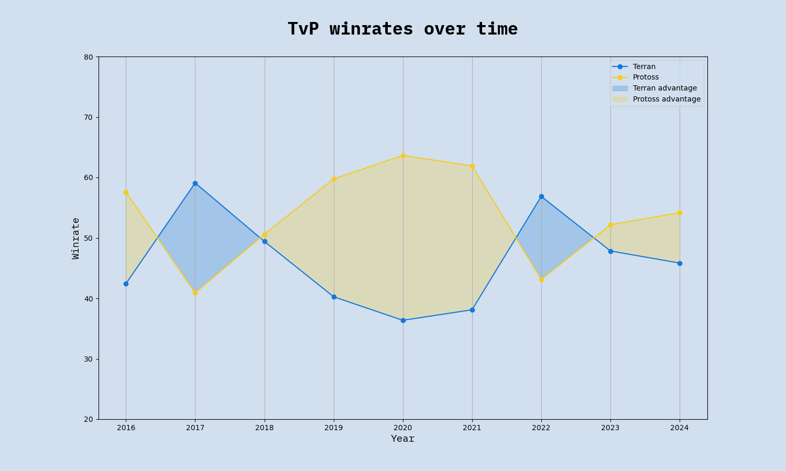
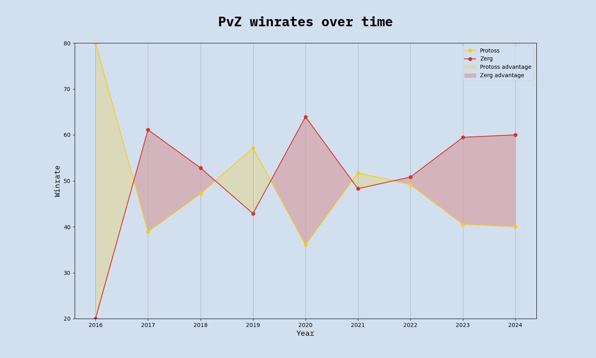

# Stats from the remastered era of pro Starcraft 1
#### by Jacob Stubbe Østergaard / JackyVSO  

## Introduction
The following is a set of insights gleaned from data on offline Starcraft 1 tournament games at the pro level between 2016 and 2023. The dataset comprises all 16 seasons of ASL and all 4 seasons of KSL for a total of **1,906 games**. This is enough to make lots of statistically significant inferences but also few enough that more fine-grained insights that build on a small subset of the games come with a lot of uncertainty. It should also be noted that, since the dataset consists exclusively of top level games, the insights in this article apply only to Starcraft played at the very highest skill level. Different dynamics may be at play at other levels.

Game data includes players, outcome, date, duration, spawn locations, map details, map selection and tournament context. I have personally compiled this data in a SQL database, which I have then queried for the insights. Most of the data has been collected from Liquipedia, while game duration and spawn location has been collected from AfreecaTV VODs.

Making these stats available is my attempt to give something back to the community. I hope you find them interesting. Please comment if you have further questions that may be answered from this dataset, and I'll get back to you.

## Table of contents
This article is divided into four main parts: Matchups, Maps, Players and Tournament Stats. For the casuals, I recommend using this menu to find the stats you're interested in. For the nerds, I recommend diving right in and reading the article from end to end.

### 1. [Matchups](#Matchups)
- [Overall winrate for each race](#A2)
- [Frequency of each matchup](#A5)
- [Overall winrates for each non-mirror matchup](#A11)
- [Matchup winrates by year](#6)
- [Average duration of each matchup](#A9)
- [Longest games by matchup](#10)
- [Matchup winrates by game duration](#11)
- [Effect of cross spawns on game duration for each matchup](#14)
- [Effect of cross spawns on winrate for each matchup](#A10)

### 2. [Maps](#Maps)
- [Matchup winrates by number of spawn locations](#7)
- [Balance ranking of popular maps](#8)
- [Tileset frequency](#A6)

### 3. [Players](#Players)
- [Games played by each player](#1)
- [Player winrates](#3)
- [Elo ranking list](#4)
- [Elo graphs of top players](#5)
- [Player winrates by game duration](#13)
- [Average game duration by player](#12)

### 4. [Tournament Stats](#TournamentStats)
- [Longest and shortest games in ASL/KSL history](#9)
- [Bo5/Bo7 win probabilities by game outcomes](#A3)
- [Map selection advantage](#A4)
- [Relative advantage of being a seeded player](#A7)
- [Group decider matches: winners' loser vs. losers' winner](#A8)
  

<h1 class="h1" id="Matchups"> 1. Matchups</h1>
<i>Artosis is technically correct - the best kind of correct</i>
<h4 id="A2"></h4>

<table border="1" class="dataframe table table-striped table-bordered">
    <thead>
    <tr>
    <th colspan="3" style="font-size: 24px; text-align: center;">Overall race winrates</th>
</tr><tr style="text-align: right;"><th>Race</th><th>Total games</th><th>Overall winrate</th>    </tr>
    </thead>
    <tbody>
    <tr>
    <td style="background-color: #d2dfee;">Terran</td><td style="background-color: #d2dfee;">1091</td><td style="background-color: #d2dfee;">50.33</td>
    </tr><tr>
    <td style="background-color: #e2effe;">Protoss</td><td style="background-color: #e2effe;">1057</td><td style="background-color: #e2effe;">50.67</td>
    </tr><tr>
    <td style="background-color: #d2dfee;">Zerg</td><td style="background-color: #d2dfee;">1162</td><td style="background-color: #d2dfee;">49.09</td>
    </tr>  </tbody>
</table>

This table shows the overall winrate for each race across both of its non-mirror matchups. It seems to show that Protoss is the best race by a margin of 0.3 percentage points over Terran. It also seems to show that Terran is the 2nd best race. But since Artosis often points out that Terran only appears to be doing well because Flash is so good, I decided to check what the winrates would be without Flash. To make a fair comparison, I also removed the statistically best player for each of the other races (Rain for Protoss and Effort for Zerg), and this is what the updated figures look like:

<table border="1" class="dataframe table table-striped table-bordered">
    <thead>
    <tr>
    <th colspan="3" style="font-size: 24px; text-align: center;">Overall race winrates</th>
</tr><tr style="text-align: right;"><th>Race</th><th>Total games</th><th>Overall winrate</th>    </tr>
    </thead>
    <tbody>
    <tr>
    <td style="background-color: #d2dfee;">Terran</td><td style="background-color: #d2dfee;">973</td><td style="background-color: #d2dfee;">47.97</td>
    </tr><tr>
    <td style="background-color: #e2effe;">Protoss</td><td style="background-color: #e2effe;">892</td><td style="background-color: #e2effe;">49.94</td>
    </tr><tr>
    <td style="background-color: #d2dfee;">Zerg</td><td style="background-color: #d2dfee;">1088</td><td style="background-color: #d2dfee;">48.29</td>
    </tr>  </tbody>
</table>

So Terran does seem to be the worst race without Flash, but only 0.3 percentage points below Zerg.  

(While this was a fun exercise, I should really emphasize that it means very little. The Protoss winrate advantage of 50.67 vs 50.33 over Terran amounts to an advantage of no more than four games, which makes it statistically insignificant by any reasonable standards. There is really only one thing that these numbers show very clearly, and that is that Starcraft is a remarkably balanced game - at least when played on carefully designed maps)  

Now let's look at the winrates for the individual non-mirror matchups. The numbers confirm the well-known pattern of T > Z > P > T but suggest that Zerg's advantage over Protoss is slightly smaller than Terran's advantage over Zerg and Protoss' advantage over Terran:  

<h4 id="A11"></h4>

While these figures are very unsurprising, the story becomes a lot more interesting when we go into some more detail. For starters, let's take a look at the development of the matchup winrates year on year:

<h4 id="6"></h4>

  
  
  

These graphs tell quite a different story than the overall winrates. The power distributions have actually fluctuated greatly as the races have struggled for the upper hand in the metagame. The pictures becomes still more nuanced when we take game duration and spawn locations into consideration.  
First, let's look at how game duration correlates to matchup winrates. 

*Note:because of the limited data available (only 400-500 tournament games played in each non-mirror matchup since 2016), I have created these graphs using 10 automatically clustered intervals, which means the intervals are of different length but each represent roughly the same amount of games (20-50 games per interval). Using any more intervals than this, let alone setting a point for every single minute, would leave some intervals with way too few data points, which would make the graphs noisy/random. The presented graphs represent a compromise between that and a very coarse version with only a few intervals but more certainty. Their minor details do not represent reality but their major trends are accurate.*

<h3 id="11">Zerg rules the early game but struggles in the midgame. The late game is balanced.</h3>

We can see that if the game ends quickly, that bodes well for Zerg. In TvZ, there is a clear trend of early victories being Zerg, midgame victories being Terran, and the late game being very even. Long games are quite evenly split in all three matchups. PvZ has a similar trend but with semi-long games being once again Zerg-favored.

Moving on to spawn locations, we come to one of the most unambiguous findings of this study:

<h3 id="A10">Cross spawns is VERY BAD for Terran</h3>
... and amazing for Protoss.

<table border="1" class="dataframe table table-striped table-bordered">
    <thead>
    <tr>
    <th colspan="8" style="font-size: 24px; text-align: center;">Effect of cross spawns in each matchup</th>
</tr><tr style="text-align: right;"><th>Matchup</th><th>Adjacent spawns winrate</th><th>Cross spawns winrate</th><th>Net effect</th>    </tr>
    </thead>
    <tbody>
    <tr>
    <td style="background-color: #e2effe;">TvP</td><td style="background-color: #e2effe;">Terran +14</td><td style="background-color: #e2effe;">Protoss +7</td><td style="background-color: #e2effe;"><b>Protoss +21</b></td>
    </tr><tr>
    <td style="background-color: #e2effe;">TvZ</td><td style="background-color: #e2effe;">Terran +14</td><td style="background-color: #e2effe;">Terran +2</td><td style="background-color: #e2effe;"><b>Zerg +12</b></td>
    </tr><tr>
    <td style="background-color: #e2effe;">PvZ</td><td style="background-color: #e2effe;">Zerg +13</td><td style="background-color: #e2effe;">Protoss +4</td><td style="background-color: #e2effe;"><b>Protoss +17</b></td>
    </tr>  </tbody>
</table>

Now, if you're wondering why