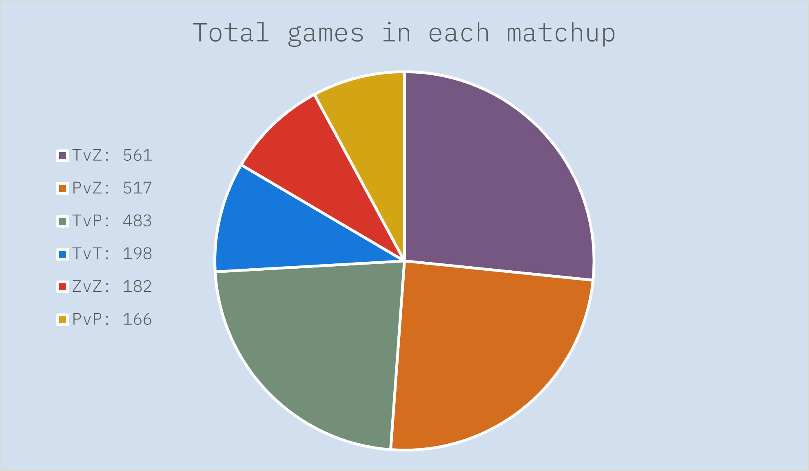
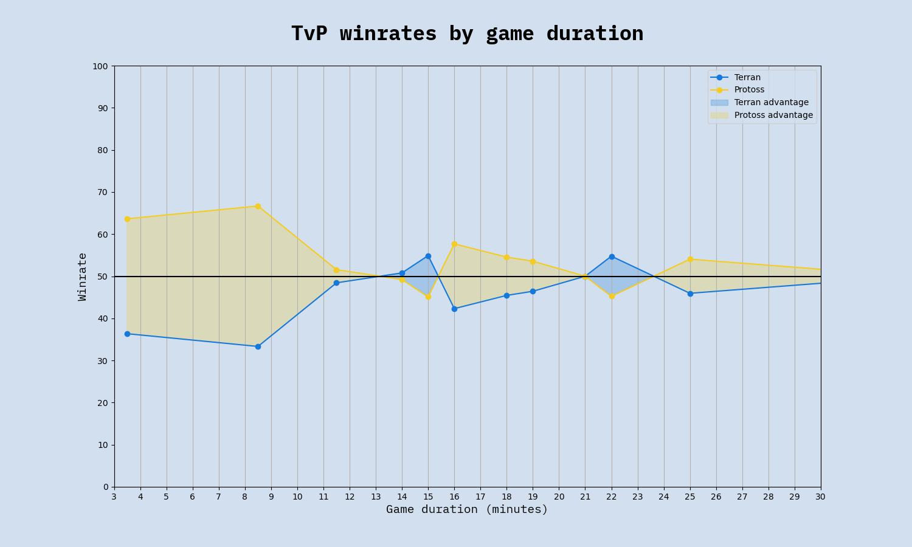
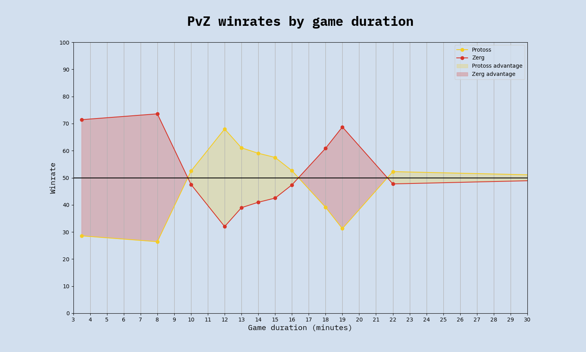
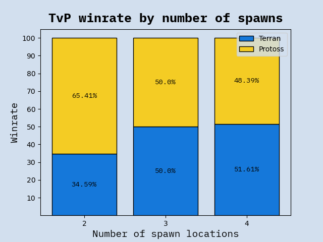
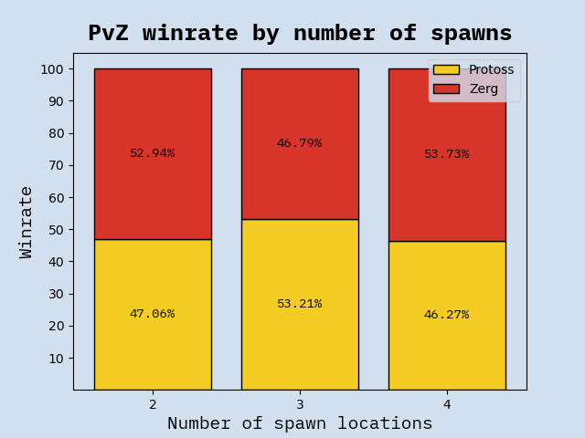
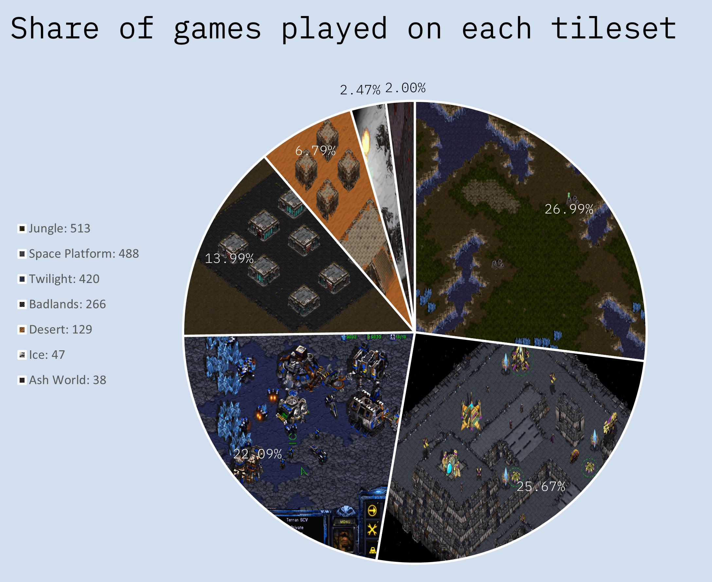
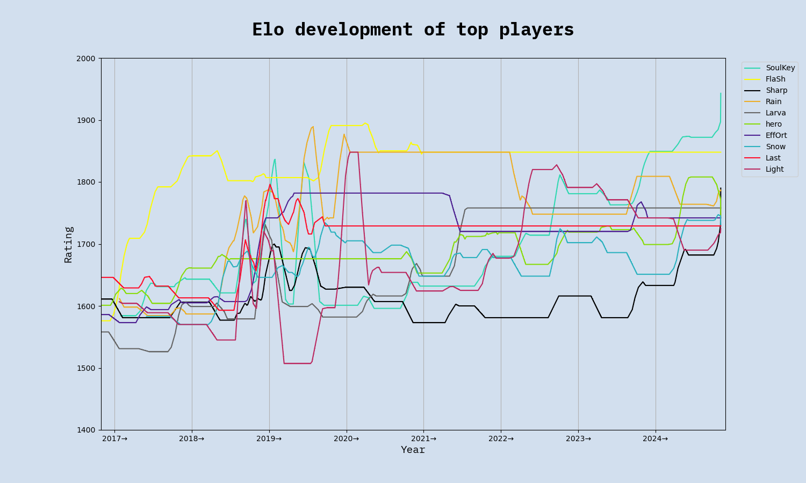
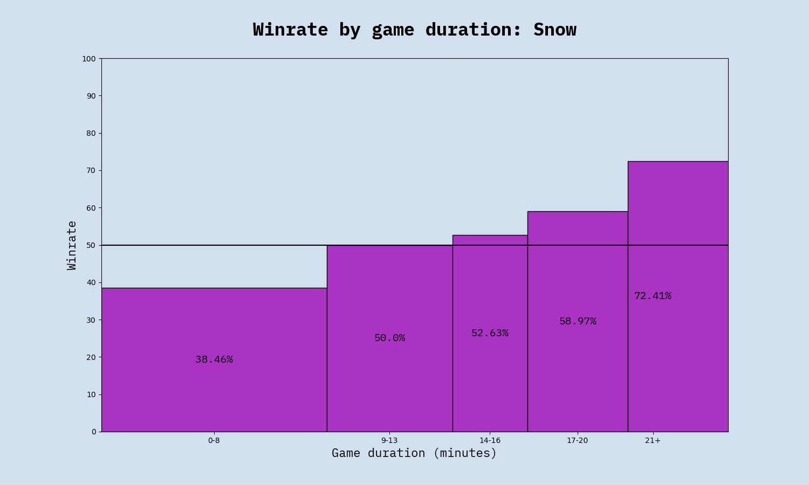
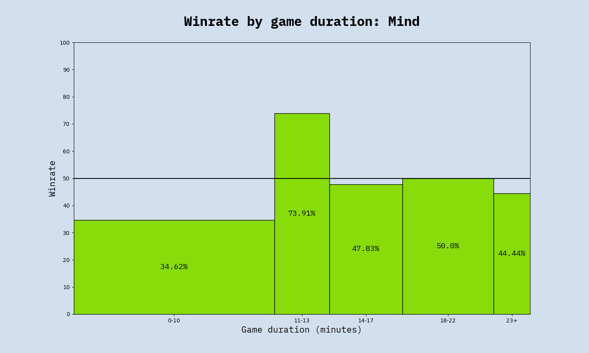

# Stats from the ASL/KSL era
#### by Jacob Stubbe Østergaard / JackyVSO  

## Introduction
The following is a set of insights gleaned from data on offline Starcraft 1 tournament games at the pro level between 2016 and 2023. The dataset comprises all 16 seasons of ASL and all 4 seasons of KSL for a total of **1,906 games**. This is enough to make lots of statistically significant inferences but also few enough that more fine-grained insights that build on a small subset of the games come with a lot of uncertainty. It should also be noted that, since the dataset consists exclusively of top level games, the insights in this article apply only to Starcraft played at the very highest skill level. Different dynamics may be at play at other levels.

Game data includes players, outcome, date, duration, spawn locations, map details, map selection and tournament context. I have personally compiled this data in a SQL database, which I have then queried for the insights. Most of the data has been collected from Liquipedia, while game duration and spawn location has been collected from AfreecaTV VODs.

Making these stats available is my attempt to give something back to the community. I hope you find them interesting. Please comment if you have further questions that may be answered from this dataset, and I'll get back to you.

## Table of contents
This article is divided into four main parts: Matchups, Maps, Players and Tournament Stats. For the casuals, I recommend using this menu to find the stats you're interested in. For the nerds, I recommend diving right in and reading the article from end to end.

### 1. [Matchups](#Matchups)
- [Frequency of each matchup](#A5)
- [Overall winrate for each race](#A2)
- [Overall winrates for each non-mirror matchup](#A11)
- [Matchup winrates by year](#6)
- [Average duration of each matchup](#A9)
- [Longest games by matchup](#10)
- [Matchup winrates by game duration](#11)
- [Effect of cross spawns on game duration for each matchup](#14)
- [Effect of cross spawns on winrate for each matchup](#A10)

### 2. [Maps](#Maps)
- [Matchup winrates by number of spawn locations](#7)
- [Balance ranking of popular maps](#8)
- [Tileset frequency](#A6)

### 3. [Players](#Players)
- [Games played by each player](#1)
- [Player winrates](#3)
- [Elo ranking list](#4)
- [Elo graphs of top players](#5)
- [Player winrates by game duration](#13)
- [Average game duration by player](#12)

### 4. [Tournament Stats](#TournamentStats)
- [Longest and shortest games in ASL/KSL history](#9)
- [Bo5/Bo7 win probabilities by game outcomes](#A3)
- [Map selection advantage](#A4)
- [Relative advantage of being a seeded player](#A7)
- [Group decider matches: winners' loser vs. losers' winner](#A8)
  

<h1 class="h1" id="Matchups"> 1. Matchups</h1>
The distribution of matchups of games in the database is as follows:
<h4 id="A5"></h4>

We can see that mirror matchups are quite rare, which is only logical. The comparative scarcity of TvPs can be explained by a slight overrepresentation of Zergs in ASL and KSL in general (see the figures for total games played by each race in the table below) but that leaves no obvious explanation for why there have then been more TvTs than ZvZs. Maybe Zergs try to avoid each other in group selections. Maybe ZvZ series are generally more one-sided and therefore shorter than TvTs series. I don't know. Now let's move on to matchup winrates, about which this study shows that

<i>Artosis is technically correct - the best kind of correct</i>
<h4 id="A2"></h4>

This table shows the overall winrate for each race across both its non-mirror matchups:

<table border="1" class="dataframe table table-striped table-bordered">
    <thead>
    <tr>
    <th colspan="3" style="font-size: 24px; text-align: center;">Overall race winrates</th>
</tr><tr style="text-align: right;"><th>Race</th><th>Total games</th><th>Overall winrate</th>    </tr>
    </thead>
    <tbody>
    <tr>
    <td style="background-color: #d2dfee;">Terran</td><td style="background-color: #d2dfee;">1091</td><td style="background-color: #d2dfee;">50.33</td>
    </tr><tr>
    <td style="background-color: #e2effe;">Protoss</td><td style="background-color: #e2effe;">1057</td><td style="background-color: #e2effe;">50.67</td>
    </tr><tr>
    <td style="background-color: #d2dfee;">Zerg</td><td style="background-color: #d2dfee;">1162</td><td style="background-color: #d2dfee;">49.09</td>
    </tr>  </tbody>
</table>

 It seems to show that Protoss is the best race by a margin of 0.3 percentage points over Terran. It also seems to show that Terran is the 2nd best race. But since Artosis often points out that Terran only appears to be doing well because Flash is so good, I decided to check what the winrates would be without Flash. To make a fair comparison, I also removed the statistically best player for each of the other races (Rain for Protoss and Effort for Zerg), and this is what the updated figures look like:

<table border="1" class="dataframe table table-striped table-bordered">
    <thead>
    <tr>
    <th colspan="3" style="font-size: 24px; text-align: center;">Overall race winrates</th>
</tr><tr style="text-align: right;"><th>Race</th><th>Total games</th><th>Overall winrate</th>    </tr>
    </thead>
    <tbody>
    <tr>
    <td style="background-color: #d2dfee;">Terran</td><td style="background-color: #d2dfee;">973</td><td style="background-color: #d2dfee;">47.97</td>
    </tr><tr>
    <td style="background-color: #e2effe;">Protoss</td><td style="background-color: #e2effe;">892</td><td style="background-color: #e2effe;">49.94</td>
    </tr><tr>
    <td style="background-color: #d2dfee;">Zerg</td><td style="background-color: #d2dfee;">1088</td><td style="background-color: #d2dfee;">48.29</td>
    </tr>  </tbody>
</table>

So Terran does seem to be the worst race without Flash, but only 0.3 percentage points below Zerg.  

(While this was a fun exercise, I should really emphasize that it means very little. The Protoss winrate advantage of 50.67 vs 50.33 over Terran amounts to an advantage of no more than four games, which makes it statistically insignificant by any reasonable standards. There is really only one thing that these numbers show very clearly, and that is that Starcraft is a remarkably balanced game - at least when played on carefully designed maps)  

Now let's look at the winrates for the individual non-mirror matchups. The numbers confirm the well-known pattern of T > Z > P > T but suggest that Zerg's advantage over Protoss is slightly smaller than Terran's advantage over Zerg and Protoss' advantage over Terran:  

<h4 id="A11"></h4>

While these figures are very unsurprising, the story becomes a lot more interesting when we go into some more detail. For starters, let's take a look at the development of the matchup winrates year on year:

<h4 id="6"></h4>

These graphs tell quite a different story than the overall winrates. The power distributions have actually fluctuated greatly as the races have struggled for the upper hand in the metagame. The pictures becomes still more nuanced when we take game duration and spawn locations into consideration.  
First, let's look at how game duration correlates to matchup winrates. 

*Note:because of the limited data available (only 400-500 tournament games played in each non-mirror matchup since 2016), I have created these graphs using 10 automatically clustered intervals, which means the intervals are of different length but each represent roughly the same amount of games (20-50 games per interval). Using any more intervals than this, let alone setting a point for every single minute, would leave some intervals with way too few data points, which would make the graphs noisy/random. The presented graphs represent a compromise between that and a very coarse version with only a few intervals but more certainty. Their minor details do not represent reality but their major trends are accurate.*

<h3 id="11">Zerg rules the early game but struggles in the midgame. The late game is balanced.</h3>

We can see that if the game ends quickly, that bodes well for Zerg. In TvZ, there is a clear trend of early victories being Zerg, midgame victories being Terran, and the late game being very even. Long games are quite evenly split in all three matchups. PvZ has a similar trend but with semi-long games being once again Zerg-favored.

Moving on to spawn locations, we come to one of the most unambiguous findings of this study:

<h3 id="A10">Cross spawns is VERY BAD for Terran</h3>
... and amazing for Protoss.

<table border="1" class="dataframe table table-striped table-bordered">
    <thead>
    <tr>
    <th colspan="8" style="font-size: 24px; text-align: center;">Effect of cross spawns in each matchup</th>
</tr><tr style="text-align: right;"><th>Matchup</th><th>Adjacent spawns winrate</th><th>Cross spawns winrate</th><th>Net effect</th>    </tr>
    </thead>
    <tbody>
    <tr>
    <td style="background-color: #e2effe;">TvP</td><td style="background-color: #e2effe;">Terran +14</td><td style="background-color: #e2effe;">Protoss +7</td><td style="background-color: #e2effe;"><b>Protoss +21</b></td>
    </tr><tr>
    <td style="background-color: #e2effe;">TvZ</td><td style="background-color: #e2effe;">Terran +14</td><td style="background-color: #e2effe;">Terran +2</td><td style="background-color: #e2effe;"><b>Zerg +12</b></td>
    </tr><tr>
    <td style="background-color: #e2effe;">PvZ</td><td style="background-color: #e2effe;">Zerg +13</td><td style="background-color: #e2effe;">Protoss +4</td><td style="background-color: #e2effe;"><b>Protoss +17</b></td>
    </tr>  </tbody>
</table>

Such strong discrepancies across 200+ games in each matchup on 4-player maps is unlikely to have happened randomly. This table begins to reveal how the overall winrate of each matchup is really just an average of a range of varied winrates under specific conditions. TvP in general might be slightly Protoss-favored but TvP on a 4 player map with adjacent spawns is strongly Terran-favored.

If that table began to reveal how circumstance-dependent the power dynamics between the races are, these charts should drive the point home. They show how matchup winrates are affect by whether it's a 2-player, 3-player or 4-player map:

<h4 id="7"></h4>

The most notable thing here is just how lopsided TvP on 2-player maps is. Out of 116 games in the database, Terran has won 38 and Protoss has won 78. If TvP was never played on 2-player maps, it would be a Terran-favored matchup. Terran also fares better with more spawning locations against Zerg, although this is far less pronounced. This is consistent with another finding in the data, which was that *the bigger the map (by size in tiles), the better for Terran*. I have not included that figure here because it shows the same as the above but less markedly.
PvZ, on the other hand, seems hardly to be affected by the number of spawning locations on the map at all. I'll leave it to more accomplished players to explain this difference.

<h1 class="h1" id="Maps"> 2. Maps</h1>

Now let's keep our focus on the maps for a bit before we move on to stats about players. No less than 68 different maps have been used in ASL and KSL: 19 2-player maps (553 games), 14 3-player maps (391 games), and 35 4-player maps (962 games).

<h4 id="A6"></h4>

(For some reason, we almost never see maps on Ash World tileset. Why?)

Since most of these maps have been in use for only one or two seasons, it isn't really possible to glean any statistical insights from them. However, for the most popular maps which have been played across many seasons, it should be possible to make meaningful comparisons. I thought it might be interesting to devise a metric to score these maps according to how balanced they are. The following balance ranking of the 13 most played maps was calculated using RMSE (root mean squared error) across the three matchups, with 50.0% as the target value.

*Note: Using RMSE instead of MAE (mean absolute error) means that a strong bias in one matchup is punished more than a moderate bias across all matchups. Whether to use one or the other is a question of what one's idea of balance really is. I'm using RMSE because I personally think a map that is perfectly balanced in two matchups but has a 75% bias in the third one is less balanced than one that has scores of, say, 57/40/58.*

<h4 id="8"></h4>
<table border="1" class="dataframe table table-striped table-bordered">
  <thead>
    <tr>
    <th colspan="7" style="font-size: 24px; text-align: center;">Most to least balanced maps</th>
</tr><tr style="text-align: right;"><th>Rank</th><th>Map</th><th>Total games</th><th>TvP</th><th>TvZ</th><th>PvZ</th><th>Balance score</th>    </tr>
    </thead>
    <tbody>
    <tr>
    <td style="background-color: #d2dfee;">1</td><td style="background-color: #d2dfee;">Sylphid</td><td style="background-color: #d2dfee;">141</td><td style="background-color: #eee1df;">47.1</td><td style="background-color: #eec8c1;">47.1</td><td style="background-color: #ee9b8b;">58.8</td><td style="background-color: #2261ff;">94.4</td>
    </tr><tr>
    <td style="background-color: #e2effe;">2</td><td style="background-color: #e2effe;">Eddy</td><td style="background-color: #e2effe;">55</td><td style="background-color: #eed9d6;">54.5</td><td style="background-color: #ee9685;">58.8</td><td style="background-color: #eec7bf;">46.7</td><td style="background-color: #2761fa;">94.0</td>
    </tr><tr>
    <td style="background-color: #d2dfee;">3</td><td style="background-color: #d2dfee;">Butter</td><td style="background-color: #d2dfee;">41</td><td style="background-color: #eed4d0;">44.4</td><td style="background-color: #ee765f;">37.5</td><td style="background-color: #eee1df;">50.0</td><td style="background-color: #3d5fe5;">92.1</td>
    </tr><tr>
    <td style="background-color: #e2effe;">4</td><td style="background-color: #e2effe;">Polypoid</td><td style="background-color: #e2effe;">77</td><td style="background-color: #eedfdd;">53.3</td><td style="background-color: #ee6348;">64.7</td><td style="background-color: #eebdb4;">54.5</td><td style="background-color: #4b5dd7;">90.9</td>
    </tr><tr>
    <td style="background-color: #d2dfee;">5</td><td style="background-color: #d2dfee;">Eclipse</td><td style="background-color: #d2dfee;">94</td><td style="background-color: #eeaca0;">36.0</td><td style="background-color: #eecdc6;">52.4</td><td style="background-color: #eeac9f;">43.3</td><td style="background-color: #4b5dd7;">90.9</td>
    </tr><tr>
    <td style="background-color: #e2effe;">6</td><td style="background-color: #e2effe;">Vermeer</td><td style="background-color: #e2effe;">46</td><td style="background-color: #eeb3a8;">62.5</td><td style="background-color: #ee674c;">64.3</td><td style="background-color: #eee1df;">50.0</td><td style="background-color: #625cc2;">89.0</td>
    </tr><tr>
    <td style="background-color: #d2dfee;">7</td><td style="background-color: #d2dfee;">Circuit Breaker</td><td style="background-color: #d2dfee;">149</td><td style="background-color: #eea99c;">64.7</td><td style="background-color: #ee9a8a;">58.3</td><td style="background-color: #ee7d67;">62.5</td><td style="background-color: #6f5ab5;">87.9</td>
    </tr><tr>
    <td style="background-color: #e2effe;">8</td><td style="background-color: #e2effe;">Fighting Spirit</td><td style="background-color: #e2effe;">105</td><td style="background-color: #eebfb7;">40.0</td><td style="background-color: #ee846f;">60.9</td><td style="background-color: #ee664c;">34.6</td><td style="background-color: #715ab3;">87.7</td>
    </tr><tr>
    <td style="background-color: #d2dfee;">9</td><td style="background-color: #d2dfee;">Benzene</td><td style="background-color: #d2dfee;">48</td><td style="background-color: #eecdc7;">42.9</td><td style="background-color: #ee3d1a;">30.8</td><td style="background-color: #ee9f90;">58.3</td><td style="background-color: #775aad;">87.2</td>
    </tr><tr>
    <td style="background-color: #e2effe;">10</td><td style="background-color: #e2effe;">Heartbreak Ridge</td><td style="background-color: #e2effe;">48</td><td style="background-color: #ee907e;">30.0</td><td style="background-color: #ee9e8e;">57.9</td><td style="background-color: #eeb4a9;">55.6</td><td style="background-color: #775aad;">87.2</td>
    </tr><tr>
    <td style="background-color: #d2dfee;">11</td><td style="background-color: #d2dfee;">Transistor</td><td style="background-color: #d2dfee;">41</td><td style="background-color: #eea090;">66.7</td><td style="background-color: #ee765f;">37.5</td><td style="background-color: #ee5c3f;">33.3</td><td style="background-color: #965790;">84.6</td>
    </tr><tr>
    <td style="background-color: #e2effe;">12</td><td style="background-color: #e2effe;">Overwatch</td><td style="background-color: #e2effe;">54</td><td style="background-color: #eeb3a8;">37.5</td><td style="background-color: #ee3d1a;">69.2</td><td style="background-color: #ee3d1a;">70.6</td><td style="background-color: #b25575;">82.2</td>
    </tr><tr>
    <td style="background-color: #d2dfee;">13</td><td style="background-color: #d2dfee;">Gladiator</td><td style="background-color: #d2dfee;">47</td><td style="background-color: #ee3d1a;">12.5</td><td style="background-color: #eee1df;">50.0</td><td style="background-color: #ee4827;">69.2</td><td style="background-color: #ff4e2b;">75.7</td>
    </tr>  </tbody>
</table>

*The winrates displayed are for the first race mentioned in the matchup (e.g. Sylphid has a 47.1% winrate for T in TvP, 47.1% for T in TvZ and 58.8% for P in PvZ)*

So Sylphid appears to be the most balanced map yet made, closely followed by (In The Way of An) Eddy, whereas Gladiator is the least balanced - even though it's somehow perfectly balanced in TvZ. Looking at the scores for Vermeer, Polypoid and Circuit Breaker, we can see that what is sometimes termed "standard maps" are actually clearly Terran-favored, whereas more unusual maps might be less comfortable for Terran.

<h1 id="Players">3. Players</h1>
In this section, we'll abandon the bird's eye view and instead zoom in on how the individual Starcraft 1 pros have been faring against each other. A total of 76 players have qualified for ASL and/or KSL at least once (27 Zerg, 26 Terran, 23 Protoss). Here they are, listed according to how many tournament games they've played:

<h4 id="1"></h4>
<table border="1" class="dataframe table table-striped table-bordered">
    <thead>
    <tr>
    <th colspan="3" style="font-size: 24px; text-align: center;">Total games played (ASL+KSL)</th>
</tr><tr style="text-align: right;"><th>Rank</th><th>Player</th><th>Games</th>    </tr>
    </thead>
    <tbody>
    <tr>
    <td style="background-color: #d2dfee;">1</td><td style="background-color: #d2dfee;">SoulKey</td><td style="background-color: #d2dfee;">205</td>
    </tr><tr>
    <td style="background-color: #e2effe;">2</td><td style="background-color: #e2effe;">Mini</td><td style="background-color: #e2effe;">200</td>
    </tr><tr>
    <td style="background-color: #d2dfee;">3</td><td style="background-color: #d2dfee;">Light</td><td style="background-color: #d2dfee;">170</td>
    </tr><tr>
    <td style="background-color: #e2effe;">4</td><td style="background-color: #e2effe;">Rain</td><td style="background-color: #e2effe;">165</td>
    </tr><tr>
    <td style="background-color: #d2dfee;">5</td><td style="background-color: #d2dfee;">Best</td><td style="background-color: #d2dfee;">163</td>
    </tr><tr>
    <td style="background-color: #e2effe;">6</td><td style="background-color: #e2effe;">Sharp</td><td style="background-color: #e2effe;">157</td>
    </tr><tr>
    <td style="background-color: #d2dfee;">7</td><td style="background-color: #d2dfee;">Snow</td><td style="background-color: #d2dfee;">157</td>
    </tr><tr>
    <td style="background-color: #e2effe;">8</td><td style="background-color: #e2effe;">hero</td><td style="background-color: #e2effe;">151</td>
    </tr><tr>
    <td style="background-color: #d2dfee;">9</td><td style="background-color: #d2dfee;">Queen</td><td style="background-color: #d2dfee;">140</td>
    </tr><tr>
    <td style="background-color: #e2effe;">10</td><td style="background-color: #e2effe;">Rush</td><td style="background-color: #e2effe;">135</td>
    </tr><tr>
    <td style="background-color: #d2dfee;">11</td><td style="background-color: #d2dfee;">FlaSh</td><td style="background-color: #d2dfee;">118</td>
    </tr><tr>
    <td style="background-color: #e2effe;">12</td><td style="background-color: #e2effe;">Last</td><td style="background-color: #e2effe;">117</td>
    </tr><tr>
    <td style="background-color: #d2dfee;">13</td><td style="background-color: #d2dfee;">Action</td><td style="background-color: #d2dfee;">115</td>
    </tr><tr>
    <td style="background-color: #e2effe;">14</td><td style="background-color: #e2effe;">Larva</td><td style="background-color: #e2effe;">113</td>
    </tr><tr>
    <td style="background-color: #d2dfee;">15</td><td style="background-color: #d2dfee;">Bisu</td><td style="background-color: #d2dfee;">111</td>
    </tr><tr>
    <td style="background-color: #e2effe;">16</td><td style="background-color: #e2effe;">Mind</td><td style="background-color: #e2effe;">108</td>
    </tr><tr>
    <td style="background-color: #d2dfee;">17</td><td style="background-color: #d2dfee;">Soma</td><td style="background-color: #d2dfee;">101</td>
    </tr><tr>
    <td style="background-color: #e2effe;">18</td><td style="background-color: #e2effe;">Shuttle</td><td style="background-color: #e2effe;">91</td>
    </tr><tr>
    <td style="background-color: #d2dfee;">19</td><td style="background-color: #d2dfee;">Stork</td><td style="background-color: #d2dfee;">91</td>
    </tr><tr>
    <td style="background-color: #e2effe;">20</td><td style="background-color: #e2effe;">Jaedong</td><td style="background-color: #e2effe;">88</td>
    </tr><tr>
    <td style="background-color: #d2dfee;">21</td><td style="background-color: #d2dfee;">JyJ</td><td style="background-color: #d2dfee;">84</td>
    </tr><tr>
    <td style="background-color: #e2effe;">22</td><td style="background-color: #e2effe;">EffOrt</td><td style="background-color: #e2effe;">74</td>
    </tr><tr>
    <td style="background-color: #d2dfee;">23</td><td style="background-color: #d2dfee;">Shine</td><td style="background-color: #d2dfee;">73</td>
    </tr><tr>
    <td style="background-color: #e2effe;">24</td><td style="background-color: #e2effe;">RoyaL</td><td style="background-color: #e2effe;">71</td>
    </tr><tr>
    <td style="background-color: #d2dfee;">25</td><td style="background-color: #d2dfee;">Mong</td><td style="background-color: #d2dfee;">58</td>
    </tr><tr>
    <td style="background-color: #e2effe;">26</td><td style="background-color: #e2effe;">Sea</td><td style="background-color: #e2effe;">53</td>
    </tr><tr>
    <td style="background-color: #d2dfee;">27</td><td style="background-color: #d2dfee;">MIsO</td><td style="background-color: #d2dfee;">47</td>
    </tr><tr>
    <td style="background-color: #e2effe;">28</td><td style="background-color: #e2effe;">sSak</td><td style="background-color: #e2effe;">42</td>
    </tr><tr>
    <td style="background-color: #d2dfee;">29</td><td style="background-color: #d2dfee;">Horang2</td><td style="background-color: #d2dfee;">42</td>
    </tr><tr>
    <td style="background-color: #e2effe;">30</td><td style="background-color: #e2effe;">Sacsri</td><td style="background-color: #e2effe;">40</td>
    </tr><tr>
    <td style="background-color: #d2dfee;">31</td><td style="background-color: #d2dfee;">Modesty</td><td style="background-color: #d2dfee;">40</td>
    </tr><tr>
    <td style="background-color: #e2effe;">32</td><td style="background-color: #e2effe;">Movie</td><td style="background-color: #e2effe;">38</td>
    </tr><tr>
    <td style="background-color: #d2dfee;">33</td><td style="background-color: #d2dfee;">Ample</td><td style="background-color: #d2dfee;">34</td>
    </tr><tr>
    <td style="background-color: #e2effe;">34</td><td style="background-color: #e2effe;">BarrackS</td><td style="background-color: #e2effe;">34</td>
    </tr><tr>
    <td style="background-color: #d2dfee;">35</td><td style="background-color: #d2dfee;">Jaehoon</td><td style="background-color: #d2dfee;">32</td>
    </tr><tr>
    <td style="background-color: #e2effe;">36</td><td style="background-color: #e2effe;">GuemChi</td><td style="background-color: #e2effe;">31</td>
    </tr><tr>
    <td style="background-color: #d2dfee;">37</td><td style="background-color: #d2dfee;">free</td><td style="background-color: #d2dfee;">29</td>
    </tr><tr>
    <td style="background-color: #e2effe;">38</td><td style="background-color: #e2effe;">Killer</td><td style="background-color: #e2effe;">29</td>
    </tr><tr>
    <td style="background-color: #d2dfee;">39</td><td style="background-color: #d2dfee;">Leta</td><td style="background-color: #d2dfee;">25</td>
    </tr><tr>
    <td style="background-color: #e2effe;">40</td><td style="background-color: #e2effe;">Calm</td><td style="background-color: #e2effe;">24</td>
    </tr><tr>
    <td style="background-color: #d2dfee;">41</td><td style="background-color: #d2dfee;">Piano</td><td style="background-color: #d2dfee;">19</td>
    </tr><tr>
    <td style="background-color: #e2effe;">42</td><td style="background-color: #e2effe;">ggaemo</td><td style="background-color: #e2effe;">17</td>
    </tr><tr>
    <td style="background-color: #d2dfee;">43</td><td style="background-color: #d2dfee;">ForGG</td><td style="background-color: #d2dfee;">17</td>
    </tr><tr>
    <td style="background-color: #e2effe;">44</td><td style="background-color: #e2effe;">Hyuk</td><td style="background-color: #e2effe;">15</td>
    </tr><tr>
    <td style="background-color: #d2dfee;">45</td><td style="background-color: #d2dfee;">beast</td><td style="background-color: #d2dfee;">14</td>
    </tr><tr>
    <td style="background-color: #e2effe;">46</td><td style="background-color: #e2effe;">HyuN</td><td style="background-color: #e2effe;">12</td>
    </tr><tr>
    <td style="background-color: #d2dfee;">47</td><td style="background-color: #d2dfee;">nOOb</td><td style="background-color: #d2dfee;">11</td>
    </tr><tr>
    <td style="background-color: #e2effe;">48</td><td style="background-color: #e2effe;">815</td><td style="background-color: #e2effe;">9</td>
    </tr><tr>
    <td style="background-color: #d2dfee;">49</td><td style="background-color: #d2dfee;">Brain</td><td style="background-color: #d2dfee;">8</td>
    </tr><tr>
    <td style="background-color: #e2effe;">50</td><td style="background-color: #e2effe;">Ss1nz</td><td style="background-color: #e2effe;">8</td>
    </tr><tr>
    <td style="background-color: #d2dfee;">51</td><td style="background-color: #d2dfee;">ZeLoT</td><td style="background-color: #d2dfee;">7</td>
    </tr><tr>
    <td style="background-color: #e2effe;">52</td><td style="background-color: #e2effe;">Ruin</td><td style="background-color: #e2effe;">7</td>
    </tr><tr>
    <td style="background-color: #d2dfee;">53</td><td style="background-color: #d2dfee;">HiyA</td><td style="background-color: #d2dfee;">6</td>
    </tr><tr>
    <td style="background-color: #e2effe;">54</td><td style="background-color: #e2effe;">Pusan</td><td style="background-color: #e2effe;">5</td>
    </tr><tr>
    <td style="background-color: #d2dfee;">55</td><td style="background-color: #d2dfee;">Sky</td><td style="background-color: #d2dfee;">5</td>
    </tr><tr>
    <td style="background-color: #e2effe;">56</td><td style="background-color: #e2effe;">Tyson</td><td style="background-color: #e2effe;">5</td>
    </tr><tr>
    <td style="background-color: #d2dfee;">57</td><td style="background-color: #d2dfee;">YSC</td><td style="background-color: #d2dfee;">5</td>
    </tr><tr>
    <td style="background-color: #e2effe;">58</td><td style="background-color: #e2effe;">BishOp</td><td style="background-color: #e2effe;">5</td>
    </tr><tr>
    <td style="background-color: #d2dfee;">59</td><td style="background-color: #d2dfee;">Lazy</td><td style="background-color: #d2dfee;">4</td>
    </tr><tr>
    <td style="background-color: #e2effe;">60</td><td style="background-color: #e2effe;">firebathero</td><td style="background-color: #e2effe;">4</td>
    </tr><tr>
    <td style="background-color: #d2dfee;">61</td><td style="background-color: #d2dfee;">ByuL</td><td style="background-color: #d2dfee;">4</td>
    </tr><tr>
    <td style="background-color: #e2effe;">62</td><td style="background-color: #e2effe;">Iris</td><td style="background-color: #e2effe;">3</td>
    </tr><tr>
    <td style="background-color: #d2dfee;">63</td><td style="background-color: #d2dfee;">NaDa</td><td style="background-color: #d2dfee;">3</td>
    </tr><tr>
    <td style="background-color: #e2effe;">64</td><td style="background-color: #e2effe;">Yoon</td><td style="background-color: #e2effe;">3</td>
    </tr><tr>
    <td style="background-color: #d2dfee;">65</td><td style="background-color: #d2dfee;">Hint</td><td style="background-color: #d2dfee;">2</td>
    </tr><tr>
    <td style="background-color: #e2effe;">66</td><td style="background-color: #e2effe;">Maru</td><td style="background-color: #e2effe;">2</td>
    </tr><tr>
    <td style="background-color: #d2dfee;">67</td><td style="background-color: #d2dfee;">Force(Name)</td><td style="background-color: #d2dfee;">2</td>
    </tr><tr>
    <td style="background-color: #e2effe;">68</td><td style="background-color: #e2effe;">Terror</td><td style="background-color: #e2effe;">2</td>
    </tr><tr>
    <td style="background-color: #d2dfee;">69</td><td style="background-color: #d2dfee;">PURPOSE</td><td style="background-color: #d2dfee;">2</td>
    </tr><tr>
    <td style="background-color: #e2effe;">70</td><td style="background-color: #e2effe;">Tinkle</td><td style="background-color: #e2effe;">2</td>
    </tr><tr>
    <td style="background-color: #d2dfee;">71</td><td style="background-color: #d2dfee;">soso</td><td style="background-color: #d2dfee;">2</td>
    </tr><tr>
    <td style="background-color: #e2effe;">72</td><td style="background-color: #e2effe;">Scan</td><td style="background-color: #e2effe;">2</td>
    </tr><tr>
    <td style="background-color: #d2dfee;">73</td><td style="background-color: #d2dfee;">Speed</td><td style="background-color: #d2dfee;">2</td>
    </tr><tr>
    <td style="background-color: #e2effe;">74</td><td style="background-color: #e2effe;">JJabNewDa</td><td style="background-color: #e2effe;">2</td>
    </tr><tr>
    <td style="background-color: #d2dfee;">75</td><td style="background-color: #d2dfee;">ivOry</td><td style="background-color: #d2dfee;">2</td>
    </tr><tr>
    <td style="background-color: #e2effe;">76</td><td style="background-color: #e2effe;">Yerim2</td><td style="background-color: #e2effe;">0</td>
    </tr>  </tbody>
</table>

Notably, the two finalists of this last ASL are also the two players with the most total games played in ASL and KSL.  

In terms of winrates, these are the overall standings:

<table border="1" class="dataframe table table-striped table-bordered">
  <thead>
  <tr>
    <th colspan="4" style="font-size: 24px; text-align: center;">Total</th>
</tr><tr style="text-align: right;"><th>Rank</th><th>Name</th><th>Games</th><th>Winrate</th>    </tr>
  </thead>
  <tbody>
  <tr>
    <td style="background-color: #d2dfee;">1</td><td style="background-color: #d2dfee;">FlaSh</td><td style="background-color: #d2dfee;">118</td><td style="background-color: #4382ee;">74.58</td>
    </tr><tr>
    <td style="background-color: #e2effe;">2</td><td style="background-color: #e2effe;">Rain</td><td style="background-color: #e2effe;">165</td><td style="background-color: #627fd1;">64.24</td>
    </tr><tr>
    <td style="background-color: #d2dfee;">3</td><td style="background-color: #d2dfee;">Last</td><td style="background-color: #d2dfee;">117</td><td style="background-color: #6f7dc4;">59.83</td>
    </tr><tr>
    <td style="background-color: #e2effe;">4</td><td style="background-color: #e2effe;">EffOrt</td><td style="background-color: #e2effe;">74</td><td style="background-color: #707dc3;">59.46</td>
    </tr><tr>
    <td style="background-color: #d2dfee;">5</td><td style="background-color: #d2dfee;">SoulKey</td><td style="background-color: #d2dfee;">205</td><td style="background-color: #727dc2;">59.02</td>
    </tr><tr>
    <td style="background-color: #e2effe;">6</td><td style="background-color: #e2effe;">Mini</td><td style="background-color: #e2effe;">200</td><td style="background-color: #7b7cb9;">56.0</td>
    </tr><tr>
    <td style="background-color: #d2dfee;">7</td><td style="background-color: #d2dfee;">Light</td><td style="background-color: #d2dfee;">170</td><td style="background-color: #7b7cb9;">55.88</td>
    </tr><tr>
    <td style="background-color: #e2effe;">8</td><td style="background-color: #e2effe;">Soma</td><td style="background-color: #e2effe;">101</td><td style="background-color: #7c7cb8;">55.45</td>
    </tr><tr>
    <td style="background-color: #d2dfee;">9</td><td style="background-color: #d2dfee;">Bisu</td><td style="background-color: #d2dfee;">111</td><td style="background-color: #7e7bb6;">54.95</td>
    </tr><tr>
    <td style="background-color: #e2effe;">10</td><td style="background-color: #e2effe;">hero</td><td style="background-color: #e2effe;">151</td><td style="background-color: #807bb4;">54.3</td>
    </tr><tr>
    <td style="background-color: #d2dfee;">11</td><td style="background-color: #d2dfee;">Queen</td><td style="background-color: #d2dfee;">140</td><td style="background-color: #827bb2;">53.57</td>
    </tr><tr>
    <td style="background-color: #e2effe;">12</td><td style="background-color: #e2effe;">Snow</td><td style="background-color: #e2effe;">157</td><td style="background-color: #867bae;">52.23</td>
    </tr><tr>
    <td style="background-color: #d2dfee;">13</td><td style="background-color: #d2dfee;">Best</td><td style="background-color: #d2dfee;">163</td><td style="background-color: #867bae;">52.15</td>
    </tr><tr>
    <td style="background-color: #e2effe;">14</td><td style="background-color: #e2effe;">Larva</td><td style="background-color: #e2effe;">113</td><td style="background-color: #897aac;">51.33</td>
    </tr><tr>
    <td style="background-color: #d2dfee;">15</td><td style="background-color: #d2dfee;">RoyaL</td><td style="background-color: #d2dfee;">71</td><td style="background-color: #8b7aaa;">50.7</td>
    </tr><tr>
    <td style="background-color: #e2effe;">16</td><td style="background-color: #e2effe;">Rush</td><td style="background-color: #e2effe;">135</td><td style="background-color: #8c7aa9;">50.37</td>
    </tr><tr>
    <td style="background-color: #d2dfee;">17</td><td style="background-color: #d2dfee;">Mind</td><td style="background-color: #d2dfee;">108</td><td style="background-color: #8d7aa8;">50.0</td>
    </tr><tr>
    <td style="background-color: #e2effe;">18</td><td style="background-color: #e2effe;">JyJ</td><td style="background-color: #e2effe;">84</td><td style="background-color: #8d7aa8;">50.0</td>
    </tr><tr>
    <td style="background-color: #d2dfee;">19</td><td style="background-color: #d2dfee;">Action</td><td style="background-color: #d2dfee;">114</td><td style="background-color: #8f7aa6;">49.12</td>
    </tr><tr>
    <td style="background-color: #e2effe;">20</td><td style="background-color: #e2effe;">Sharp</td><td style="background-color: #e2effe;">156</td><td style="background-color: #9379a3;">48.08</td>
    </tr><tr>
    <td style="background-color: #d2dfee;">21</td><td style="background-color: #d2dfee;">Leta</td><td style="background-color: #d2dfee;">25</td><td style="background-color: #9379a2;">48.0</td>
    </tr><tr>
    <td style="background-color: #e2effe;">22</td><td style="background-color: #e2effe;">Jaedong</td><td style="background-color: #e2effe;">88</td><td style="background-color: #9479a2;">47.73</td>
    </tr><tr>
    <td style="background-color: #d2dfee;">23</td><td style="background-color: #d2dfee;">Shuttle</td><td style="background-color: #d2dfee;">91</td><td style="background-color: #9579a0;">47.25</td>
    </tr><tr>
    <td style="background-color: #e2effe;">24</td><td style="background-color: #e2effe;">Sea</td><td style="background-color: #e2effe;">53</td><td style="background-color: #9579a0;">47.17</td>
    </tr><tr>
    <td style="background-color: #d2dfee;">25</td><td style="background-color: #d2dfee;">Stork</td><td style="background-color: #d2dfee;">91</td><td style="background-color: #9c789a;">45.05</td>
    </tr><tr>
    <td style="background-color: #e2effe;">26</td><td style="background-color: #e2effe;">Jaehoon</td><td style="background-color: #e2effe;">32</td><td style="background-color: #a07896;">43.75</td>
    </tr><tr>
    <td style="background-color: #d2dfee;">27</td><td style="background-color: #d2dfee;">Shine</td><td style="background-color: #d2dfee;">73</td><td style="background-color: #a37793;">42.47</td>
    </tr><tr>
    <td style="background-color: #e2effe;">28</td><td style="background-color: #e2effe;">Calm</td><td style="background-color: #e2effe;">24</td><td style="background-color: #a67790;">41.67</td>
    </tr><tr>
    <td style="background-color: #d2dfee;">29</td><td style="background-color: #d2dfee;">Ample</td><td style="background-color: #d2dfee;">34</td><td style="background-color: #a7778f;">41.18</td>
    </tr><tr>
    <td style="background-color: #e2effe;">30</td><td style="background-color: #e2effe;">sSak</td><td style="background-color: #e2effe;">42</td><td style="background-color: #a9778d;">40.48</td>
    </tr><tr>
    <td style="background-color: #d2dfee;">31</td><td style="background-color: #d2dfee;">Horang2</td><td style="background-color: #d2dfee;">42</td><td style="background-color: #a9778d;">40.48</td>
    </tr><tr>
    <td style="background-color: #e2effe;">32</td><td style="background-color: #e2effe;">GuemChi</td><td style="background-color: #e2effe;">31</td><td style="background-color: #af7688;">38.71</td>
    </tr><tr>
    <td style="background-color: #d2dfee;">33</td><td style="background-color: #d2dfee;">free</td><td style="background-color: #d2dfee;">29</td><td style="background-color: #b17686;">37.93</td>
    </tr><tr>
    <td style="background-color: #e2effe;">34</td><td style="background-color: #e2effe;">Sacsri</td><td style="background-color: #e2effe;">40</td><td style="background-color: #b27684;">37.5</td>
    </tr><tr>
    <td style="background-color: #d2dfee;">35</td><td style="background-color: #d2dfee;">Mong</td><td style="background-color: #d2dfee;">58</td><td style="background-color: #b67581;">36.21</td>
    </tr><tr>
    <td style="background-color: #e2effe;">36</td><td style="background-color: #e2effe;">BarrackS</td><td style="background-color: #e2effe;">34</td><td style="background-color: #b9757e;">35.29</td>
    </tr><tr>
    <td style="background-color: #d2dfee;">37</td><td style="background-color: #d2dfee;">Killer</td><td style="background-color: #d2dfee;">29</td><td style="background-color: #bb757c;">34.48</td>
    </tr><tr>
    <td style="background-color: #e2effe;">38</td><td style="background-color: #e2effe;">Movie</td><td style="background-color: #e2effe;">38</td><td style="background-color: #bc757b;">34.21</td>
    </tr><tr>
    <td style="background-color: #d2dfee;">39</td><td style="background-color: #d2dfee;">Hyuk</td><td style="background-color: #d2dfee;">15</td><td style="background-color: #bf7479;">33.33</td>
    </tr><tr>
    <td style="background-color: #e2effe;">40</td><td style="background-color: #e2effe;">Modesty</td><td style="background-color: #e2effe;">40</td><td style="background-color: #c17476;">32.5</td>
    </tr><tr>
    <td style="background-color: #d2dfee;">41</td><td style="background-color: #d2dfee;">MIsO</td><td style="background-color: #d2dfee;">47</td><td style="background-color: #c37475;">31.91</td>
    </tr><tr>
    <td style="background-color: #e2effe;">42</td><td style="background-color: #e2effe;">Piano</td><td style="background-color: #e2effe;">19</td><td style="background-color: #c47474;">31.58</td>
    </tr><tr>
    <td style="background-color: #d2dfee;">43</td><td style="background-color: #d2dfee;">ggaemo</td><td style="background-color: #d2dfee;">17</td><td style="background-color: #cb736d;">29.41</td>
    </tr><tr>
    <td style="background-color: #e2effe;">44</td><td style="background-color: #e2effe;">ForGG</td><td style="background-color: #e2effe;">17</td><td style="background-color: #ee6f4c;">17.65</td>
    </tr>  </tbody>
</table>

This leaves little room for doubt about who has been the best player in this era of Starcraft. However, FlaSh hasn't played since 2020, and when we'll check a ranking that prioritizes recent performance in a moment, the story will be more ambiguous.

Now let's take a look at the top players in each matchup:

<h4 id="3"></h4>

<table border="1" class="dataframe table table-striped table-bordered small-table">
  <thead>
  <tr>
    <th colspan="4" style="font-size: 24px; text-align: center;">TvT</th>
</tr><tr style="text-align: right;"><th>Rank</th><th>Name</th><th>Games</th><th>Winrate</th>    </tr>
  </thead>
  <tbody>
  <tr>
    <td style="background-color: #d2dfee;">1</td><td style="background-color: #d2dfee;">FlaSh</td><td style="background-color: #d2dfee;">27</td><td style="background-color: #4382ee;">77.78</td>
    </tr><tr>
    <td style="background-color: #e2effe;">2</td><td style="background-color: #e2effe;">Last</td><td style="background-color: #e2effe;">25</td><td style="background-color: #5680dc;">72.0</td>
    </tr><tr>
    <td style="background-color: #d2dfee;">3</td><td style="background-color: #d2dfee;">Light</td><td style="background-color: #d2dfee;">33</td><td style="background-color: #877aae;">57.58</td>
    </tr><tr>
    <td style="background-color: #e2effe;">4</td><td style="background-color: #e2effe;">RoyaL</td><td style="background-color: #e2effe;">16</td><td style="background-color: #8b7aaa;">56.25</td>
    </tr><tr>
    <td style="background-color: #d2dfee;">5</td><td style="background-color: #d2dfee;">Sharp</td><td style="background-color: #d2dfee;">52</td><td style="background-color: #9379a2;">53.85</td>
    </tr><tr>
    <td style="background-color: #e2effe;">6</td><td style="background-color: #e2effe;">Rush</td><td style="background-color: #e2effe;">45</td><td style="background-color: #9579a1;">53.33</td>
    </tr><tr>
    <td style="background-color: #d2dfee;">7</td><td style="background-color: #d2dfee;">sSak</td><td style="background-color: #d2dfee;">14</td><td style="background-color: #a07896;">50.0</td>
    </tr><tr>
    <td style="background-color: #e2effe;">8</td><td style="background-color: #e2effe;">JyJ</td><td style="background-color: #e2effe;">26</td><td style="background-color: #ba757e;">42.31</td>
    </tr><tr>
    <td style="background-color: #d2dfee;">9</td><td style="background-color: #d2dfee;">BarrackS</td><td style="background-color: #d2dfee;">14</td><td style="background-color: #d07269;">35.71</td>
    </tr><tr>
    <td style="background-color: #e2effe;">10</td><td style="background-color: #e2effe;">Mind</td><td style="background-color: #e2effe;">31</td><td style="background-color: #db715e;">32.26</td>
    </tr><tr>
    <td style="background-color: #d2dfee;">11</td><td style="background-color: #d2dfee;">Sea</td><td style="background-color: #d2dfee;">22</td><td style="background-color: #dd715c;">31.82</td>
    </tr><tr>
    <td style="background-color: #e2effe;">12</td><td style="background-color: #e2effe;">Mong</td><td style="background-color: #e2effe;">15</td><td style="background-color: #ee6f4c;">26.67</td>
    </tr>  </tbody>
</table>

<table border="1" class="dataframe table table-striped table-bordered small-table">
  <thead>
  <tr>
    <th colspan="4" style="font-size: 24px; text-align: center;">TvP</th>
</tr><tr style="text-align: right;"><th>Rank</th><th>Name</th><th>Games</th><th>Winrate</th>    </tr>
  </thead>
  <tbody>
  <tr>
    <td style="background-color: #d2dfee;">1</td><td style="background-color: #d2dfee;">FlaSh</td><td style="background-color: #d2dfee;">28</td><td style="background-color: #4382ee;">82.14</td>
    </tr><tr>
    <td style="background-color: #e2effe;">2</td><td style="background-color: #e2effe;">Mong</td><td style="background-color: #e2effe;">20</td><td style="background-color: #737dc0;">65.0</td>
    </tr><tr>
    <td style="background-color: #d2dfee;">3</td><td style="background-color: #d2dfee;">Sea</td><td style="background-color: #d2dfee;">16</td><td style="background-color: #7a7cba;">62.5</td>
    </tr><tr>
    <td style="background-color: #e2effe;">4</td><td style="background-color: #e2effe;">Light</td><td style="background-color: #e2effe;">61</td><td style="background-color: #847bb0;">59.02</td>
    </tr><tr>
    <td style="background-color: #d2dfee;">5</td><td style="background-color: #d2dfee;">Rush</td><td style="background-color: #d2dfee;">28</td><td style="background-color: #9e7898;">50.0</td>
    </tr><tr>
    <td style="background-color: #e2effe;">6</td><td style="background-color: #e2effe;">Mind</td><td style="background-color: #e2effe;">34</td><td style="background-color: #a67790;">47.06</td>
    </tr><tr>
    <td style="background-color: #d2dfee;">7</td><td style="background-color: #d2dfee;">Last</td><td style="background-color: #d2dfee;">51</td><td style="background-color: #a67790;">47.06</td>
    </tr><tr>
    <td style="background-color: #e2effe;">8</td><td style="background-color: #e2effe;">Sharp</td><td style="background-color: #e2effe;">56</td><td style="background-color: #b27685;">42.86</td>
    </tr><tr>
    <td style="background-color: #d2dfee;">9</td><td style="background-color: #d2dfee;">JyJ</td><td style="background-color: #d2dfee;">17</td><td style="background-color: #b67581;">41.18</td>
    </tr><tr>
    <td style="background-color: #e2effe;">10</td><td style="background-color: #e2effe;">sSak</td><td style="background-color: #e2effe;">18</td><td style="background-color: #bd747b;">38.89</td>
    </tr><tr>
    <td style="background-color: #d2dfee;">11</td><td style="background-color: #d2dfee;">RoyaL</td><td style="background-color: #d2dfee;">23</td><td style="background-color: #d57264;">30.43</td>
    </tr><tr>
    <td style="background-color: #e2effe;">12</td><td style="background-color: #e2effe;">Ample</td><td style="background-color: #e2effe;">14</td><td style="background-color: #ee6f4c;">21.43</td>
    </tr>  </tbody>
</table>

<table border="1" class="dataframe table table-striped table-bordered small-table">
  <thead>
  <tr>
    <th colspan="4" style="font-size: 24px; text-align: center;">TvZ</th>
</tr><tr style="text-align: right;"><th>Rank</th><th>Name</th><th>Games</th><th>Winrate</th>    </tr>
  </thead>
  <tbody>
  <tr>
    <td style="background-color: #d2dfee;">1</td><td style="background-color: #d2dfee;">FlaSh</td><td style="background-color: #d2dfee;">54</td><td style="background-color: #4382ee;">70.37</td>
    </tr><tr>
    <td style="background-color: #e2effe;">2</td><td style="background-color: #e2effe;">Last</td><td style="background-color: #e2effe;">41</td><td style="background-color: #4a81e8;">68.29</td>
    </tr><tr>
    <td style="background-color: #d2dfee;">3</td><td style="background-color: #d2dfee;">Mind</td><td style="background-color: #d2dfee;">43</td><td style="background-color: #5480de;">65.12</td>
    </tr><tr>
    <td style="background-color: #e2effe;">4</td><td style="background-color: #e2effe;">RoyaL</td><td style="background-color: #e2effe;">32</td><td style="background-color: #5c7fd6;">62.5</td>
    </tr><tr>
    <td style="background-color: #d2dfee;">5</td><td style="background-color: #d2dfee;">Ample</td><td style="background-color: #d2dfee;">17</td><td style="background-color: #687ecb;">58.82</td>
    </tr><tr>
    <td style="background-color: #e2effe;">6</td><td style="background-color: #e2effe;">JyJ</td><td style="background-color: #e2effe;">41</td><td style="background-color: #697eca;">58.54</td>
    </tr><tr>
    <td style="background-color: #d2dfee;">7</td><td style="background-color: #d2dfee;">Leta</td><td style="background-color: #d2dfee;">11</td><td style="background-color: #767cbe;">54.55</td>
    </tr><tr>
    <td style="background-color: #e2effe;">8</td><td style="background-color: #e2effe;">Sea</td><td style="background-color: #e2effe;">15</td><td style="background-color: #7a7cba;">53.33</td>
    </tr><tr>
    <td style="background-color: #d2dfee;">9</td><td style="background-color: #d2dfee;">Light</td><td style="background-color: #d2dfee;">76</td><td style="background-color: #7c7cb8;">52.63</td>
    </tr><tr>
    <td style="background-color: #e2effe;">10</td><td style="background-color: #e2effe;">Rush</td><td style="background-color: #e2effe;">62</td><td style="background-color: #8a7aab;">48.39</td>
    </tr><tr>
    <td style="background-color: #d2dfee;">11</td><td style="background-color: #d2dfee;">Sharp</td><td style="background-color: #d2dfee;">48</td><td style="background-color: #8b7aa9;">47.92</td>
    </tr><tr>
    <td style="background-color: #e2effe;">12</td><td style="background-color: #e2effe;">BarrackS</td><td style="background-color: #e2effe;">13</td><td style="background-color: #c37475;">30.77</td>
    </tr><tr>
    <td style="background-color: #d2dfee;">13</td><td style="background-color: #d2dfee;">sSak</td><td style="background-color: #d2dfee;">10</td><td style="background-color: #c57473;">30.0</td>
    </tr><tr>
    <td style="background-color: #e2effe;">14</td><td style="background-color: #e2effe;">Mong</td><td style="background-color: #e2effe;">23</td><td style="background-color: #ee6f4c;">17.39</td>
    </tr>  </tbody>
</table>

<table border="1" class="dataframe table table-striped table-bordered small-table">
      <thead>
      <tr>
        <th colspan="4" style="font-size: 24px; text-align: center;">PvT</th>
    </tr><tr style="text-align: right;"><th>Rank</th><th>Name</th><th>Games</th><th>Winrate</th>    </tr>
      </thead>
      <tbody>
      <tr>
        <td style="background-color: #d2dfee;">1</td><td style="background-color: #d2dfee;">Snow</td><td style="background-color: #d2dfee;">35</td><td style="background-color: #4382ee;">65.71</td>
        </tr><tr>
        <td style="background-color: #e2effe;">2</td><td style="background-color: #e2effe;">Jaehoon</td><td style="background-color: #e2effe;">12</td><td style="background-color: #687ecb;">58.33</td>
        </tr><tr>
        <td style="background-color: #d2dfee;">3</td><td style="background-color: #d2dfee;">Best</td><td style="background-color: #d2dfee;">57</td><td style="background-color: #6a7ec9;">57.89</td>
        </tr><tr>
        <td style="background-color: #e2effe;">4</td><td style="background-color: #e2effe;">Horang2</td><td style="background-color: #e2effe;">19</td><td style="background-color: #6a7ec9;">57.89</td>
        </tr><tr>
        <td style="background-color: #d2dfee;">5</td><td style="background-color: #d2dfee;">Mini</td><td style="background-color: #d2dfee;">64</td><td style="background-color: #6a7ec9;">57.81</td>
        </tr><tr>
        <td style="background-color: #e2effe;">6</td><td style="background-color: #e2effe;">Bisu</td><td style="background-color: #e2effe;">45</td><td style="background-color: #807bb4;">53.33</td>
        </tr><tr>
        <td style="background-color: #d2dfee;">7</td><td style="background-color: #d2dfee;">Rain</td><td style="background-color: #d2dfee;">54</td><td style="background-color: #887aad;">51.85</td>
        </tr><tr>
        <td style="background-color: #e2effe;">8</td><td style="background-color: #e2effe;">Shuttle</td><td style="background-color: #e2effe;">36</td><td style="background-color: #9179a4;">50.0</td>
        </tr><tr>
        <td style="background-color: #d2dfee;">9</td><td style="background-color: #d2dfee;">Stork</td><td style="background-color: #d2dfee;">26</td><td style="background-color: #9179a4;">50.0</td>
        </tr><tr>
        <td style="background-color: #e2effe;">10</td><td style="background-color: #e2effe;">GuemChi</td><td style="background-color: #e2effe;">14</td><td style="background-color: #b47583;">42.86</td>
        </tr><tr>
        <td style="background-color: #d2dfee;">11</td><td style="background-color: #d2dfee;">Movie</td><td style="background-color: #d2dfee;">16</td><td style="background-color: #ee6f4c;">31.25</td>
        </tr>  </tbody>
    </table>

<table border="1" class="dataframe table table-striped table-bordered small-table">
  <thead>
  <tr>
    <th colspan="4" style="font-size: 24px; text-align: center;">PvP</th>
</tr><tr style="text-align: right;"><th>Rank</th><th>Name</th><th>Games</th><th>Winrate</th>    </tr>
  </thead>
  <tbody>
  <tr>
    <td style="background-color: #d2dfee;">1</td><td style="background-color: #d2dfee;">Rain</td><td style="background-color: #d2dfee;">50</td><td style="background-color: #4382ee;">84.0</td>
    </tr><tr>
    <td style="background-color: #e2effe;">2</td><td style="background-color: #e2effe;">Bisu</td><td style="background-color: #e2effe;">14</td><td style="background-color: #99789c;">57.14</td>
    </tr><tr>
    <td style="background-color: #d2dfee;">3</td><td style="background-color: #d2dfee;">Snow</td><td style="background-color: #d2dfee;">43</td><td style="background-color: #9e7898;">55.81</td>
    </tr><tr>
    <td style="background-color: #e2effe;">4</td><td style="background-color: #e2effe;">Mini</td><td style="background-color: #e2effe;">30</td><td style="background-color: #a67791;">53.33</td>
    </tr><tr>
    <td style="background-color: #d2dfee;">5</td><td style="background-color: #d2dfee;">Shuttle</td><td style="background-color: #d2dfee;">19</td><td style="background-color: #ca736f;">42.11</td>
    </tr><tr>
    <td style="background-color: #e2effe;">6</td><td style="background-color: #e2effe;">Horang2</td><td style="background-color: #e2effe;">12</td><td style="background-color: #cb736d;">41.67</td>
    </tr><tr>
    <td style="background-color: #d2dfee;">7</td><td style="background-color: #d2dfee;">Stork</td><td style="background-color: #d2dfee;">48</td><td style="background-color: #d27267;">39.58</td>
    </tr><tr>
    <td style="background-color: #e2effe;">8</td><td style="background-color: #e2effe;">Best</td><td style="background-color: #e2effe;">44</td><td style="background-color: #dc715d;">36.36</td>
    </tr><tr>
    <td style="background-color: #d2dfee;">9</td><td style="background-color: #d2dfee;">Jaehoon</td><td style="background-color: #d2dfee;">13</td><td style="background-color: #ee6f4c;">30.77</td>
    </tr><tr>
    <td style="background-color: #e2effe;">10</td><td style="background-color: #e2effe;">Movie</td><td style="background-color: #e2effe;">13</td><td style="background-color: #ee6f4c;">30.77</td>
    </tr>  </tbody>
</table>

<table border="1" class="dataframe table table-striped table-bordered small-table">
  <thead>
  <tr>
    <th colspan="4" style="font-size: 24px; text-align: center;">PvZ</th>
</tr><tr style="text-align: right;"><th>Rank</th><th>Name</th><th>Games</th><th>Winrate</th>    </tr>
  </thead>
  <tbody>
  <tr>
    <td style="background-color: #d2dfee;">1</td><td style="background-color: #d2dfee;">Rain</td><td style="background-color: #d2dfee;">61</td><td style="background-color: #4382ee;">59.02</td>
    </tr><tr>
    <td style="background-color: #e2effe;">2</td><td style="background-color: #e2effe;">Best</td><td style="background-color: #e2effe;">62</td><td style="background-color: #4682eb;">58.06</td>
    </tr><tr>
    <td style="background-color: #d2dfee;">3</td><td style="background-color: #d2dfee;">Bisu</td><td style="background-color: #d2dfee;">52</td><td style="background-color: #4e81e3;">55.77</td>
    </tr><tr>
    <td style="background-color: #e2effe;">4</td><td style="background-color: #e2effe;">Mini</td><td style="background-color: #e2effe;">106</td><td style="background-color: #4f81e3;">55.66</td>
    </tr><tr>
    <td style="background-color: #d2dfee;">5</td><td style="background-color: #d2dfee;">Stork</td><td style="background-color: #d2dfee;">17</td><td style="background-color: #5880da;">52.94</td>
    </tr><tr>
    <td style="background-color: #e2effe;">6</td><td style="background-color: #e2effe;">Shuttle</td><td style="background-color: #e2effe;">36</td><td style="background-color: #6b7ec8;">47.22</td>
    </tr><tr>
    <td style="background-color: #d2dfee;">7</td><td style="background-color: #d2dfee;">Snow</td><td style="background-color: #d2dfee;">79</td><td style="background-color: #757cbe;">44.3</td>
    </tr><tr>
    <td style="background-color: #e2effe;">8</td><td style="background-color: #e2effe;">free</td><td style="background-color: #e2effe;">11</td><td style="background-color: #9179a4;">36.36</td>
    </tr><tr>
    <td style="background-color: #d2dfee;">9</td><td style="background-color: #d2dfee;">Horang2</td><td style="background-color: #d2dfee;">11</td><td style="background-color: #ee6f4c;">9.09</td>
    </tr>  </tbody>
</table>

<table border="1" class="dataframe table table-striped table-bordered small-table">
  <thead>
  <tr>
    <th colspan="4" style="font-size: 24px; text-align: center;">ZvT</th>
</tr><tr style="text-align: right;"><th>Rank</th><th>Name</th><th>Games</th><th>Winrate</th>    </tr>
  </thead>
  <tbody>
  <tr>
    <td style="background-color: #d2dfee;">1</td><td style="background-color: #d2dfee;">EffOrt</td><td style="background-color: #d2dfee;">23</td><td style="background-color: #4382ee;">69.57</td>
    </tr><tr>
    <td style="background-color: #e2effe;">2</td><td style="background-color: #e2effe;">SoulKey</td><td style="background-color: #e2effe;">79</td><td style="background-color: #6c7dc7;">59.49</td>
    </tr><tr>
    <td style="background-color: #d2dfee;">3</td><td style="background-color: #d2dfee;">Queen</td><td style="background-color: #d2dfee;">45</td><td style="background-color: #737dc1;">57.78</td>
    </tr><tr>
    <td style="background-color: #e2effe;">4</td><td style="background-color: #e2effe;">Action</td><td style="background-color: #e2effe;">38</td><td style="background-color: #7d7cb7;">55.26</td>
    </tr><tr>
    <td style="background-color: #d2dfee;">5</td><td style="background-color: #d2dfee;">Sacsri</td><td style="background-color: #d2dfee;">15</td><td style="background-color: #857bb0;">53.33</td>
    </tr><tr>
    <td style="background-color: #e2effe;">6</td><td style="background-color: #e2effe;">hero</td><td style="background-color: #e2effe;">65</td><td style="background-color: #9b789a;">47.69</td>
    </tr><tr>
    <td style="background-color: #d2dfee;">7</td><td style="background-color: #d2dfee;">Larva</td><td style="background-color: #d2dfee;">24</td><td style="background-color: #a37793;">45.83</td>
    </tr><tr>
    <td style="background-color: #e2effe;">8</td><td style="background-color: #e2effe;">Jaedong</td><td style="background-color: #e2effe;">39</td><td style="background-color: #ac768b;">43.59</td>
    </tr><tr>
    <td style="background-color: #d2dfee;">9</td><td style="background-color: #d2dfee;">Soma</td><td style="background-color: #d2dfee;">36</td><td style="background-color: #bf7479;">38.89</td>
    </tr><tr>
    <td style="background-color: #e2effe;">10</td><td style="background-color: #e2effe;">Modesty</td><td style="background-color: #e2effe;">32</td><td style="background-color: #c57473;">37.5</td>
    </tr><tr>
    <td style="background-color: #d2dfee;">11</td><td style="background-color: #d2dfee;">MIsO</td><td style="background-color: #d2dfee;">22</td><td style="background-color: #c9736f;">36.36</td>
    </tr><tr>
    <td style="background-color: #e2effe;">12</td><td style="background-color: #e2effe;">Shine</td><td style="background-color: #e2effe;">36</td><td style="background-color: #ca736e;">36.11</td>
    </tr><tr>
    <td style="background-color: #d2dfee;">13</td><td style="background-color: #d2dfee;">Killer</td><td style="background-color: #d2dfee;">11</td><td style="background-color: #ee6f4c;">27.27</td>
    </tr>  </tbody>
</table>

<table border="1" class="dataframe table table-striped table-bordered small-table">
  <thead>
  <tr>
    <th colspan="4" style="font-size: 24px; text-align: center;">ZvP</th>
</tr><tr style="text-align: right;"><th>Rank</th><th>Name</th><th>Games</th><th>Winrate</th>    </tr>
  </thead>
  <tbody>
  <tr>
    <td style="background-color: #d2dfee;">1</td><td style="background-color: #d2dfee;">Soma</td><td style="background-color: #d2dfee;">39</td><td style="background-color: #4382ee;">71.79</td>
    </tr><tr>
    <td style="background-color: #e2effe;">2</td><td style="background-color: #e2effe;">hero</td><td style="background-color: #e2effe;">43</td><td style="background-color: #5a7fd8;">65.12</td>
    </tr><tr>
    <td style="background-color: #d2dfee;">3</td><td style="background-color: #d2dfee;">Jaedong</td><td style="background-color: #d2dfee;">28</td><td style="background-color: #5d7fd6;">64.29</td>
    </tr><tr>
    <td style="background-color: #e2effe;">4</td><td style="background-color: #e2effe;">SoulKey</td><td style="background-color: #e2effe;">72</td><td style="background-color: #637ed0;">62.5</td>
    </tr><tr>
    <td style="background-color: #d2dfee;">5</td><td style="background-color: #d2dfee;">EffOrt</td><td style="background-color: #d2dfee;">36</td><td style="background-color: #7a7cb9;">55.56</td>
    </tr><tr>
    <td style="background-color: #e2effe;">6</td><td style="background-color: #e2effe;">Larva</td><td style="background-color: #e2effe;">51</td><td style="background-color: #7d7cb7;">54.9</td>
    </tr><tr>
    <td style="background-color: #d2dfee;">7</td><td style="background-color: #d2dfee;">Shine</td><td style="background-color: #d2dfee;">22</td><td style="background-color: #8d7aa7;">50.0</td>
    </tr><tr>
    <td style="background-color: #e2effe;">8</td><td style="background-color: #e2effe;">Queen</td><td style="background-color: #e2effe;">51</td><td style="background-color: #9179a4;">49.02</td>
    </tr><tr>
    <td style="background-color: #d2dfee;">9</td><td style="background-color: #d2dfee;">Action</td><td style="background-color: #d2dfee;">47</td><td style="background-color: #a07896;">44.68</td>
    </tr><tr>
    <td style="background-color: #e2effe;">10</td><td style="background-color: #e2effe;">Killer</td><td style="background-color: #e2effe;">14</td><td style="background-color: #a67790;">42.86</td>
    </tr><tr>
    <td style="background-color: #d2dfee;">11</td><td style="background-color: #d2dfee;">Calm</td><td style="background-color: #d2dfee;">10</td><td style="background-color: #b07687;">40.0</td>
    </tr><tr>
    <td style="background-color: #e2effe;">12</td><td style="background-color: #e2effe;">MIsO</td><td style="background-color: #e2effe;">15</td><td style="background-color: #dd715c;">26.67</td>
    </tr><tr>
    <td style="background-color: #d2dfee;">13</td><td style="background-color: #d2dfee;">Sacsri</td><td style="background-color: #d2dfee;">23</td><td style="background-color: #ee6f4c;">21.74</td>
    </tr>  </tbody>
</table>

<table border="1" class="dataframe table table-striped table-bordered small-table">
  <thead>
  <tr>
    <th colspan="4" style="font-size: 24px; text-align: center;">ZvZ</th>
</tr><tr style="text-align: right;"><th>Rank</th><th>Name</th><th>Games</th><th>Winrate</th>    </tr>
  </thead>
  <tbody>
  <tr>
    <td style="background-color: #d2dfee;">1</td><td style="background-color: #d2dfee;">Queen</td><td style="background-color: #d2dfee;">44</td><td style="background-color: #4382ee;">54.55</td>
    </tr><tr>
    <td style="background-color: #e2effe;">2</td><td style="background-color: #e2effe;">Soma</td><td style="background-color: #e2effe;">26</td><td style="background-color: #4981e9;">53.85</td>
    </tr><tr>
    <td style="background-color: #d2dfee;">3</td><td style="background-color: #d2dfee;">SoulKey</td><td style="background-color: #d2dfee;">54</td><td style="background-color: #4a81e8;">53.7</td>
    </tr><tr>
    <td style="background-color: #e2effe;">4</td><td style="background-color: #e2effe;">hero</td><td style="background-color: #e2effe;">43</td><td style="background-color: #4c81e6;">53.49</td>
    </tr><tr>
    <td style="background-color: #d2dfee;">5</td><td style="background-color: #d2dfee;">EffOrt</td><td style="background-color: #d2dfee;">15</td><td style="background-color: #4d81e5;">53.33</td>
    </tr><tr>
    <td style="background-color: #e2effe;">6</td><td style="background-color: #e2effe;">Larva</td><td style="background-color: #e2effe;">38</td><td style="background-color: #687ecb;">50.0</td>
    </tr><tr>
    <td style="background-color: #d2dfee;">7</td><td style="background-color: #d2dfee;">Action</td><td style="background-color: #d2dfee;">29</td><td style="background-color: #767cbe;">48.28</td>
    </tr><tr>
    <td style="background-color: #e2effe;">8</td><td style="background-color: #e2effe;">Shine</td><td style="background-color: #e2effe;">15</td><td style="background-color: #837bb2;">46.67</td>
    </tr><tr>
    <td style="background-color: #d2dfee;">9</td><td style="background-color: #d2dfee;">Jaedong</td><td style="background-color: #d2dfee;">21</td><td style="background-color: #ee6f4c;">33.33</td>
    </tr>  </tbody>
</table>

<i>Note: Only players with at least 10 games in the matchup have been included</i>

A few things I found interesting in those rankings:
- While Light is often praised for his TvZ, it is statistically his worst matchup
- Mong has the most lopsided record, being #2 behind FlaSh in TvP but dead last in TvT and TvZ
- No one has a 55%+ winrate in ZvZ. It really seems to be the most random matchup
- ZvZ is often listed as SoulKey's "weakness" but he still has a 54% winrate, ranking 3rd
- FlaSh is #1 in every Terran matchup
- Rain is the absolute monarch of Aiur...

...which brings us to the next table: best and worst matchup scores across all matchups:

<table border="1" class="dataframe table table-striped table-bordered small-table">
    <thead>
    <tr>
    <th colspan="4" style="font-size: 24px; text-align: center;">All matchups</th>
</tr><tr style="text-align: right;"><th>Rank</th><th>Name</th><th>Matchup</th><th>Winrate</th>    </tr>
    </thead>
    <tbody>
    <tr>
    <td style="background-color: #d2dfee;">1</td><td style="background-color: #d2dfee;">Rain</td><td style="background-color: #d2dfee;">PvP</td><td style="background-color: #1150ee;">84.0</td>
    </tr><tr>
    <td style="background-color: #e2effe;">2</td><td style="background-color: #e2effe;">FlaSh</td><td style="background-color: #e2effe;">TvP</td><td style="background-color: #3066ee;">82.14</td>
    </tr><tr>
    <td style="background-color: #d2dfee;">3</td><td style="background-color: #d2dfee;">FlaSh</td><td style="background-color: #d2dfee;">TvT</td><td style="background-color: #7a9aee;">77.78</td>
    </tr><tr>
    <td style="background-color: #e2effe;">4</td><td style="background-color: #e2effe;">Last</td><td style="background-color: #e2effe;">TvT</td><td style="background-color: #dbdfee;">72.0</td>
    </tr><tr>
    <td style="background-color: #d2dfee;">5</td><td style="background-color: #d2dfee;">Soma</td><td style="background-color: #d2dfee;">ZvP</td><td style="background-color: #dfe1ee;">71.79</td>
    </tr>  </tbody>
</table>

<table border="1" class="dataframe table table-striped table-bordered small-table">
    <thead>
    <tr>
    <th colspan="4" style="font-size: 24px; text-align: center;">All matchups (worst)</th>
</tr><tr style="text-align: right;"><th>Rank</th><th>Name</th><th>Matchup</th><th>Winrate</th>    </tr>
    </thead>
    <tbody>
    <tr>
    <td style="background-color: #d2dfee;">1</td><td style="background-color: #d2dfee;">Mong</td><td style="background-color: #d2dfee;">TvZ</td><td style="background-color: #ee3d1a;">17.39</td>
    </tr><tr>
    <td style="background-color: #e2effe;">2</td><td style="background-color: #e2effe;">Sacsri</td><td style="background-color: #e2effe;">ZvP</td><td style="background-color: #ee745c;">21.74</td>
    </tr><tr>
    <td style="background-color: #d2dfee;">3</td><td style="background-color: #d2dfee;">Mong</td><td style="background-color: #d2dfee;">TvT</td><td style="background-color: #eeb2a6;">26.67</td>
    </tr><tr>
    <td style="background-color: #e2effe;">4</td><td style="background-color: #e2effe;">MIsO</td><td style="background-color: #e2effe;">ZvP</td><td style="background-color: #eeb2a6;">26.67</td>
    </tr><tr>
    <td style="background-color: #d2dfee;">5</td><td style="background-color: #d2dfee;">RoyaL</td><td style="background-color: #d2dfee;">TvP</td><td style="background-color: #eee1df;">30.43</td>
    </tr>  </tbody>
</table>

<i>Note: Only players with at least 15 games in the database have been included</i>

FlaSh once again asserting dominance by occupying two spots on the top 5, while Mong has the dubious honor of posting two entries to the bottom 5. RoyaL notably manages to be an ASL champion while his TvP is the 5th worst matchup anyone has (with more than 10 ASL/KSL in the matchup).

<h2 id="4">Elo rankings</h2>
Now, these winrates have all been historical, spanning the entire period from the 1st ASL in 2016 to the last one in 2023. If we want to get a better idea of who are the strongest players right now, it might be interesting to look at how their Elo rating might look like. Calculating Elo with k = 30 and starting rating = 1600, we get the following ranking as of October 16th, 2023:

<table border="1" class="dataframe table table-striped table-bordered">
  <thead>
    <tr style="text-align: right;"><table border="1" class="dataframe table table-striped table-bordered">
    <thead>
    <tr>
    <th colspan="4" style="font-size: 24px; text-align: center;">ASL+KSL Elo rankings, Oct 19th 2023</th>
</tr><tr style="text-align: right;"><th>Rank</th><th>Name</th><th>Games</th><th>Rating</th>    </tr>
    </thead>
    <tbody>
    <tr>
    <td>1</td><td>SoulKey</td><td>205</td><td>1849</td>
    </tr><tr>
    <td>2</td><td>FlaSh</td><td>118</td><td>1848</td>
    </tr><tr>
    <td>3</td><td>Rain</td><td>165</td><td>1809</td>
    </tr><tr>
    <td>4</td><td>Rush</td><td>135</td><td>1763</td>
    </tr><tr>
    <td>5</td><td>Mini</td><td>200</td><td>1759</td>
    </tr><tr>
    <td>6</td><td>JyJ</td><td>84</td><td>1751</td>
    </tr><tr>
    <td>7</td><td>EffOrt</td><td>74</td><td>1742</td>
    </tr><tr>
    <td>8</td><td>Light</td><td>170</td><td>1742</td>
    </tr><tr>
    <td>9</td><td>Last</td><td>117</td><td>1716</td>
    </tr><tr>
    <td>10</td><td>Best</td><td>163</td><td>1706</td>
    </tr><tr>
    <td>11</td><td>Larva</td><td>113</td><td>1702</td>
    </tr><tr>
    <td>12</td><td>hero</td><td>151</td><td>1699</td>
    </tr><tr>
    <td>13</td><td>Mind</td><td>108</td><td>1678</td>
    </tr><tr>
    <td>14</td><td>Soma</td><td>101</td><td>1673</td>
    </tr><tr>
    <td>15</td><td>RoyaL</td><td>71</td><td>1668</td>
    </tr><tr>
    <td>16</td><td>Action</td><td>114</td><td>1666</td>
    </tr><tr>
    <td>17</td><td>Bisu</td><td>111</td><td>1663</td>
    </tr><tr>
    <td>18</td><td>Queen</td><td>140</td><td>1658</td>
    </tr><tr>
    <td>19</td><td>Snow</td><td>157</td><td>1651</td>
    </tr><tr>
    <td>20</td><td>Sharp</td><td>156</td><td>1633</td>
    </tr><tr>
    <td>21</td><td>Leta</td><td>25</td><td>1609</td>
    </tr><tr>
    <td>22</td><td>Calm</td><td>24</td><td>1603</td>
    </tr><tr>
    <td>23</td><td>Ample</td><td>34</td><td>1586</td>
    </tr><tr>
    <td>24</td><td>Horang2</td><td>42</td><td>1586</td>
    </tr><tr>
    <td>25</td><td>Jaedong</td><td>88</td><td>1585</td>
    </tr><tr>
    <td>26</td><td>Stork</td><td>91</td><td>1574</td>
    </tr><tr>
    <td>27</td><td>Sacsri</td><td>40</td><td>1569</td>
    </tr><tr>
    <td>28</td><td>Jaehoon</td><td>32</td><td>1566</td>
    </tr><tr>
    <td>29</td><td>Shine</td><td>73</td><td>1562</td>
    </tr><tr>
    <td>30</td><td>Sea</td><td>53</td><td>1557</td>
    </tr><tr>
    <td>31</td><td>free</td><td>29</td><td>1556</td>
    </tr><tr>
    <td>32</td><td>Killer</td><td>29</td><td>1541</td>
    </tr><tr>
    <td>33</td><td>sSak</td><td>42</td><td>1539</td>
    </tr><tr>
    <td>34</td><td>Shuttle</td><td>91</td><td>1525</td>
    </tr><tr>
    <td>35</td><td>BarrackS</td><td>34</td><td>1525</td>
    </tr><tr>
    <td>36</td><td>Movie</td><td>38</td><td>1523</td>
    </tr><tr>
    <td>37</td><td>MIsO</td><td>47</td><td>1520</td>
    </tr><tr>
    <td>38</td><td>GuemChi</td><td>31</td><td>1519</td>
    </tr><tr>
    <td>39</td><td>Modesty</td><td>40</td><td>1518</td>
    </tr><tr>
    <td>40</td><td>Mong</td><td>58</td><td>1475</td>
    </tr>  </tbody>
</table>

SoulKey's recent streak has in fact put him ahead of FlaSh by a single point. It will be interesting to hopefully see them battle it out in the next ASL! We should also note that FlaSh dropped some rating during his last recorded games, when he was knocked out by Soma in ASL season 10 while playing Random. One can certainly speculate that he might still have been at #1 if he had stuck to his main race.

<h4 id="5"></h4>
Having access to the exact date each game in the database was played, we are also able to draw a graph of how the top players' ratings have developed over the years:

What this graph shows most clearly is just how dominant FlaSh was in 2017-18. 2018-19 brought a sea change with Rain, Last, SoulKey and Light rising to prominence. Later on, in 2021, we saw the rise to greatness of Larva, Mini and Rush.

<h2 id="13">Player winrates and game duration</h2>

Having access to the each game's duration, I drew up a script to search for players with high variance between winrates for different game duration intervals. Here's what I found:

<h3>If you're playing Snow or JyJ, finish them off quickly!</h3>

Snow and JyJ both show a clear trend. If the game is short, they likely lose. If it's long, they likely win.

<h3>Mind Mind in the midgame</h3>

Mind is vulnerable in the early game and average in the late game but, for some reason, deadly in the 11-13 minute interval!

<h3>If you're playing Shine, kill him in the midgame</h3>

Shine is the opposite of Mind: dangerous in the early and late game but vulnerable in the midgame.

<h3>If you're playing Jaedong, ...errhh... ??</h3>

This is Jaedong's graph.

<i>Note: The intervals in the above graphs have been automatically generated to each represent an equal share (roughly 20%) of the player's games, and only players with a lot of games in the database have been included. The winrate in each duration interval for each player in the graphs above is thus calculated from somewhere between 15 and 30 games. This does mean there's a lot of uncertainty but likely most of the trends are not random.</i>

Lastly, before we move on to some general tournament stats, here's a ranking of the pro players from "fastest" to "slowest" based on their average game duration:

<h4 id="12"></h4>
<table border="1" class="dataframe table table-striped table-bordered">
    <thead>
    <tr>
    <th colspan="4" style="font-size: 24px; text-align: center;">Average game duration by player</th>
</tr><tr style="text-align: right;"><th>Rank</th><th>Name</th><th>Race</th><th>Avg. game duration</th>    </tr>
    </thead>
    <tbody>
    <tr>
    <td style="background-color: #d2dfee;">1</td><td style="background-color: #d2dfee;"><b>HyuN</b</td><td style="background-color: #d2dfee;">Zerg</td><td style="background-color: #d2dfee;">9:50</td>
    </tr><tr>
    <td style="background-color: #e2effe;">2</td><td style="background-color: #e2effe;"><b>beast</b</td><td style="background-color: #e2effe;">Zerg</td><td style="background-color: #e2effe;">9:55</td>
    </tr><tr>
    <td style="background-color: #d2dfee;">3</td><td style="background-color: #d2dfee;"><b>Hyuk</b</td><td style="background-color: #d2dfee;">Zerg</td><td style="background-color: #d2dfee;">11:09</td>
    </tr><tr>
    <td style="background-color: #e2effe;">4</td><td style="background-color: #e2effe;"><b>Calm</b</td><td style="background-color: #e2effe;">Zerg</td><td style="background-color: #e2effe;">12:09</td>
    </tr><tr>
    <td style="background-color: #d2dfee;">5</td><td style="background-color: #d2dfee;"><b>Soma</b</td><td style="background-color: #d2dfee;">Zerg</td><td style="background-color: #d2dfee;">12:22</td>
    </tr><tr>
    <td style="background-color: #e2effe;">6</td><td style="background-color: #e2effe;"><b>Queen</b</td><td style="background-color: #e2effe;">Zerg</td><td style="background-color: #e2effe;">12:36</td>
    </tr><tr>
    <td style="background-color: #d2dfee;">7</td><td style="background-color: #d2dfee;"><b>MIsO</b</td><td style="background-color: #d2dfee;">Zerg</td><td style="background-color: #d2dfee;">12:49</td>
    </tr><tr>
    <td style="background-color: #e2effe;">8</td><td style="background-color: #e2effe;"><b>Shine</b</td><td style="background-color: #e2effe;">Zerg</td><td style="background-color: #e2effe;">12:58</td>
    </tr><tr>
    <td style="background-color: #d2dfee;">9</td><td style="background-color: #d2dfee;"><b>Killer</b</td><td style="background-color: #d2dfee;">Zerg</td><td style="background-color: #d2dfee;">13:01</td>
    </tr><tr>
    <td style="background-color: #e2effe;">10</td><td style="background-color: #e2effe;"><b>hero</b</td><td style="background-color: #e2effe;">Zerg</td><td style="background-color: #e2effe;">13:15</td>
    </tr><tr>
    <td style="background-color: #d2dfee;">11</td><td style="background-color: #d2dfee;"><b>Sacsri</b</td><td style="background-color: #d2dfee;">Zerg</td><td style="background-color: #d2dfee;">13:20</td>
    </tr><tr>
    <td style="background-color: #e2effe;">12</td><td style="background-color: #e2effe;"><b>SoulKey</b</td><td style="background-color: #e2effe;">Zerg</td><td style="background-color: #e2effe;">13:25</td>
    </tr><tr>
    <td style="background-color: #d2dfee;">13</td><td style="background-color: #d2dfee;"><b>Bisu</b</td><td style="background-color: #d2dfee;">Protoss</td><td style="background-color: #d2dfee;">13:37</td>
    </tr><tr>
    <td style="background-color: #e2effe;">14</td><td style="background-color: #e2effe;"><b>ggaemo</b</td><td style="background-color: #e2effe;">Zerg</td><td style="background-color: #e2effe;">13:40</td>
    </tr><tr>
    <td style="background-color: #d2dfee;">15</td><td style="background-color: #d2dfee;"><b>Mini</b</td><td style="background-color: #d2dfee;">Protoss</td><td style="background-color: #d2dfee;">13:43</td>
    </tr><tr>
    <td style="background-color: #e2effe;">16</td><td style="background-color: #e2effe;"><b>Modesty</b</td><td style="background-color: #e2effe;">Zerg</td><td style="background-color: #e2effe;">13:49</td>
    </tr><tr>
    <td style="background-color: #d2dfee;">17</td><td style="background-color: #d2dfee;"><b>Jaedong</b</td><td style="background-color: #d2dfee;">Zerg</td><td style="background-color: #d2dfee;">13:54</td>
    </tr><tr>
    <td style="background-color: #e2effe;">18</td><td style="background-color: #e2effe;"><b>Movie</b</td><td style="background-color: #e2effe;">Protoss</td><td style="background-color: #e2effe;">13:56</td>
    </tr><tr>
    <td style="background-color: #d2dfee;">19</td><td style="background-color: #d2dfee;"><b>Larva</b</td><td style="background-color: #d2dfee;">Zerg</td><td style="background-color: #d2dfee;">13:58</td>
    </tr><tr>
    <td style="background-color: #e2effe;">20</td><td style="background-color: #e2effe;"><b>EffOrt</b</td><td style="background-color: #e2effe;">Zerg</td><td style="background-color: #e2effe;">14:00</td>
    </tr><tr>
    <td style="background-color: #d2dfee;">21</td><td style="background-color: #d2dfee;"><b>BarrackS</b</td><td style="background-color: #d2dfee;">Terran</td><td style="background-color: #d2dfee;">14:00</td>
    </tr><tr>
    <td style="background-color: #e2effe;">22</td><td style="background-color: #e2effe;"><b>Action</b</td><td style="background-color: #e2effe;">Zerg</td><td style="background-color: #e2effe;">14:13</td>
    </tr><tr>
    <td style="background-color: #d2dfee;">23</td><td style="background-color: #d2dfee;"><b>Horang2</b</td><td style="background-color: #d2dfee;">Protoss</td><td style="background-color: #d2dfee;">14:41</td>
    </tr><tr>
    <td style="background-color: #e2effe;">24</td><td style="background-color: #e2effe;"><b>Rain</b</td><td style="background-color: #e2effe;">Protoss</td><td style="background-color: #e2effe;">14:47</td>
    </tr><tr>
    <td style="background-color: #d2dfee;">25</td><td style="background-color: #d2dfee;"><b>FlaSh</b</td><td style="background-color: #d2dfee;">Terran</td><td style="background-color: #d2dfee;">14:48</td>
    </tr><tr>
    <td style="background-color: #e2effe;">26</td><td style="background-color: #e2effe;"><b>RoyaL</b</td><td style="background-color: #e2effe;">Terran</td><td style="background-color: #e2effe;">14:50</td>
    </tr><tr>
    <td style="background-color: #d2dfee;">27</td><td style="background-color: #d2dfee;"><b>Stork</b</td><td style="background-color: #d2dfee;">Protoss</td><td style="background-color: #d2dfee;">14:53</td>
    </tr><tr>
    <td style="background-color: #e2effe;">28</td><td style="background-color: #e2effe;"><b>Best</b</td><td style="background-color: #e2effe;">Protoss</td><td style="background-color: #e2effe;">15:02</td>
    </tr><tr>
    <td style="background-color: #d2dfee;">29</td><td style="background-color: #d2dfee;"><b>Ample</b</td><td style="background-color: #d2dfee;">Terran</td><td style="background-color: #d2dfee;">15:08</td>
    </tr><tr>
    <td style="background-color: #e2effe;">30</td><td style="background-color: #e2effe;"><b>ForGG</b</td><td style="background-color: #e2effe;">Terran</td><td style="background-color: #e2effe;">15:22</td>
    </tr><tr>
    <td style="background-color: #d2dfee;">31</td><td style="background-color: #d2dfee;"><b>Rush</b</td><td style="background-color: #d2dfee;">Terran</td><td style="background-color: #d2dfee;">15:24</td>
    </tr><tr>
    <td style="background-color: #e2effe;">32</td><td style="background-color: #e2effe;"><b>Jaehoon</b</td><td style="background-color: #e2effe;">Protoss</td><td style="background-color: #e2effe;">15:28</td>
    </tr><tr>
    <td style="background-color: #d2dfee;">33</td><td style="background-color: #d2dfee;"><b>GuemChi</b</td><td style="background-color: #d2dfee;">Protoss</td><td style="background-color: #d2dfee;">15:30</td>
    </tr><tr>
    <td style="background-color: #e2effe;">34</td><td style="background-color: #e2effe;"><b>Snow</b</td><td style="background-color: #e2effe;">Protoss</td><td style="background-color: #e2effe;">15:40</td>
    </tr><tr>
    <td style="background-color: #d2dfee;">35</td><td style="background-color: #d2dfee;"><b>Light</b</td><td style="background-color: #d2dfee;">Terran</td><td style="background-color: #d2dfee;">15:42</td>
    </tr><tr>
    <td style="background-color: #e2effe;">36</td><td style="background-color: #e2effe;"><b>Piano</b</td><td style="background-color: #e2effe;">Terran</td><td style="background-color: #e2effe;">15:55</td>
    </tr><tr>
    <td style="background-color: #d2dfee;">37</td><td style="background-color: #d2dfee;"><b>Shuttle</b</td><td style="background-color: #d2dfee;">Protoss</td><td style="background-color: #d2dfee;">16:02</td>
    </tr><tr>
    <td style="background-color: #e2effe;">38</td><td style="background-color: #e2effe;"><b>Leta</b</td><td style="background-color: #e2effe;">Terran</td><td style="background-color: #e2effe;">16:05</td>
    </tr><tr>
    <td style="background-color: #d2dfee;">39</td><td style="background-color: #d2dfee;"><b>Last</b</td><td style="background-color: #d2dfee;">Terran</td><td style="background-color: #d2dfee;">16:07</td>
    </tr><tr>
    <td style="background-color: #e2effe;">40</td><td style="background-color: #e2effe;"><b>nOOb</b</td><td style="background-color: #e2effe;">Protoss</td><td style="background-color: #e2effe;">16:08</td>
    </tr><tr>
    <td style="background-color: #d2dfee;">41</td><td style="background-color: #d2dfee;"><b>Mind</b</td><td style="background-color: #d2dfee;">Terran</td><td style="background-color: #d2dfee;">16:36</td>
    </tr><tr>
    <td style="background-color: #e2effe;">42</td><td style="background-color: #e2effe;"><b>sSak</b</td><td style="background-color: #e2effe;">Terran</td><td style="background-color: #e2effe;">16:45</td>
    </tr><tr>
    <td style="background-color: #d2dfee;">43</td><td style="background-color: #d2dfee;"><b>JyJ</b</td><td style="background-color: #d2dfee;">Terran</td><td style="background-color: #d2dfee;">16:52</td>
    </tr><tr>
    <td style="background-color: #e2effe;">44</td><td style="background-color: #e2effe;"><b>Sea</b</td><td style="background-color: #e2effe;">Terran</td><td style="background-color: #e2effe;">17:11</td>
    </tr><tr>
    <td style="background-color: #d2dfee;">45</td><td style="background-color: #d2dfee;"><b>free</b</td><td style="background-color: #d2dfee;">Protoss</td><td style="background-color: #d2dfee;">17:30</td>
    </tr><tr>
    <td style="background-color: #e2effe;">46</td><td style="background-color: #e2effe;"><b>Sharp</b</td><td style="background-color: #e2effe;">Terran</td><td style="background-color: #e2effe;">17:42</td>
    </tr><tr>
    <td style="background-color: #d2dfee;">47</td><td style="background-color: #d2dfee;"><b>Mong</b</td><td style="background-color: #d2dfee;">Terran</td><td style="background-color: #d2dfee;">18:45</td>
    </tr>  </tbody>
</table>

<i>Note: Only players with at least 10 games in the database have been included</i>

Some findings here:
- As the "slowest" Zerg player, Action's games are slightly longer than those of the "fastest" Terran player, BarrackS
- free is practically a Terran trapped in a Protoss' body
- FlaSh is notably the second fastest Terran, but this may in part be because a few of his matches were not actually played in Terran matchups. This will only have had a minor effect though.

<h1 id="TournamentStats">4. Tournament Stats</h1>

In this section, we'll look at some overall stats. First we'll look at the longest and shortest games, game duration by matchup, and game duration by spawn locations. Then we\ll take a look at how Bo5 and Bo7 series normally play out, and then finally the advantage of being seeded and the probability of winning a group decider match.

<h2 id="9">Longest and shortest games in ASL/KSL history</h2>

Just for curiosity's sake, these were the longest games ever played in ASL or KSL:

<table border="1" class="dataframe table table-striped table-bordered">
    <thead>
    <tr>
    <th colspan="9" style="font-size: 24px; text-align: center;">Longest games</th>
</tr><tr style="text-align: right;"><th>Rank</th><th>Matchup</th><th>Winner</th><th>Loser</th><th>Map</th><th>Date</th><th>Tournament</th><th>Season</th><th>Duration</th>    </tr>
    </thead>
    <tbody>
    <tr>
    <td style="background-color: #d2dfee;">1</td><td style="background-color: #d2dfee;">TvT</td><td style="background-color: #d2dfee;"><b>Last</b</td><td style="background-color: #d2dfee;"><b>Sharp</b</td><td style="background-color: #d2dfee;">Sylphid</td><td style="background-color: #d2dfee;">2019-7-21</td><td style="background-color: #d2dfee;">ASL</td><td style="background-color: #d2dfee;">8</td><td style="background-color: #d2dfee;"><b>48 minutes</b</td>
    </tr><tr>
    <td style="background-color: #e2effe;">2</td><td style="background-color: #e2effe;">TvT</td><td style="background-color: #e2effe;"><b>Mind</b</td><td style="background-color: #e2effe;"><b>Rush</b</td><td style="background-color: #e2effe;">Fighting Spirit</td><td style="background-color: #e2effe;">2017-9-12</td><td style="background-color: #e2effe;">ASL</td><td style="background-color: #e2effe;">4</td><td style="background-color: #e2effe;"><b>47 minutes</b</td>
    </tr><tr>
    <td style="background-color: #d2dfee;">3-4</td><td style="background-color: #d2dfee;">TvT</td><td style="background-color: #d2dfee;"><b>Sea</b</td><td style="background-color: #d2dfee;"><b>FlaSh</b</td><td style="background-color: #d2dfee;">Benzene</td><td style="background-color: #d2dfee;">2017-1-22</td><td style="background-color: #d2dfee;">ASL</td><td style="background-color: #d2dfee;">2</td><td style="background-color: #d2dfee;"><b>41 minutes</b</td>
    </tr><tr>
    <td style="background-color: #e2effe;">3-4</td><td style="background-color: #e2effe;">PvZ</td><td style="background-color: #e2effe;"><b>Best</b</td><td style="background-color: #e2effe;"><b>Action</b</td><td style="background-color: #e2effe;">Nemesis</td><td style="background-color: #e2effe;">2023-4-3</td><td style="background-color: #e2effe;">ASL</td><td style="background-color: #e2effe;">15</td><td style="background-color: #e2effe;"><b>41 minutes</b</td>
    </tr><tr>
    <td style="background-color: #d2dfee;">5</td><td style="background-color: #d2dfee;">TvP</td><td style="background-color: #d2dfee;"><b>Light</b</td><td style="background-color: #d2dfee;"><b>Rain</b</td><td style="background-color: #d2dfee;">Fighting Spirit</td><td style="background-color: #d2dfee;">2018-10-18</td><td style="background-color: #d2dfee;">KSL</td><td style="background-color: #d2dfee;">2</td><td style="background-color: #d2dfee;"><b>40 minutes</b</td>
    </tr><tr>
    <td style="background-color: #e2effe;">6-9</td><td style="background-color: #e2effe;">PvZ</td><td style="background-color: #e2effe;"><b>Shuttle</b</td><td style="background-color: #e2effe;"><b>EffOrt</b</td><td style="background-color: #e2effe;">Transistor</td><td style="background-color: #e2effe;">2018-4-15</td><td style="background-color: #e2effe;">ASL</td><td style="background-color: #e2effe;">5</td><td style="background-color: #e2effe;"><b>39 minutes</b</td>
    </tr><tr>
    <td style="background-color: #d2dfee;">6-9</td><td style="background-color: #d2dfee;">PvZ</td><td style="background-color: #d2dfee;"><b>hero</b</td><td style="background-color: #d2dfee;"><b>Mini</b</td><td style="background-color: #d2dfee;">Third World</td><td style="background-color: #d2dfee;">2018-5-13</td><td style="background-color: #d2dfee;">ASL</td><td style="background-color: #d2dfee;">5</td><td style="background-color: #d2dfee;"><b>39 minutes</b</td>
    </tr><tr>
    <td style="background-color: #e2effe;">6-9</td><td style="background-color: #e2effe;">TvZ</td><td style="background-color: #e2effe;"><b>SoulKey</b</td><td style="background-color: #e2effe;"><b>Mong</b</td><td style="background-color: #e2effe;">Vermeer</td><td style="background-color: #e2effe;">2022-2-17</td><td style="background-color: #e2effe;">ASL</td><td style="background-color: #e2effe;">13</td><td style="background-color: #e2effe;"><b>39 minutes</b</td>
    </tr><tr>
    <td style="background-color: #d2dfee;">6-9</td><td style="background-color: #d2dfee;">TvP</td><td style="background-color: #d2dfee;"><b>Best</b</td><td style="background-color: #d2dfee;"><b>Light</b</td><td style="background-color: #d2dfee;">Seventy-six</td><td style="background-color: #d2dfee;">2023-3-28</td><td style="background-color: #d2dfee;">ASL</td><td style="background-color: #d2dfee;">15</td><td style="background-color: #d2dfee;"><b>39 minutes</b</td>
    </tr><tr>
    <td style="background-color: #e2effe;">10</td><td style="background-color: #e2effe;">PvZ</td><td style="background-color: #e2effe;"><b>Larva</b</td><td style="background-color: #e2effe;"><b>Rain</b</td><td style="background-color: #e2effe;">Gold Rush</td><td style="background-color: #e2effe;">2017-10-15</td><td style="background-color: #e2effe;">ASL</td><td style="background-color: #e2effe;">4</td><td style="background-color: #e2effe;"><b>38 minutes</b</td>
    </tr>  </tbody>
</table>

...and these were the shortest:

<table border="1" class="dataframe table table-striped table-bordered">
    <thead>
    <tr>
    <th colspan="9" style="font-size: 24px; text-align: center;">Shortest games</th>
</tr><tr style="text-align: right;"><th>Rank</th><th>Matchup</th><th>Winner</th><th>Loser</th><th>Map</th><th>Date</th><th>Tournament</th><th>Season</th><th>Duration</th>    </tr>
    </thead>
    <tbody>
    <tr>
    <td style="background-color: #d2dfee;">1-4</td><td style="background-color: #d2dfee;">TvZ</td><td style="background-color: #d2dfee;"><b>SoulKey</b</td><td style="background-color: #d2dfee;"><b>FlaSh</b</td><td style="background-color: #d2dfee;">Camelot</td><td style="background-color: #d2dfee;">2017-5-28</td><td style="background-color: #d2dfee;">ASL</td><td style="background-color: #d2dfee;">3</td><td style="background-color: #d2dfee;"><b>2 minutes</b</td>
    </tr><tr>
    <td style="background-color: #e2effe;">1-4</td><td style="background-color: #e2effe;">TvZ</td><td style="background-color: #e2effe;"><b>SoulKey</b</td><td style="background-color: #e2effe;"><b>Sharp</b</td><td style="background-color: #e2effe;">Gladiator</td><td style="background-color: #e2effe;">2018-8-24</td><td style="background-color: #e2effe;">KSL</td><td style="background-color: #e2effe;">1</td><td style="background-color: #e2effe;"><b>2 minutes</b</td>
    </tr><tr>
    <td style="background-color: #d2dfee;">1-4</td><td style="background-color: #d2dfee;">TvZ</td><td style="background-color: #d2dfee;"><b>Mind</b</td><td style="background-color: #d2dfee;"><b>SoulKey</b</td><td style="background-color: #d2dfee;">Heartbreak Ridge</td><td style="background-color: #d2dfee;">2018-11-9</td><td style="background-color: #d2dfee;">KSL</td><td style="background-color: #d2dfee;">2</td><td style="background-color: #d2dfee;"><b>2 minutes</b</td>
    </tr><tr>
    <td style="background-color: #e2effe;">1-4</td><td style="background-color: #e2effe;">TvZ</td><td style="background-color: #e2effe;"><b>Shine</b</td><td style="background-color: #e2effe;"><b>BarrackS</b</td><td style="background-color: #e2effe;">Nemesis</td><td style="background-color: #e2effe;">2022-8-30</td><td style="background-color: #e2effe;">ASL</td><td style="background-color: #e2effe;">14</td><td style="background-color: #e2effe;"><b>2 minutes</b</td>
    </tr>  </tbody>
</table>

<i>Note: Since game duration is only registered by whole minutes completed, games with the same duration in minutes cannot be ranked among each other. There are 27 games in the database that ended between 3:00 and 4:00 but only the four shown above ended between 2:00 and 3:00.</i>

SoulKey is known as a macrozerg but that apparently doesn't stop him from having been involved in 3 of the 4 shortest ever games in ASL and KSL.

Unsurprisingly, the three longest ever games were all TvTs. These are the average game durations by matchup:

<h4 id="A9"></h4>
<table border="1" class="dataframe table table-striped table-bordered">
    <thead>
    <tr>
    <th colspan="3" style="font-size: 24px; text-align: center;">Average duration of each matchup</th>
</tr><tr style="text-align: right;"><th>Rank</th><th>Matchup</th><th>Average duration</th>    </tr>
    </thead>
    <tbody>
    <tr>
    <td style="background-color: #d2dfee;">1</td><td style="background-color: #d2dfee;">TvT</td><td style="background-color: #d2dfee;">17m58s</td>
    </tr><tr>
    <td style="background-color: #e2effe;">2</td><td style="background-color: #e2effe;">TvP</td><td style="background-color: #e2effe;">16m57s</td>
    </tr><tr>
    <td style="background-color: #d2dfee;">3</td><td style="background-color: #d2dfee;">PvZ</td><td style="background-color: #d2dfee;">14m37s</td>
    </tr><tr>
    <td style="background-color: #e2effe;">4</td><td style="background-color: #e2effe;">TvZ</td><td style="background-color: #e2effe;">14m20s</td>
    </tr><tr>
    <td style="background-color: #d2dfee;">5</td><td style="background-color: #d2dfee;">PvP</td><td style="background-color: #d2dfee;">12m25s</td>
    </tr><tr>
    <td style="background-color: #e2effe;">6</td><td style="background-color: #e2effe;">ZvZ</td><td style="background-color: #e2effe;">9m24s</td>
    </tr>  </tbody>
</table>

And these have been the longest games in each matchup respectively:

<h4 id="10"></h4>
<table border="1" class="dataframe table table-striped table-bordered">
    <thead>
    <tr>
    <th colspan="8" style="font-size: 24px; text-align: center;">Longest game of each matchup</th>
</tr><tr style="text-align: right;"><th>Matchup</th><th>Winner</th><th>Loser</th><th>Map</th><th>Date</th><th>Tournament</th><th>Season</th><th>Duration</th>    </tr>
    </thead>
    <tbody>
    <tr>
    <td style="background-color: #d2dfee;">TvT</td><td style="background-color: #d2dfee;"><b>Last</b</td><td style="background-color: #d2dfee;"><b>Sharp</b</td><td style="background-color: #d2dfee;">Sylphid</td><td style="background-color: #d2dfee;">2019-7-21</td><td style="background-color: #d2dfee;">ASL</td><td style="background-color: #d2dfee;">8</td><td style="background-color: #d2dfee;"><b>48 minutes</b</td>
    </tr><tr>
    <td style="background-color: #e2effe;">PvZ</td><td style="background-color: #e2effe;"><b>Best</b</td><td style="background-color: #e2effe;"><b>Action</b</td><td style="background-color: #e2effe;">Nemesis</td><td style="background-color: #e2effe;">2023-4-3</td><td style="background-color: #e2effe;">ASL</td><td style="background-color: #e2effe;">15</td><td style="background-color: #e2effe;"><b>41 minutes</b</td>
    </tr><tr>
    <td style="background-color: #d2dfee;">TvP</td><td style="background-color: #d2dfee;"><b>Light</b</td><td style="background-color: #d2dfee;"><b>Rain</b</td><td style="background-color: #d2dfee;">Fighting Spirit</td><td style="background-color: #d2dfee;">2018-10-18</td><td style="background-color: #d2dfee;">KSL</td><td style="background-color: #d2dfee;">2</td><td style="background-color: #d2dfee;"><b>40 minutes</b</td>
    </tr><tr>
    <td style="background-color: #e2effe;">TvZ</td><td style="background-color: #e2effe;"><b>SoulKey</b</td><td style="background-color: #e2effe;"><b>Mong</b</td><td style="background-color: #e2effe;">Vermeer</td><td style="background-color: #e2effe;">2022-2-17</td><td style="background-color: #e2effe;">ASL</td><td style="background-color: #e2effe;">13</td><td style="background-color: #e2effe;"><b>39 minutes</b</td>
    </tr><tr>
    <td style="background-color: #d2dfee;">PvP</td><td style="background-color: #d2dfee;"><b>Snow</b</td><td style="background-color: #d2dfee;"><b>free</b</td><td style="background-color: #d2dfee;">Optimizer</td><td style="background-color: #d2dfee;">2020-10-11</td><td style="background-color: #d2dfee;">ASL</td><td style="background-color: #d2dfee;">10</td><td style="background-color: #d2dfee;"><b>31 minutes</b</td>
    </tr><tr>
    <td style="background-color: #e2effe;">ZvZ</td><td style="background-color: #e2effe;"><b>ZeLoT</b</td><td style="background-color: #e2effe;"><b>Jaedong</b</td><td style="background-color: #e2effe;">Sylphid</td><td style="background-color: #e2effe;">2019-7-7</td><td style="background-color: #e2effe;">ASL</td><td style="background-color: #e2effe;">8</td><td style="background-color: #e2effe;"><b>28 minutes</b</td>
    </tr>  </tbody>
</table>

<h4 id="14">Effect of cross spawns on game duration</h4>

It's well known that cross spawns makes games longer but this effect is drastically stronger in some matchups than others. Here's how cross spawns affects game duration:

<table border="1" class="dataframe table table-striped table-bordered">
    <thead>
    <tr>
    <th colspan="4" style="font-size: 24px; text-align: center;">Matchup duration by spawns</th>
</tr><tr style="text-align: right;"><th>Matchup</th><th>Adjacent spawns</th><th>Cross spawns</th><th>Difference</th>    </tr>
    </thead>
    <tbody>
    <tr>
    <td style="background-color: #d2dfee;">PvZ</td><td style="background-color: #d2dfee;">13m46s</td><td style="background-color: #d2dfee;">16m8s</td><td style="background-color: #1150ee;">+17.7%</td>
    </tr><tr>
    <td style="background-color: #e2effe;">ZvZ</td><td style="background-color: #e2effe;">9m20s</td><td style="background-color: #e2effe;">10m32s</td><td style="background-color: #537eee;">+13.5%</td>
    </tr><tr>
    <td style="background-color: #d2dfee;">Overall</td><td style="background-color: #d2dfee;">14m23s</td><td style="background-color: #d2dfee;">15m45s</td><td style="background-color: #8ea8ee;">+9.8%</td>
    </tr><tr>
    <td style="background-color: #e2effe;">TvP</td><td style="background-color: #e2effe;">16m34s</td><td style="background-color: #e2effe;">17m53s</td><td style="background-color: #a6b9ee;">+8.3%</td>
    </tr><tr>
    <td style="background-color: #d2dfee;">PvP</td><td style="background-color: #d2dfee;">11m58s</td><td style="background-color: #d2dfee;">12m51s</td><td style="background-color: #adbeee;">+7.8%</td>
    </tr><tr>
    <td style="background-color: #e2effe;">TvT</td><td style="background-color: #e2effe;">16m58s</td><td style="background-color: #e2effe;">17m51s</td><td style="background-color: #d3d9ee;">+5.4%</td>
    </tr><tr>
    <td style="background-color: #d2dfee;">TvZ</td><td style="background-color: #d2dfee;">14m34s</td><td style="background-color: #d2dfee;">15m13s</td><td style="background-color: #dfe1ee;">+4.6%</td>
    </tr>  </tbody>
</table>

Cross spawns has by far the strongest effect on the duration of PvZs, whereas it has little effect on TvT and TvZ. Again, I'll leave it to the experts to interpret this difference but I'm curious about the answer.

<h2>Series stats</h2>